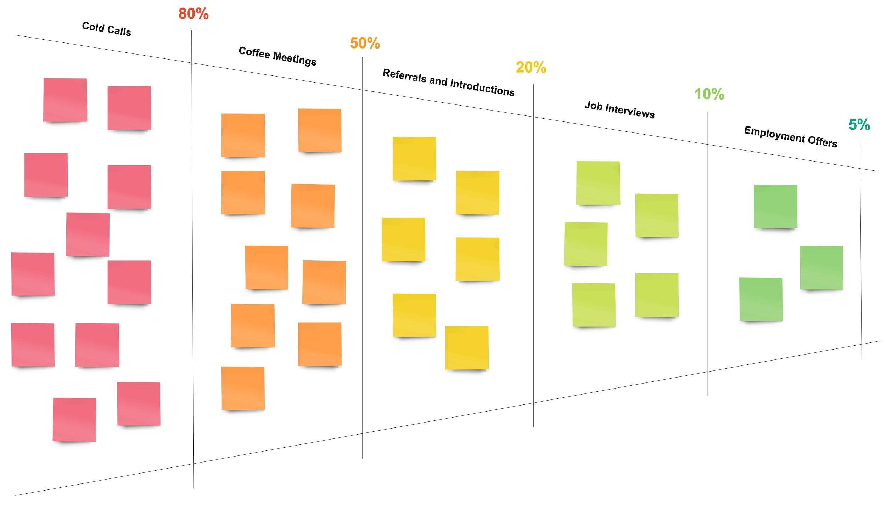
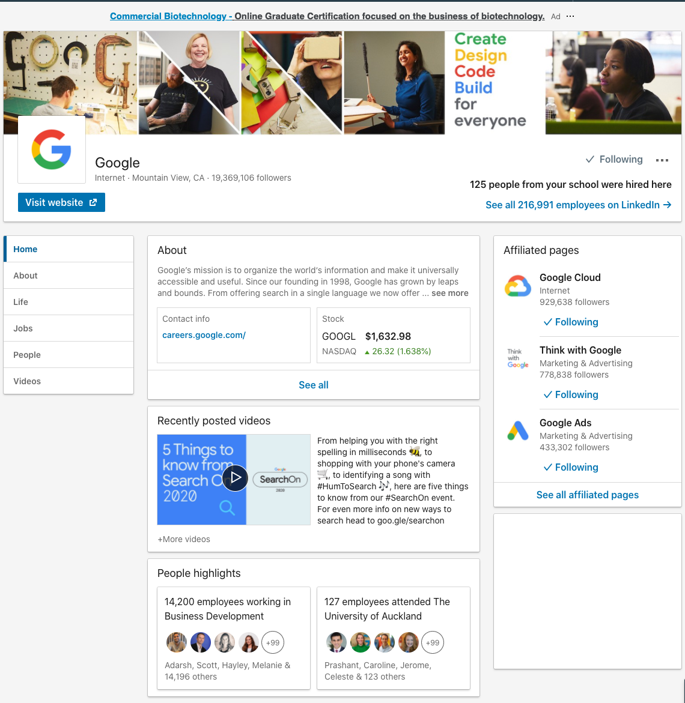
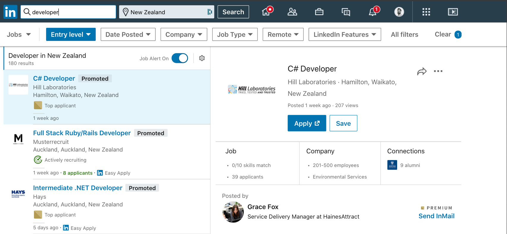
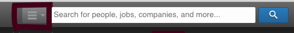
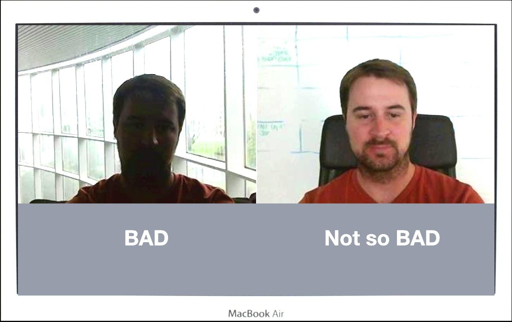

# Talent Engine Programme

## 2020-2023


# Welcome to Career Preparation Programme

You just learned tons of new knowledge and skills in your program, and now you’re equipped with what it takes to make you a competitive candidate in the job market. This next track will guide you through the process that will end with a job offer. Know that it will be hard, and that’s why we have set up this track like a roadmap to prepare you for what’s to come.

We’ll take you through units that cover every aspect of the job search, including:


*   Building a strong job search foundation
*   Writing resumes and covers letters
*   Creating your professional brand and online presence
*   Networking effectively
*   Applying to jobs
*   Preparing for interviews (both technical and non-technical)
*   Communication best practices (via email, phone, and in-person)
*   Managing job offers
*   Continuing professional development

Take your time reading through this track, and whatever you do, don't rush through it. Everything that you will read and work on here will impact your job search in some way, and has been personally written by our team of Talent Engine Team with YOUR SUCCESS in mind. Job seeking is a skill that takes time to learn and practice. Refer back to different lessons in this track throughout your job search process as you need them, to build smart practices and optimise the results of your activities.

In addition to this content, you will be working with an individual Talent Engine Team, as well as, the entire Talent Engine team.


# The Job Search


## Building a Strong Job Search Foundation

Finding a new career is not a straight line. It takes time and effort. It involves research, active outreach, tracking progress, building a personal brand, and more. It also requires:


1. Commitment
2. Flexibility
3. Creativity
4. Patience
5. Accountability


### Accept That the Job Search Isn’t Easy

Finding a job is a full-time job in itself. Understand that hiring managers will not discover you if you stay inside your apartment. You need to put yourself out there physically and online.

An effective job search involves (but isn’t limited to):


1. In-person networking
2. Sending emails
3. Arranging informal coffee meetings
4. Building an online presence through social media and blogging
5. Creating side projects, you can add to your portfolio.
6. Phone interviews, video/virtual interviews, and onsite interviews
7. Completing technical/practical challenges in your field of study
8. Continued learning and development
9. Smart time management

Landing a job is your responsibility. While there are tons of career resources (like this one) that can act as a guide, at the end of the day it comes down to one person: YOU. You’re the only one that can go on interviews and get the job offer.

It’s no one’s job to give you a job. Instead, you must prove your value to an employer, as well as, convey your genuine interest every step of the way. If you fail to demonstrate your value and interest, employers will move on.

There are always ups and downs - including rejection - when pursuing something new and exciting. However, as Henry Ford famously said, “Obstacles are those frightful things you see when you take your eyes off your goal. As you go through the job search, focus on your end goal: a new career as a software engineer.


## Landing a Job Takes More than Technical Skill

After wrapping up your Developers Institute program, you now have a strong foundation of specialised technical skills unique to your field of study.

However, having these technical skills alone is not enough to secure a job. There are other behaviors and soft skills that employers look for in a candidate.


### Appearance

First impression that you make. This includes the clothing you wear, how you act, and your body language (making eye contact, a firm handshake, good posture, speaking with confidence, smiling)


### Positive Attitude

 Do you seem like a team player? Easy to work with? Have an overall positive disposition? Are you enthusiastic about the company and role? Are you excited to code?


### Communication

Listening, writing, and speaking effectively. Essentially, how well you can explain your ideas. Also, it's important that you use proper business communication etiquette (different than informal-style/social etiquette).


### Time Management

Do you respond to emails and related correspondence in a reasonable amount of time? Does it seem like you can handle multiple responsibilities at once and set appropriate deadlines around them?

Realise that the above traits and soft skills can be even more important than your technical know-how.  Because while you can be trained to learn new technical skills, your personality is unchanging. After all, companies don't hire a resume or skillset; they hire people


## Key Traits of Successful Job Seekers

As important as the hard and soft skills are that you bring to your job search, so are the traits that you embody and bring with you into all your job search activities.

A trait can be defined as: an aspect of a person’s behavior and attitude that makes up who they are. You can also think of this as a characteristic, attribute, or quality. 

By doing so, you will be significantly more equipped to:


1. Make the best use of your time
2. Move forward at the pace and in the direction that you desire
3. Position yourself powerfully to potential employers
4. Optimise your candidate credibility, value, and visibility
5. Stand out and distinguish yourself as a no brainer hire


### Traits of successful job seekers


#### Commitment

First and foremost, you must be committed to your job search goal/s! You must know why you want what you want, and then you must decide wholeheartedly that you will do whatever it takes to get there. It will not be easy (nothing truly worth it is). There will likely be ups and downs, but it will be worth it once you have achieved it! You must above all ‘keep your eye on the prize’, and keep moving forward, one step at a time. While it is easy to sometimes feel like each step seems so small that it’s meaningless (especially in the beginning), the only way to move closer towards your goal is to keep moving! As long as each step you are taking day by day is moving you one step closer, then you are headed in the right direction.


#### Patience 

This is perhaps one of the most critical traits to possess as a job seeker (and especially for a career changer)! There will be highs and lows throughout your job search (guaranteed!) and times when a company or recruiter doesn’t get back to when they said they will, just to name a few examples. In times like these you must not give up, assume the worst, or take it personally. Instead, you must persist, and realise that every company manages their recruiting process differently, and at their own pace and as frustrating as it may seem, this is the way it is, and you must be able endure it with calmness, professionalism, and positivity. 

You must be the one to “take the high road” and show them that you are someone who can navigate through a variety of ambiguous circumstances with ease and poise. After all, how you behave throughout the recruiting process is a direct indicator of how you will act on the job. Companies want to hire people who are a pleasure to work with, so show them that you are that person.


#### Preparedness

This one goes without saying, but is necessary to highlight. Since your goal is to stand out powerfully as a no-brainer hire, you must be as prepared as is humanly possible for each and every interaction you have with a company, in the research you do before interviews, career fairs, networking events and coffee chats, etc. This even applies to your job search marketing collaterals and communications (cover letters, thank you’s, follow-ups, etc.), all of which your Talent Engine Team (should you be working with one) is highly skilled in helping you optimise. 

You only have one first impression, so you must do the preparation needed to make it count! How? By throwing standard, run of the mill, mediocre preparation out the window, and replacing it with extraordinary, thorough preparation, at each and every stage of your job search, such as:

Preparing customised, compelling cover letters and thank you’s to convey your exceptional interest in, passion for, and value you can contribute to each company you apply to/interview with.

Researching a company in detail across the web (their website, social media channels, etc.) to gather valuable intel on their history, products/services, clients, mission, culture, key values and principles, and how YOU are aligned with them. They will expect you to know these things.

Researching your interviewers on LinkedIn (and Google) before interviews so you have a deeper understanding of not only what is important to them in the work context, but also of them as an individual, their career path, interests, etc. This is helpful in finding a commonality so that you can ‘break the ice’ as soon as you meet them. Did you both come from a bootcamp or graduate from the same school? Are you both from the same home town? Do you both follow the same sports teams or volunteer for the same non-profits? Do you have friends/connections in common? Don’t disregard these things! As small as they may seem, they can make a huge difference in your ability to instantly connect and build a strong and positive rapport with them. People like to hire people like them (on the same page, similar mindset, attitude, etc.) and that fit well into their culture. Leverage the available information out there to help you do this successfully. By doing so you will also show your interviewer that you are serious about the role and have a great work ethic. After all, how well you research them is an indication of how thorough you will be in the job.


#### Passion/Personality

Your passion for the company and role, and your ability to convey that, is as important as your technical abilities. Yes, we’ve said it, and it’s true! Companies don’t just want to hire the person with the ‘best’ resume or skills, because frankly, your resume tells them nothing about how you are to work with 8 hours a day, and lots of people have equally strong skills. 

Companies want to hire the person with the right set of skills who is personable, has great energy, and who can show they are passionate about their career of choice, can explain why they chose this path, this company, and this role, in a way that is genuine, compelling, enthusiastic, and passionate! No one wants to hire a candidate who obviously is not really into the company or knows they will want to leave in 6 months; this would be a complete waste of the company’s time and money. 

In other words, let your passion for your work and the company shine through, in all your interactions with them; emails, phone calls, interviews, follow-up challenges/assessments, etc!


#### Flexibility

Defined as “an ability to change or compromise”, this trait is especially key in your job search. Does a company ask you to reschedule a call, perhaps last minute? 

Did an HR person or team lead at a company whom you emailed not reply back to you? 

As frustrating or inconvenient as it may feel in the moment, you must be flexible and go with the flow. Never assume why someone does or doesn’t do something. This is a very dangerous thing to do, and can put you in a negative mindset and course of subsequent actions that can adversely impact your candidacy. 

A company may have had a last minute emergency, an interviewer might have been called out of town to a VIP client meeting, an HR person might be swamped with tons of emails in their inbox (and hasn’t seen yours), may be on vacation, etc. 

The possibilities are endless. So, what you must do in these situations is to remain neutral and proactively take the necessary actions to bring these opportunities to fruition. Think about how you would expect candidates to behave if you were hiring them. What impression would a candidate who grumbled and complained rudely about an interview reschedule make on you, as compared to a candidate who graciously acknowledged the change and expressed their continued interest and enthusiasm for rescheduling the interview? 

As companies are assessing you on not only your technical/hard skills but also your behavior, attitude, and communication skills, your ability to be flexible throughout the recruiting processes that they have put into place will significantly impact your credibility, value and appeal as a candidate. Remember: it’s their company, their job, and how they want to run those processes is their choice (and they’re the one with the job to give).


#### Creativity

Yes! You can (and should) be creative in both how you approach your job search and how you market yourself as a candidate. Since your goal is to stand out as not just any candidate, but as the winning candidate, creativity reigns supreme here. How can you approach job lead development and strategic networking in a way that uncovers opportunities outside of overpopulated and overused job boards and other typical job sources? 

How can you craft stellar, customised, compelling, engaging cover letters and thank you emails that distinguish you powerfully and communicate the incredible value you have to offer? 

What can you do post-interview as a bonus to showcase your exceptional skills, passion, determination and work ethic to a company? 

Give yourself permission to think outside the box and devise new ways to get yourself out there and bring jobs to you. Should you be working with a Talent Engine Team, they can help you to brainstorm and come up with an action plan.


#### Courage

Partaking in a career change can feel equal parts exciting and frightening. You may be feeling like you are in unknown territory or a deer in headlights. You may feel very uncomfortable. You may even sometimes feel like you want to turn back. That’s normal, and you’re not alone! In times like this, you need to remember why you’re pursuing this new career and the positive impact it will have on your life going forward. 

Conjure up a high-definition image of this in your mind, with all your senses. What does it look like? Feel like? Taste like? This is what you need to keep your focus on to ensure you are taking steps that move you closer to this goal. 

You will likely have to do things very differently than you have in past job searches. After all, a different result requires different actions. Acknowledge the differences and any weird or uncomfortable feelings they bring. 

They are a natural part of the process in creating a huge and extraordinary change in your life that you want to see for yourself!  Just as important as your hard skills are in getting a job, so are the traits that you bring with you into all your job search activities. Consistently embodying those traits throughout your job search journey will help you remain in a focused, can-do mindset, enabling you to maximise your efforts efficiently and distinguish yourself powerfully to employers, making you a no brainer hire!"

Just as important as your hard skills are in getting a job, so are the traits that you bring with you into all your job search activities. Consistently embodying those traits throughout your job search journey will help you remain in a focused, can-do mindset, enabling you to maximise your efforts efficiently and distinguish yourself powerfully to employers, making you a no brainer hire!


### Ways to Be Proactive in Your Job Hunt


#### Be Proactive

Below are activities that define a proactive job search.


1. Schedule time in your calendar for specific job search related tasks:
    1. 1 hour to research open positions
    2. 2 hours emailing new and existing contacts, another 30 minutes following up
2. Research job openings, companies you want to work for, and people you already know (or have mutual connections with) who work at those companies.
3. Attend in-person networking events (meetups, conferences, association meetings, etc)
4. Join online groups around a particular interest/industry. Example: a vocation-specific LinkedIn group.
5. Create an online presence by using professional social media (LinkedIn and Twitter) and start to blog.
6. Consider volunteering your skills for an organisation you care about (something you can add to your LinkedIn/portfolio!).
7. Build side projects that people can actually use and find value from (another thing you can add to your LinkedIn/portfolio). The more invested you are in your own education, you'll come off as more passionate and excited!
8. Prepare answers to common interview questions you may be asked.
9. Practice online challenges as a way to prepare for interviews.


### Networking FAQs


#### How do I make small talk?

In general asking, “What are you working on right now?” is a great way to get a conversation going with anyone from CEOs to fellow practitioners. However, at a networking event, a great way to break the ice is by using the situation. Example: “So, how long have you been going to this Ruby on Rails meetup?” or “Wasn’t that last speaker great?!” When you’re making small talk, don’t make it all about you; show that you’re interested in the other person. Try to find ways to help people. It doesn’t have to be big. Suggest an idea or offer to introduce them to a contact at a company where you know someone, or recommend a book or your favorite meetup. When you help someone, they will naturally want to return the favor. (Aka “pay it forward”.)


#### What should I do if I am shy? 

When it comes to networking events and even one-on-one meetings, try to schedule them all on the same day of the week. This way, you can relax afterwards (if being around people exhausts you). Another way to make yourself feel at ease is by making it about the other person (especially when at a networking event). When you do this by asking questions about them and offering help, it puts less pressure on you having to talk about yourself. And you’ll be much more likeable. (It’s flattering to have another person take interest in your life/work!)


#### What if evenings don’t work for me?

Whether you have small children at home or don’t drink alcohol (and therefore don’t enjoy happy hours/”getting drinks after work”) - ask for a lunch/coffee date instead. When it comes to attending networking events, you can try to go to breakfasts before the workday begins. (If you live in a city, there is most likely some kind of breakfast meetup near you, and many breakfast meetups are attended by people who are employed because those are the people you want to meet.) There are also more and more weekend meetups popping up. Try to explore all options within your surrounding areas.


#### Isn’t it creepy to research and email someone I don’t know?” 

Actually, no! The fact that you are reaching out shows that you are serious, committed, and passionate about your career. People appreciate and are drawn to other people who share their same interests, goals, etc. And, they were once in your shoes! Consider that every person you know in your life was once a stranger, until your first interaction the same holds true in professional networking. 

The approach that you take in writing your networking emails will make all the difference in your response rate. Work with your Talent Engine Team to craft fully personalised, compelling emails that engage the recipient and make them interested in meeting you.


#### Why should I go to an event if there aren't any recruiters there or people hiring? 

Truth be told, everyone you meet has some value to offer you, whether it be in this moment, or in the future. Never make an assumption who can and can’t be helpful. You never know who knows who, and who knows what! For example, while talking to other job seekers at an event you could learn about new companies and job opportunities that you weren’t aware of before, or other worthwhile events, seminars, resources, etc. Or, perhaps while speaking with another attendee you learn that their best friend/relative is a recruiter or executive at a company that you’d love to work for. Y

ou would never have learned any of this if you just decided to stay home under the assumption that the event wasn’t worth your time. People are always willing to help out their friends, acquaintances, etc. 

The key is to cultivate those relationships so when the opportunity comes you are able to both give and receive value from each other in pursuit of your mutual career goals.


### Employers Want to Hire People They Like

Because you’ll be spending a lot of time together and with the rest of the team, hiring managers want to make sure you can get along with others. Are you pleasant to be around? Can you make small talk? Are you easy to hang out with?

There is a test often used in the world of recruiting and HR called “The Airport Test”. Essentially, the employer asks themselves, “Would I want to be stuck in an airport with this person?”

Keep this in mind during every stage of the job search process — from initial contact down to the in-house interview and even job offer."


### The Best Opportunities Come When You're Committed


1. Finding a job isn’t easy or a straight line it takes time and effort
2. Throughout your job search, communication is key
3. Having technical/hard skills matter, but your personality/soft skills do, too
4. Employers want to hire people they like and can spend time with
5. Ultimately it’s your responsibility to land the job to do this, you must be proactive"


### Working with a Talent Engine Team

Our Talent Engine Team will be the students’ partner and guide, and they will meet them when they are 90% of the way through their program. Once graduates start their job search together, you'll meet regularly to tailor a job search that helps you find somewhere you'll thrive.


1. Meet your Talent Engine Team for 1:1 sessions
2. Together, you'll build your own personal brand, develop a pristine digital presence, and conduct interview practice — this way, employers will know who you are and why you're valuable.
3. Build your resume with a personalised approach
4. Set up your personal online brand on platforms like LinkedIn and GitHub.
5. Once you have your roadmap, we'll help you search culture, company sise, geography, and growth potential, and continue with our interview practice. We want you working somewhere you'll thrive.
6. Help graduates find jobs, all based on tried-and-true job search structure that ensures you put their best foot forward.


### Talent Engine Team

Our coach will address the importance of committing to a job search. Our coach will be there for graduates in all the aspects of their search, including:


1. Staying motivated
2. Holding graduates accountable
3. Optimising a resume, cover letters, thank employers for interviews, and all communications
4. Preparing for interviews, networking conversations, and career fairs
5. Refining graduates job search strategy
6. Circumventing potential roadblocks
7. Reviewing and negotiating job offers


### Your Job Search Mindset

Going through a career transition will be challenging at times. It requires a growth mindset and positive attitude to power through the process.

As Carol Dweck explained in her book Mindset: New Psychology of Success, a growth mindset is powerful because you believe your talents and abilities can be developed through effort, good teaching, and persistence.


#### Be Aware of Your State of Mind

While looking for a new job, you will go through ups and downs. While it is natural to experience strong emotional responses during the process, it is important not to bring negative emotions, comments, and tones you’re experiencing into:


*   Written emails
*   Calls with recruiters
*   On-site interviews
*   Conversations with people at networking events
*   Being aware of your state of mind and learning to control it will help you immensely throughout your job search.


#### What Puts You in a Great State of Mind?

Even when you are going through a crazy time like a career transition, you still need to take care of your mental and physical well being. Ask yourself what is most helpful for you to put you in a good state of mind, and make time for those activities, especially in times of stress.

Here are some suggestions:


1. Consistently get a good night's rest
2. Exercise regularly
3. Manage your time
4. Practice relaxation; deep breathing, meditation, and progressive muscle relaxation are good ways to calm yourself
5. Take breaks in between hours of skills practice, blogging or job search activity
6. Be confident in your abilities and know you will improve even more over time
7. Stay connected with people who can provide emotional and other types of support. It’s important to have a network of people to support you.
8. When your body and mind are in good shape, it’s easier for you to maintain a positive mental state.


#### Have a Positive Attitude

A candidate with an optimistic attitude attracts more employers, makes more meaningful connections, and ultimately gets hired faster. Confidence will help you during interviews and make you more likeable.

There are three simple ways to maintain a positive attitude during the job search process.

Visualise acing the interviews and getting the job. What would this feel like? Can you imagine how confident and knowledgeable you are in these interviews? What the mind conjures up are where actions follow.

Team up with a fellow learner. Other students going through the online curriculum are going through the same job search process and need help with keeping a good mindset. What better way to help each other than by holding one another accountable for weekly (or even daily progress) and talking through challenges!

Reach out to your coach for support, motivation, and encouragement. They’re there for you through the ups and the downs!

Realise that staying positive during the process is something you choose and can continuously work on. Also know that if you have a premium account, you can reach out to your coach if you're feeling this way. This is a critical part of the job search and we're here to help you with this as well.


#### Above the Line

Above the line, in the realm of the victor


*   Ownership
*   Accountability
*   Responsibility

Below the line, the language of the victim


*   Blame
*   Excuses
*   Denial

This concept has been well known in business and personal development circles for many years. Still, it is such a critical lesson that it is one worth revisiting regularly.


### Dealing With Negative Events and Rejection

There are going to be ups and downs along this journey. Be prepared for rejection from some companies, this is an inescapable part of every job search.

During the job search, you may have normal feelings like:


*   Imposter Syndrome - Being plagued by self doubt and feeling like a fraud.
*   Discouragement - When you don’t get the results you were hoping for, it’s easy to get discouraged.
*   Lack of energy and enthusiasm - This can happen after a long period of not a lot of progress.
*   Frustration - If your hard work is not yielding the desired results in the time you hoped, you receive a rejection, or overall just feel lousy throughout the process.

Even though you may experience these normal feelings, you can control how you respond to unfavorable setbacks. Don’t get discouraged. Instead, reflect on how it could have gone better and change your approach or improve your preparation for subsequent interviews.

For getting through these rough patches, you can vent to your Talent Engine Team, a friend, partner, or therapist whenever you need it.


### Your Attitude Means a Lot To Employers

Employers don’t just want someone who knows programming fundamentals, or the latest framework. They want a candidate with certain attitudes that will make them a positive addition to their team.

Some of the most desirable attitudes are:


*   Adaptability - If an employer wants to start you out with a 3 month contract to test your skills before transitioning you to full-time, are you open to this?
*   Accountability - If an employer asks you to complete an assignment, do you turn it in on time and not make excuses that you lost your charger or didn’t have a wifi connection?
*   Commitment - Employers want candidates who are planning to stick around and carry out what they set out to do. Do you embody this attitude of follow through?
*   Curiosity - Do you ask thoughtful questions to your interviewers?
*   Enthusiasm - During interviews, do you express sincere interest for company’s mission and the role you would be growing into?
*   Honesty - Are you upfront about what you do or don’t know? If you don’t know something, you can always say you’ll put time into learning the new skill.

Do you have these types of attitudes? If you don’t yet, being aware and cultivating them during your job search will put you far ahead in landing your next full-time job.


### Getting a Job is Easier When You're Positive

A growth mindset and positive attitude are powerful in a job search. Monitor your thoughts and understand how to put yourself in a great state of mind.

Having a fixed mindset and negative attitude can have psychological and physiological effects

Employers want to hire people with optimistic attitudes.

There are different ways of dealing with the ups and downs of finding a job. Recognise this is a choice on how you respond to those feelings.

To tackle these psyche issues, you can use internal and external tools to get confidently back on track. Should you want to work on your job search mindset or you are looking for strategies to stay positive, talk to your coach.


## Confidence

Searching for a new job and the related networking/interviewing can require a giant step out of your normal comfort zone. This takes confidence — confidence in your skills, in your communication, and in yourself. Easier said than done, right? 

In this section, we’ll take a look at the challenges of showing up with confidence and explore some strategies to boost and maintain your confidence whenever you are not quite feeling it.


### Self-Confidence vs. Self-Compassion

Let’s start with the difference between confidence (or self-esteem) and self-compassion.

The trouble with self-confidence is that it is often contingent on success. In short, we judge ourselves positively when we do well. But the minute we fail or make a mistake, our confidence can fly out the window and we judge ourselves negatively.

Self-confidence tends to be fueled by comparison and whether we are doing “better” or “worse” than others. Basically, if I have high self-confidence I have to feel special and above average. Mathematically, everyone can’t be above average at the same time; this desire to be better than others is based on a logical impossibility, which is a simple reason why comparing yourself to others isn’t productive.

Self-compassion on the other hand is not earned by successes or contingent on doing well, or even comparative in nature. It’s simply about doing your best and treating one’s self kindly, like you would treat a good friend — with warmth and understanding. When we make a mistake or we fail, we may lose our self-confidence. But that is where self-compassion steps in. 

Self-compassion recognises that it’s natural and normal to make mistakes, and that we’re worthy of kindness even though we may not have performed as well as we wanted to, or mis-stepped somewhere along the way. When we're kind to ourselves, we're able to see the ways in which we can grow and what we can take away from these experiences. It's not about being better than other people. It's about being better than the current version of one’s self.

The secret to increasing your confidence? Stop convincing yourself that you’re awesome and confident. Instead, forgive yourself when you’re not. Focus on learning, and think of any mistakes as things you can learn from with self-compassion in that ability to learn. Your self-compassion will shine as outward confidence because you are simply being you to the best of your knowledge and being kind to yourself in the process.


### What Should You Do With All of This Confidence?


#### Roll with Rejection

There will always be other talented job seekers applying for the same companies, and chances are you will hear some form of “no” at different points in your job search. This is a normal and inescapable part of every job search, and is the perfect opportunity to practice self-compassion. Once you have treated yourself kindly, you can look at the experience in a different light. When you're not being so hard on yourself, it’s easier to assess what you learned from the experience and move on. You’ll need to have thick skin. If one door closes, use this as a prompt to reflect on what you learned and then seek out another door to open in its place.""


#### Be Curious

Networking and cold email outreach can feel awkward and intimidating at times. If this is you, you are not alone! A highly effective way to connect with others and develop relationships is to use your curiosity as a guide. With self-compassion, you're not thinking that you're awesome and know everything. Instead, you're giving yourself the permission to put your best self forward and learn and ask real, interesting questions that you’d like to know the answers to. What do you actually want to know about the person? What makes you curious about their work or background? The more truly curious you are, the more authentic the interaction will be - and likely the more comfortable and engaging.


#### Know That You're Not a Burden

Don’t be shy about reaching out or assume others are too busy or don’t want to talk with you. Everyone who works at a company joined that company at some point in time and has gone through a similar process: of getting to know the company, interviewing, and accepting a position. In short, all professionals at one point or another have been a job seeker and know what it’s like to be in your shoes. Yes, many people are busy - but many people will also happily connect with you to offer their help or advice. You are not a burden and it’s up to you to take initiative to reach out.


#### Take It One Step at a Time

Being self-compassionate means that you're taking things one step at a time and that you don't need to know all the answers at the outset. Networking and interviewing can have ambiguous moments. For example, a potential employer may ask to schedule an introductory call but does not provide much detail beyond that. It’s key to take each interaction one step at a time and not allow yourself to get too far ahead. What is the immediate next step, and how can you best prepare? (For example, a well-written email response inclusive of a couple of available windows of time to connect, not assuming the employer isn’t interested just because his email wasn’t detailed enough.)

Ask thoughtful questions during each interaction to help bring you clarity where possible. (e.g. Could you give me a sense of what the schedule might look like for Friday’s interview?, Could you share with me your general timeline for bringing on a new programmer?) It’s often tempting to jump ahead, but resist!


#### Resources


1. [https://www.psychologytoday.com/us/blog/hide-and-seek/201205/building-confidence-and-self-esteem](https://www.psychologytoday.com/us/blog/hide-and-seek/201205/building-confidence-and-self-esteem)
2. [https://www.forbes.com/sites/francesbridges/2017/07/21/10-ways-to-build-confidence/#1121a1b53c59](https://www.forbes.com/sites/francesbridges/2017/07/21/10-ways-to-build-confidence/#1121a1b53c59)
3. [https://www.workitdaily.com/job-search-confidence](https://www.workitdaily.com/job-search-confidence)


## Job Search Action Plan

We’re going to cover a lot in this track. From building your online presence to networking effectively to writing a compelling resume. Everything you read will set you on the path to landing a job offer.

But reading alone isn’t enough and it’s important that you start your job outreach from day one. Don’t wait until the end of this track to get started. In this lesson we’re going to create an action plan for you that will tie together all the useful advice in the upcoming units.


### Time Management

It can feel a bit overwhelming to transition from your Developers Institute program into job search mode. Whether you were an immersive or online student, you likely had a very robust, intensive, structured schedule that guided your every action, day after day, until your program completion. So what can you do after you’ve graduated to ensure the same amount of structure, momentum and progress, but in your job search? You create a whole new plan for smart time management!

Consider for a moment how you successfully managed your life to complete your Developers Institute program. How did you organise yourself? What support mechanisms did you put into place? What strategies did you use to prioritise your time effectively? Take advantage of the smart habits and methods you used in your program and begin applying them directly into your job search action plan.

Since a successful job search requires commitment and consistent action and you are the person responsible for leading and steering your job search, how you effectively manage your time will directly impact your success in getting a job, and the amount of time it takes to get a job.


### Strategies for Managing Your Time Well

Set priorities. On a scale of 1-5 (5 being the highest), where does your job search fall as a priority in your life right now? How important to you is finding a job sooner vs. later? 

Your answer should determine how you prioritise your job search activities in your daily life. We all have many things we are balancing in our lives day by day, and sometimes it is not as ‘easy’ or carefree’ as we’d like — but the effort is well worth it, when you consider why you are pursuing what you’re pursuing, and why you’ve just spent the past several months (or even longer) of blood, sweat and tears in completing your program.

Make a defined schedule. Going to the gym might not be something you’re excited about, but if you plan the time in advance, block it out on your calendar, and gather your gym accessories together ahead of time, etc., getting yourself there will likely be much easier. In the same way, making a job search plan will make you more motivated to get started and stick to your plan. Just like forming a habit of going to the gym can be easier.

In other words, don’t just keep it in your head. Block out specific chunks of time, in your calendar, in Trello, or in whatever personal time management tool that you use. Blocking out the time somewhere where you can see it makes it more ‘real,’ and more likely that you will remember, and prioritise, that activity.

Perhaps you want to set aside X hours each morning for practicing your skills or working on a project, X hours every afternoon for company research and outreaches, X hours for follow-ups and cover letter drafts, and X day a week for writing a blog post. Only you truly know how you best manage your productivity, so leverage that into your job search. If you are working with a Talent Engine Team and would like guidance, ask them — they can help you formulate a smart time management plan.

In a future lesson we will go into more detail on what you should be doing post-graduation to stay active, keep your skills sharp, and ensure your market competitiveness.


### Monitor and Tweak As Needed

Sometimes in life things don’t go as planned, unexpected things come up, etc. If you notice a pattern surfacing of not being able to meet your job search activity goals each week that you’ve set for yourself, that’s a perfect opportunity to chat with your coach. They can help you to identify what’s getting in the way, and ways to re-calibrate your action plan. That’s one reason why we set you up with a job search tracker, so you can monitor/track your activities to help you stay on track, build momentum, and get the results you want. Your Talent Engine Team will provide you with your own individualised tracker to use.

In summary, smart time management is key to staying on track and reaching your job search goals. Through setting priorities, scheduling out your activities, and tracking your progress on an ongoing basis you will be significantly more equipped to ensure your actions are moving you forward in the right direction.


## 


## Weekly Activity

We have thought carefully about how to guide our students to be proactive and successful in their job search, by outlining specific activities that successful students did to facilitate their job offers. This information helped us to craft the Talent Engine Programme Commitment, which includes requirements for specific activities we ask students to engage in every week they are job-seeking. 

Those include:


1. Make contact with at least eight (8) individuals, verified by first, last name and title, at prospective employers within your field of study with respect to the Money-Back Guarantee Qualifying Program (recording evidence of such contact to be furnished upon request by Developers Institute School) and update your job-search tracking tool with a written summary of all such job search activities.
2. Post at least one written or video blog post (containing your original thoughts and ideas, providing all appropriate citations and references to third-party content from other sources), focused on a topic in your field of study
3. Post at least 5 GitHub contributions per week to your public GitHub profile


### Make Contact with 8 Specific People

People don’t get jobs from job boards, they get jobs from people! When submitting an application electronically, the chances are small that your application is being carefully reviewed by a human. As a matter of fact, most companies utilise applicant tracking systems (aka. ‘ATS’) to quickly scan your application to identify keywords to determine if a candidate should move forward. If all you do is hit “Submit,” you’re going to be on the bottom of a digital pile of hundreds of resumes, and a human may never actually lay eyes on your materials. In addition, it’s estimated that 70-80% of jobs are never even posted.

Instead of relying on the “black hole” of job board submissions, we want you to focus on connecting with an actual human who is relevant to your search. Connecting with people allows you to build out your professional network and develop relationships with people who may be able to help you. It gives you a chance to tell your story, and to communicate your passion for your craft.

Connecting with people can happen via two means: in-person or electronically.


#### In-person Informal networking

You could go to a meetup or an event and strike up a conversation with the person sitting next to you, or approach the presenter at the end of the event. Meeting new people face to face is a great way to build connections. However, simply having a nice conversation and parting ways does not guarantee that this person becomes part of your ongoing network. You should nurture this contact by sending them a follow-up email the next day (or the same night!) to keep communication going.


#### In-person - formal interview processes

Another way of connecting with people is throughout the stages of an interview process. Every time you have a meaningful conversation (including formal interviews), it helps you to advance in your job search.


#### Electronically - warm outreach

Maybe you email an old colleague, call up a former roommate, or your brother connects you to his girlfriend’s mother (all of whom work in jobs you want to work in, or at companies you want to work for). You schedule a phone call, a coffee, or grab drinks to learn more about their role and their company, and ideally to learn about openings and/or contacts in their network that can be helpful. In this situation, you are connecting individually with a person who can provide advice, guidance, and/or support in your search - these activities count!


#### Electronically - cold outreach

It is entirely normal, and appropriate, to send cold outreach emails to contacts at companies you are interested in. Maybe the company isn’t hosting an event anytime soon, or you have no personal connections there. That’s okay! You don’t want to lose the opportunity to get your foot in the door, so you can use email in hopes of opening the line of communication. As long as your email is professional, polite, and clear as to why you are reaching out, it won’t be negatively received. Sure, some people won’t answer - and that’s okay! It is imperative to generate quality, customised outreach to pique employers’ interest and elicit responses.

You can fulfill your goal of 8 individual contacts per week with outreach emails, or a combination of event follow-up emails, cold outreach, informal coffees with personal connections, and/or interviews! The idea is to connect with real live people throughout your search. If you have specific questions (which you will), make sure to connect with your Talent Engine Team, so they can help you to navigate every step of this process!


#### Different stages of an interview


*   Phone screen, video call, on-site/meet the team, etc.
*   Cold emailing a fellow practitioner who works at a company you’re interested in
*   Having coffee, lunch, or a networking call with a friend, former colleague, family member, friend of a friend, your girlfriend’s mother’s sister’s landlord who works in your field of study and may be able to connect you to some influential people, etc.
*   Meeting new people at a meetup or event, and sending an email the next day to keep the line of communication open
*   Sending an email to a fellow practitioner, asking for advice/feedback on a project, resume, or blog post (advice helps you to become a better practitioner and job seeker!)


#### Note on External Recruiters

Talking to external/3rd party recruiters / recruiting/staffing agencies does not count towards the 8 connections per week (as they are not individuals at prospective employers within your field of study). If you want to talk to an external recruiter, that is okay! But it will need to be in addition to your 8 individual contacts. (Check out this article that explains why we encourage students to focus their efforts directly on the companies they want to work for.)

Keep in mind that some leads that you pursue will respond quickly, while others might take a week or two to get back to you. Some you won’t ever hear from, and that’s okay. This is why we suggest the amount of activity that we do, because we know what amount of activity it takes to run a successful job search.

So, how do you tell if a company is an external/3rd party recruiting/staffing firm? There are a few ways. First, if their company name contains words such as 'Technology Staffing' or 'Solutions', this could be an indicator, but it's not always guaranteed. What you should do is still go to the company's website and/or LinkedIn page to research thema and see what type of organisation they are; there you should be able to quick ascertain what they do. Often they'll say this right up front in their 'About Us', 'Services, or 'What We Do' sections. Also, look closely at their job postings; if they use language 'Our client is looking for...' anywhere in the posting, it is almost certain the role is for another company ('client') that they are recruiting on behalf of.

While external 3rd party recruiting/staffing firms are aplenty, here are a few of the more well-known, larger ones: Recruit It, Talent Army. (these are just a few). 

If you are uncertain whether or not a company falls into this category, please connect with your Talent Engine Team for guidance.


#### Protect Yourself

While most recruiting/HR people and companies you interact with are fully legit, beware anyone who asks you to share your personal and/or private financial information (other than as part of completing a formal background check, application etc. for employment right before or at the time of a formal job offer/onboarding process). Equally, beware anyone who asks you to send them money in exchange for access to job opportunities, technical equipment to perform a job, etc. Report this to your Talent Engine Team right away so the two of you can vet/investigate further together.


### 5 GitHub Contributions

As a job seeker, you need to be building and selling your personal brand all the time. Your GitHub profile link – where examples of your code/projects live will be included in your resume, your LinkedIn, and on your personal portfolio, which means employers will have the opportunity to browse through it. 

Potential employers are interested in seeing if you are actively coding/practicing your craft; specifically, whether you have continued building your skills after graduation. Use this as an opportunity to showcase your passion and continued learning!

Of course, there are private repos, labs, and projects that don’t live on GitHub, and a lack of activity doesn’t necessarily mean you aren’t practicing your skills – but employers can’t see that, so it’s as good as invisible when it comes to your candidacy for jobs. It’s important to show weekly activity on your public GitHub profile. That’s why the Talent Engine Programme Commitment requires that you make a minimum of 5 public GitHub contributions weekly. Emphasis on minimum!

Note: Each student is responsible for ensuring that their contributions are correctly authored and are appearing on their public GitHub profile (Contributions chart) every week. Read this to ensure that you are properly authoring your contributions.

Also, read this to ensure you understand how GitHub counts contributions.

A question we often get is: what does the contribution have to look like? How big does it have to be? The specifics are up to you - but make sure each contribution is meaningful. It’s pretty easy to go in and change a ReadMe or write a small piece of code to show a contribution was made. But the content of the changes can also be seen by employers. Our suggestion is to constantly be working on a side project that you are passionate about, and, ideally, daily. Make sure the contribution is adding to something more extensive, and to something that is visible. We want to ensure you are practicing regularly, and keeping your skills sharp.


### Technical Blog Post

This topic is covered at length here, but we’re touching on it again because a weekly blog is a required activity within the Talent Engine Programme Commitment.

Blogs demonstrate to employers that you’re passionate about your craft and can communicate the projects you’re building and the concepts you’re learning to a general audience – an essential skill for job seekers. When an employer peruses the LinkedIn profiles of 2 candidates with equal credentials – but one is an active blogger on technical topics, and the other isn’t – it’s obvious which candidate the employer is going to be more excited to speak with. You want to be that candidate!

You can blog about almost anything related to your learning. You will be learning new skills, technologies and frameworks along your journey. You will be implementing those new skills to projects, getting stuck, and implementing solutions. Write about it all! Topics of interest, for you and for others, can truly run the gamut from solving a technical or design challenge to lessons learned while interviewing. When you begin to identify companies of interest – and even interview with them – look out for topics that could be relevant to the company, and write about them!

The key here is also to post your blog to a public URL: Medium, Facebook, LinkedIn, your personal website – anywhere that can generate activity and get your blog seen by others. If you have any specific questions, just connect with your Talent Engine Team.

Finding a job takes time and commitment. To land a job, you must be an active job seeker. Below you'll see how active seekers operate as well as ways you can strategise and manage your job search.


## 


## Managing Your Job Search

Finding a job takes time and commitment. To land a job, you must be an active job seeker. Below you'll see how active seekers operate as well as ways you can strategise and manage your job search.


### Passive vs. Active Job Seekers	

Passive (or hobbyist) job seekers try to cut corners when it comes to their job search. Instead of dedicating time to the search process, passive seekers feel entitled to a job. As a result, they often make excuses like, “There are no jobs out there.” Passive seekers do insufficient research and ultimately sloppy work. You don’t want to be this kind of job seeker.

Active job seekers are committed to finding a job and put in the hard work associated with it. As an active seeker you'll block out time to search for opportunities, research companies and positions, network with influencers, establish a job search tracking system, and follow up with contacts.

Here are practices active seekers put into place:


1. Building - apps, projects, etc. Ultimately, assembling a portfolio of work samples and continuing to grow as a professional.
2. Blogging - as a way to document learning or discuss news/events in the industry.
3. Networking - going to meetups, conferences, and other events.
4. Contacting people directly - asking for informal/coffee meetings, introductions, etc. from existing and new relationships.
5. Active job seekers are strategic in their system and outreach like salespeople.


#### Treat the Job Search Like a Sales Funnel

When it comes to closing deals, salespeople are strategic. They use tools to track their activity, set goals, and manage their workflow. One tool used for these purposes is called a funnel.

Sales funnels start at the top and narrow as they head towards the bottom. They are the widest at the upper part because of the many initial contacts made. At the very bottom, the funnel is the smallest in sise reflecting the number of activities from the first points of contact.

Another term salespeople use is “conversion rate”. In simple terms, it’s the percentage of people who take a desired action. For salespeople, the desired action is a new lead purchasing what they are selling. Conversion rates are often used by salespeople as a benchmark to see if they’re on track with hitting their goals.

As a job seeker, you can also think about conversion rates as a way to measure your progress. When it comes to sending out emails, set a goal for a 25-30% conversion rate. Meaning that if you send out ten emails, you can expect 2 or 3 responses. This is why it’s important to send out a lot of (high quality, engaging, compelling) emails as you’re job hunting. Overall, funnels are a good way to budget how much time and outreach you should do. They also remind us that rejection is normal.


#### Job Search Funnel

Like a salesperson, you want to start off by making many contacts. Some of these will turn into phone calls and informal meetings. Sometimes, these connections will introduce you to a contact of theirs at a particular company. 

From these informal meetings, fewer will lead to interviews. That’s okay, that’s how the job search (aka sales) process works! And then all the way at the bottom of the funnel is a job offer the fewest in number.

To help manage your job search funnel, you can use a job search tracker. Your Talent Engine Team will provide you with an individualised tracker for your use.





### Job Search Tracker

Successful salespeople track their work in a database so they know how much activity they must generate to achieve their goals. Think of your job search the same way. And, just like a salesperson, you can measure your progress with a job search tracker.

While there are various ways you can track your search (like with a notebook), one of the best options is in a spreadsheet. When you store information in a spreadsheet, it’s easy to locate at all times, unlike a notebook which is easy to misplace or leave at home. Plus, you can access the information again down the road — like in a future job search.

Spreadsheets allow you to store all your job search related activities in a central location. You can even add filters to quickly sort information based on type (like by contact date).

If you don’t track your progress, it may feel like you’ve done a lot of networking, but in reality only reached out to a handful of people. A job search tracker will show the progress you've made at a given time. With one, it's easy to see if you need to do extra outreach or not."


*   [Develop a Job Search Tracker](https://docs.google.com/spreadsheets/d/1Xr4W9TwxUVuTOJfpVShkP--4E4f3lcHyg06P2r3-Jhc/edit#gid=2065124896)
*   [Targeted Job Search Plan - The Hub](https://docs.google.com/document/d/1mxK1adVGAIm16qtc4ZDOcbpuo5av6YCcY5FjnbqwavA/edit)


### Be Active	

As a committed job-seeker, you will:


1. Dedicate the time required for an effective job search by scheduling specific activities in your daily calendar (e.g. 3 hours practicing your technical skills, 2 hours researching opportunities, and 2 hours sending emails)
2. Build projects, blog, network, and actively outreach to your network
3. Treat the job search process like a salesperson
4. Create a special place to track your progress

If you don't commit to the job search in this way and don't track your activities, you're far less likely to get a job offer, and far less likely for an offer to be the one that you want."


# Online Presence


## Personal Brand Building

Personal branding is marketing yourself and career as a brand. Even if you never made a concentrated effort to “create” your brand, you still have one. 


#### Here’s how to see it


*   Google your full name (in quotes) + the town and state you grew up in
*   Most likely your Facebook, Twitter, or LinkedIn profile appears in the results (if not, try the city + state you live in now)


#### Here’s the reality

Recruiters and hiring managers are Googling your name. And this is what they’re seeing. The goal of this unit is to get you thinking of yourself as a brand and understand the ways you can build and establish your personal brand through online channels.


### Why a Personal Brand Matters	

For starters, taking control of your personal brand allows you to shape the conversation.

More than that, it helps you build credibility. When an employer Googles your name and nothing appears - it raises eyebrows. On the other hand, have a personal brand validates your existence and shows that you can be trusted.

When applying for jobs, a personal brand can also distinguish you from the competition. And ultimately it may be a factor that can help you land better opportunities."


### How You Can Shape Your Brand	

Here are specific ways you can curate your personal brand:


1. Creating an online portfolio/personal site
2. Social media presence (namely LinkedIn and Twitter)
3. Consistently building new projects
4. Starting and keeping a consistent blog
5. Speaking at meetups/events
6. Even your email address and business cards say something about your brand.

More than a refined digital footprint (e.g. completed LinkedIn profile, personal website, blog), the goal is to establish yourself as a contributor to the community. This means you’re sharing thoughts, ideas, and helping your peers. 

Many of the ways above especially social media, blogging, and speaking—allow you to contribute to the community.


### Myth: You Need to Be an Expert	

Many avoid sharing on social media, blogging, or speaking at events, because they believe they have nothing to add to the conversation.

This is not true. There are many ways you can add value to your professional community, even as a beginner. For instance, you can do an experiment, or build a project, and document your results. This way others can learn from your mistakes and realisations. Another way you can add value to the community is by curating industry news, events, etc., on your LinkedIn profile, blog, or Twitter.

These are just two ways you can get involved without being an “expert”.

While being an expert is not a prerequisite for taking part in conversations and ultimately building your brand, what does matter is recognising how to use each channel effectively. Every platform has its own etiquette—which we’ll dive into in the upcoming lessons.

However, an essential component across all platforms is consistency.


### Why Consistency Matters	

Despite not needing to be an expert to start building a personal brand as a developer, you should be consistent across all channels.

Inactive, but searchable social media platforms may hurt your brand. For example, an inactive Twitter handle with a few Tweets dating back to 2010, will probably hurt more than help you. It indicates that you start things, but don’t commit to them. Changing your privacy settings, or deleting the account, can have a positive impact.

Another common misstep people make is having more than one LinkedIn profile. For yourself, you should only have one LinkedIn profile. If an employer sees that you have multiple accounts, it may come across as being out of touch, or unable to use social media/the internet. Luckily, LinkedIn has ways you can merge duplicate accounts. Read here to learn how you can go about it.

Many people make the mistake of signing up for every social media platform out there, but then only sticking to a few, while leaving the others to collect Internet dust. In reality, quality is more important than quantity. Instead of signing up for every social media site, stick to 1-3. And do them well.

However, if you’d like to try a new platform to see if you like it, start by making your account private. This is an option for most, if not all, popular social media networks. This way you can test the waters without coming across as inactive.


### Maintain a Professional Image

People will be looking you up, looking into your background, and generally paying attention to your professional presence while you’re job-seeking. It’s crucial to maintain a professional image! 

Do your best to stay out of trouble: Don’t get arrested. Don’t tweet a string of profanities on your public Twitter. And remember that drug testing is a viable possibility as you are considered for a position at companies of all sises.


### Effective Ways to Build Your Brand

Your personal brand matters because it’s what employers consider when reviewing your application. They may take it into account before inviting you in for an interview, as well as later when deciding if you should be made an offer.


## GitHub

Github isn't just a repository for code, it’s another part of your online presence, and arguably the most specific tool a hiring manager has (without talking to you) to understand how you’ll stack up as a candidate. 

Based on numerous feedback sessions with employers we know that your GitHub profile will be a critical step in their assessment of you as a candidate.

Note: Sometimes when graduates leave the program, they stop receiving attribution >for their Git commits (i.e. the link between their computer and their GitHub account becomes severed). This can happen for a variety of reasons. To ensure the commits you make on your computer are associated to your GitHub profile, follow the steps below:


1. Open your [email settings in Github](https://github.com/settings/emails).
2. In your terminal, run the command git config user.email.
3. Verify that the email in your terminal matches the email(s) listed in your GitHub profile.

If you don't see an email when you run the command above, follow the "Your Identity" section in the [First-Time Git Setup Guide](https://git-scm.com/book/en/v2/Getting-Started-First-Time-Git-Setup#_your_identity).

If you see an email when you run the command above but it's not listed in your GitHub profile, [add the email to your profile](https://github.com/settings/emails#email_label) so that you receive the proper attribution for your work.

If you notice that your repository already has commits that aren't attributed to you, you can follow [the directions here](https://help.github.com/en/articles/changing-author-info) to update the attribution for each commit. 

In order to find the old email, you can run git log in the repository. Since this action is "destructive", make sure you clone down a separate copy of your repo into a separate folder on your computer before you update the attributions. This way you'll have another copy of the original repo in case something goes wrong.


### Tips for a Strong GitHub Profile


#### Pin Projects to the Top of Your Profile


1. Highlight your most impressive, large and/or recent projects (this can include Developers Institute Schools projects, and solo projects) at the top of your GitHub page. The first thing an employer should see is what you’ve been working on most recently (your current skill set).
2. Having small projects is okay, but try to make them diverse. Having projects using different languages or technologies will show that you possess a variety of skills.
3. You can do this through the ‘Customise your pins’ link.
4. These should be projects you have created - NOT completed labs!


#### Add Project Descriptions and Tags


1. EVERY Developers Institute School project (and future projects) should have a detailed description, which can be added/edited in the project repo.
2. Descriptions should include a few sentences about functionality, languages and/or major tools used. Be concise while explaining what the project is about. Include the project’s purpose and highlights.
3. They should also include a link to a live site (at one point or another every final project should be hosted).
4. If your live site is buggy, make sure to video a demo of yourself using the project before the site comes down. Add that instead of a live link.


#### Add a README for Every Project


1. All projects should have a README attached (gifs are highly recommended), which can be added/edited in the project repo.
2. READMEs can include wireframes or videos demonstrating project design and/or functionality.
3. This differs from a description as it should be longer, and about project functionality.
4. For SOFTWARE ENGINEERING students: READMEs can also include links to live apps - if Front End and Back End are broken into separate repos, provide a link to the other relevant portion.
5. For DATA SCIENCE students: Your READMEs should also include some visual elements [graphs, gifs], just as you would include and present at a science fair.
6. If you wrote a blog post about your project, link it here.
7. Check out this [guide to writing a kick-ass README](https://dev.to/scottydocs/how-to-write-a-kickass-readme-5af9) 
8. While you can't embed a Youtube link (i.e. a project demo video) to a >README in GitHub, you can include a thumbnail using the code at the very bottom of [this article](https://github.com/adam-p/markdown-here/wiki/Markdown-Cheatsheet#links).
9. Adding a youtube thumbnail is not required, but looks snappy.


#### Fill out ALL Profile Information


1. Full Name
2. Bio (if nothing else, Student of {Your Field of Study})
3. URL (to something! blog, personal portfolio, etc. - preferably something with contact info)
4. Email (personal choice)
5. Company (Field of Study)
6. Location. Recruiters use search tools and filter out profiles based on location. Having this information on your profile makes it easy for them to find you.
7. Picture (professional: think LinkedIn)


#### Commit Often


1. Does your GitHub account show that you are actively building/coding?
2. Make consistent (daily) contributions to your Github profile. Think GREEN BOXES! Your daily activity will show potential employers your level of activity each day, week, month - and commits should be frequent! Employers look for this.
3. One employer shared this: A flurry of activity and then a decline to nothing is bad; a flurry of activity during the bootcamp and then sustained progress will distinguish you from 80% of bootcamp grads.


#### Contribute to Open Source Projects


1. This shows that you can work well with a community, you know how to dive into large codebases/datasets and can adapt to different coding/programming standards.
2. Having pull requests/issues/reviews visible on your profile makes you stand out.


#### If You Fork Code, Actually Work on It


1. Create meaningful contributions to other people’s code. If you want to note a fork to return to later, delete the fork, but star the repo it came from.
2. Your GitHub should communicate that you can build purposeful, meaningful apps/projects and features.
3. Companies are interested in what you are capable of creating, not that you completed a lesson; avoid arbitrarily pinning forked Learn.co lessons.


#### Focus on Project Structure and Organisation


1. In regards to architecture and design, make sure it is easy to figure out where to go in the project to locate the various functional areas and layers.
2. Use relevant and well-known design patterns/file structures (don’t go out on a crazy limb).


#### Have Clean, Easy-to-Read Code on Your GitHub


1. Functions should be responsible for one thing in general.
2. Keep your code modular and DRY (‘Don’t Repeat Yourself’).
3. Keep methods small and create chunks you can reuse in different places as well as stack in different orders.
4. Stay away from ‘copy and paste.’


#### Ensure your Contributions Chart Reflects Your Activity


1. Show potential employers that you are serious, committed and continually developing your technical skills by having an active, consistently populated Contributions chart (they are looking at this).
2. You are responsible for ensuring your contributions are properly authored and showing up publicly in your Contributions chart. Follow the steps above at the beginning of this lesson to ensure that you are properly authoring your contributions.
3. Read this to ensure you understand how GitHub counts contributions (for example: forks to a commit do not count towards contributions).


#### Bonus Tips

Are There Tests?


1. Building out tests is impressive, especially at a junior level.
2. Check out this article for tips on how to write testable code and why it matters.

Are There Comments on Code?


1. In a great code base, you’ll see a line about each code before writing the method, giving a description of what it does.
2. On your next big project start adding in comments - this will prepare you for working on a common code base at your future developer gig, and demonstrate to employers that you’re ready to collaborate effectively.


## Linkedin

LinkedIn is the first place an employer will go to evaluate you. When someone Googles your full name, the top result is generally your LinkedIn profile. (One exception is if you’re a celebrity, or have a common name.) Because of this, if you’re not on LinkedIn, you don’t “exist” in the eyes of a hiring manager or recruiter.


### Why You Should Be on It

There are four main reasons why you need to be on LinkedIn.


#### Professional Validator

LinkedIn verifies your professional identity. Recruiters use LinkedIn to source potential candidates while employers use it to research applicants and see if they'd be a good fit. Having a completed LinkedIn profile can help build trust. And in some cases, it can even allow you to be discovered for a job opening.


#### Network Building

LinkedIn is a tool for building a professional network. It allows you to find like-minded people in your area as well as beyond. LinkedIn even shows you what employees work at the companies you want to work for, as well as how you’re connected to them. This is a great way to get an introduction from a mutual connection.


#### Research Tool

LinkedIn also serves as an effective research tool. With LinkedIn you can research both companies you want to work for and contacts. Because of this, you can use LinkedIn to gather information for a coffee meeting or as a way to research a company before an interview.


#### Job Opportunities

Unlike any other social media network, LinkedIn has a whole component on the platform where companies can post [job openings](https://www.linkedin.com/jobs/). 

And you can apply to them without having to leave LinkedIn. LinkedIn can even email notifications letting you know when openings are posted in your area where you have a skill-match.


#### A Complete Profile Matters

A person with a complete LinkedIn profile (scoring 100%, or an “all-star”) is 40 times more likely to receive opportunities through the platform. This is because LinkedIn will rank complete profiles higher in their internal search than incomplete. Meaning if a recruiter is looking for a candidate with your qualifications, you’ll show up higher in the results than your peers if your profile is complete, but theirs is not.  Even if your skills and experience are comparable.

So, having a complete profile is important. And here is what you need to do to achieve a completed profile:


1. A profile photo
2. Include your industry and location
3. Have an up-to-date headline listed, with keywords that will help recruiters find you
4. Have an up-to-date current position listed, with a description (indicate that you are a full-time Student in your field of study, if that is the case)
5. A summary section that describes a bit about your past and how you discovered your new career of choice.
6. At least two previous positions (with an impact/achievement-focused description of your responsibilities, just like on your resume)
7. Your skills (with a minimum of 3)
8. Education
9. At least 50 connections
10. Links to technical projects


#### Key LinkedIn Components You Need to Know About


##### Your Profile Photo

Do not underestimate the importance of your photo. One the biggest mistakes you can make is not having one. Did you know that having a LinkedIn photo makes you [14 times](https://www.linkedin.com/pulse/immediately-increase-your-linkedin-profile-views-14-times-steve-bruce?trkSplashRedir=true&forceNoSplash=true) more likely to be found?

Here are a few things you want to avoid in your LinkedIn photo.


1. Sunglasses/hats
2. Pictures with animals (unless you’re a veterinarian)
3. Poor lighting
4. You out on the town in Vegas


The idea is to keep your LinkedIn photo identifiable and professional. Also, to come across as friendly and easy-to-work with. (No scowling!)

You don’t have to invest hundreds in a professional photographer to get a polished photo. (However, if you do have the funds, it’s certainly a worthwhile investment.) Many have a friend (or two) with a photography hobby - and they’re the perfect people to ask. If you’re unable to find a friend with a nice camera, you can always use your smartphone. Learn some [smartphone portrait pro-tips here](http://www.sitepoint.com/faking-pro-portraits-phone-camera/). Basically, you want to be aware of lighting and the background.


##### Professional Headline

By default, LinkedIn will use your first job title from your Experience section as your professional headline which appears right under your name at the top. 

Since this is likely totally unrelated to your new career pursuit, we suggest you go into “Edit Profile” mode and change your Headline to something that not only entices people to read your profile, but that also optimises the visibility and findability of your profile by recruiters who are searching for candidates with particular keywords in their profile, such as Full Stack Web Developer or UX Designer or Data Scientist, etc. 

While you’re still in school, you can put your headline as “Student in..." or "Studying... (your field of study)” @ Developers Institute School”. Be mindful that once your headline says ou are already working in your new vocation, you’re more likely to get pinged by recruiters, and you want to wait until you’re really ready before you make that your headline. Once you graduate you will want to update your Headline accordingly.


##### A Custom Profile URL

LinkedIn allows you to make a custom URL for your profile. Usually it will look something like this: [https://www.linkedin.com/in/yourname](https://www.linkedin.com/in/yourname) You can customise yours in the “Edit profile” section. A custom URL looks more professional and adds legitimacy.


##### Privacy Settings

If your privacy settings are too tight, hiring managers won’t be able to find you on LinkedIn. If you’re actively looking for a job, you want to make sure all of your information can be viewed by the “public”. (The only exception would be for someone who cannot be searchable online for their own safety).

You can adjust what is shown to the public under the “Privacy & Settings” section. Also, make sure to include your email address in your summary, contact information, and advice for contacting sections. This way, it makes it easier for people to get in touch with you.


##### Contact Info

You want people to be able to easily get in touch with you. Fill out the Contact Information (it’s at the bottom of your main information box where you will see “Contact Info”) Populate these fields with your email, phone and link to your other online professional profiles, such as a personal website/portfolio, and/or blog, GitHub, etc. (depending on your field of study).


##### Summary

This is a 2,000 character advertisement you can write for yourself! Describe how you can benefit a company here and, again, be sure to add all your contact information (email, phone, etc.) to make it easy to get a hold of you. This can be the same language as the “bio” that you create for the top of your resume (which you’ll work with your coach on!). NOTE: Only the first 250 characters will automatically display at first; the rest will be truncated until the user clicks on “Show more”so plan the first 250 characters accordingly to capture and hold visitors’ attention.


##### Keywords

Be searchable on LinkedIn. Decide what employers will be searching for to find candidates like you, and then make sure you fill up your profile with those keywords. Your keyword is your job title, core function, or core skill. To come up high in LinkedIn searches for your keyword, add your keyword throughout your profile, but especially in these sections: Headline, Summary, Current Job title, Past job title. To get ideas on all the places to put your keywords, search and look at profiles of other professionals with skills like yours or who are in the types of roles you desire.


##### LinkedIn Groups 

LinkedIn also has a forum-like feature on the platform: [LinkedIn groups](https://www.linkedin.com/groups/). These groups allow you to connect with likeminded people around a certain career field/interest. Groups are great for people who don’t live in big cities, but still want to network. Remember, always provide value to the group you’re in - don’t just promote yourself!


##### Messaging Functions

On LinkedIn you can send direct messages to your 1st-degree connections. There is also a messaging feature called InMail. InMail allows you to message LinkedIn members you’re not connected to. However, only [premium](https://www.linkedin.com/premium/products) accounts have InMail capabilities.


##### Be Active/Post Content

To truly leverage LinkedIn for all it can offer, make a concerted effort to be active on LinkedIn regularly; this includes things such as posting status updates (are you at a fascinating seminar, conference or meetup?), commenting on or sharing an interesting article that appeared in your News Feed, or re-posting your blog articles. 

After all, there’s no better place to have your blog articles seen than in the world’s largest and most influential professional networking platform, where potential employers and recruiters abound! PLUS, being regularly active will make you stand out as a serious, genuine, knowledgeable professional who is on their A-game.


#### Basic LinkedIn Etiquette

When connecting with people on LinkedIn, you want to keep it personal. Think of your LinkedIn network like your real-life network, meaning you want to primarily connect with people you know in real life.

Be careful about how many invitations you send out and to whom. If enough people ignore your invitation or mark that they don’t know you, LinkedIn may prevent you from sending out invitations. Yikes!

Another tip to follow, especially when connecting with people you just met, is to add a custom message to the invitation. Never use the default message that pops up when you're connecting with someone. Something like this below is a good custom message.

_Hi Brad,_

_It was great to meet you at the (Event Name) meetup! Hope to stay in touch._

_Laurence_

However, if you'd like to make a cold outreach or connect with someone you never “met”, here are a few ways to go about it:


*   Pay them a compliment. Maybe you read their blog and love it. If that’s the case, let them know this in your invitation message. Say something like, “Hey! I follow your blog and love what you share. Wanted to stay up to date with you on LinkedIn as well.”
*   Identify a mutual connection. And use that shared connection as your "in."
*   Note a common interest. Perhaps you’re both members of a certain LinkedIn group, or you both volunteer with the same nonprofit.


#### The point is

whenever connecting with someone on LinkedIn, make sure you give them a reason why they should accept your invitation. If they are unsure who you are, and your invitation message is blank, the chances of them connecting with you is slim to none. Especially for influencers who are bombarded with invites everyday, you want to make sure yours stands out from the rest.


#### Final Thoughts

LinkedIn is the social media network for professionals. It’s paramount that you have a profile on the platform. Otherwise, you’ll look like a recluse in the eyes of hiring managers.

LinkedIn has many features like the ability to apply for jobs, join groups, message others, and more. While you don’t have to take advantage of all LinkedIn has to offer, at least have a profile that is filled out and up-to-date. A polished LinkedIn presence can take you a long way.


#### Resources


1. [The Complete Guide to the Perfect LinkedIn Profile](https://www.armstrongappointments.com/the-complete-guide-to-the-perfect-linkedin-profile/)
2. [Creative Ways to Use LinkedIn in Your Job Search](https://blog.simplyhired.com/jobsearch/job-search-tips/creative-ways-use-linkedin-job-search/)
3. [31 LinkedIn skills for Developers Institute School grads](https://medium.com/@sylwiavargas/25-linkedin-skills-for-flatiron-school-students-dedd6a188c54)


## 


## Twitter

Like LinkedIn, Twitter is another social media network that can be beneficial for job seekers. Unlike LinkedIn, which is strictly professional, Twitter has some wiggle room to show off your personality and interests. Think of Twitter as a cocktail party it’s more casual and conversational in nature. It’s the perfect place to engage with others and make connections. And then later (hopefully) bring those conversations outside the Twitter platform.


### Twitter and Your Job Search

Twitter is best for engaging with others and making connections. However, it can also help with your job search more directly in these ways:


1. Act as a research tool. Twitter has a powerful search tool, making it great for researching companies and interviewers. You can learn a lot about a person by scrolling through their Twitter feed!
2. Find job openings. Some companies (or employees) will post openings on Twitter. Frequently they’ll use hashtags like #techjobs, #devjobs, #designjobs, #datasiencejobs, #hiring, or #jobopening. You can find jobs by looking through relevant hashtags. Moreover, many companies have specific job handles, e.g. @googlejobs.
3. Vetting. Lastly, recruiters and hiring managers may look at your Twitter profile to get a sense of who you are and see if you’d be a good fit at the company. This may be before or even after a job interview. That said, be mindful about sharing polarising content about political or religious beliefs. And anything you wouldn’t want a potential boss to see.


### How Twitter Works

Twitter revolves around tweeting. This is like posting statuses. Because tweets are limited to 280 characters, it’s not the place to go to write long-form. (Save that for your blog!) Many people enjoy Twitter because of its brevity. It prevents people from getting stuck in 30-minute long conversations.

A hallmark of the Twitter platform is hashtags. (The # symbol.) Essentially, it’s a way to 

categorise messages based on topic/keyword. It allows people to follow related tweets and makes it easier to find tweets/users in Twitter’s Search. While using hashtags in your tweets is good, make sure to do so in moderation. #Hashtagging #every #word #in #your #tweet #is #not #necessary #and #looks #spammy.

Unlike other social media platforms, like LinkedIn, Facebook, and Instagram, things move much more quickly on Twitter. For this reason, it is perfectly acceptable to tweet multiple times a day even right in a row. (Especially if you’re participating in a [Twitter chat](https://blog.bufferapp.com/twitter-chat-101) or tweeting during a live event.)

Another feature on Twitter is direct messaging. However, you can only direct message people who follow you.


### Setting Up Your Twitter Profile

Unlike a LinkedIn profile, there are far fewer components that make-up a Twitter profile. Here are some of the important ones you should familiarise yourself with.


#### Bio

Your Twitter bio is like a jumping off point. It’s limited to 160 characters, so you can only say so much. Make sure to include what you do as well as a bit of your personality. Have some fun with it!


#### Profile photo

Nothing says “amateur” like the boilerplate egghead photo that comes with every new Twitter account. Make sure to upload your own photo.


#### Your location 

This is especially important to include if you're looking for opportunities in your area.


#### Website

Make sure to add your portfolio website or blog. If you don’t have one yet, you can link to your LinkedIn or Github instead. This gives people a chance to learn more about you.


#### Cover photo

While this is not necessary, it is an opportunity to let your personality shine.

Trouble choosing a Twitter handle (aka username)? It’s best to use your name, or something close to it, if possible. That way, you’ll be easier to find.


### Who to Follow

There are no set rules on who you can and can’t follow on Twitter. (Unless their account is private.) 

Below are some suggestions of who you can follow:


1. Peers who are also in your industry
2. Influencers you admire (like Elon Musk)
3. Companies you’d like to keep tabs on (aka dream companies you’d like to work for)
4. People you want to keep tabs on (aka managers at that dream company)
5. Blogs in your field of study
6. Job forums


### Engaging with People on Twitter

Again, Twitter is like a cocktail party or networking event. It’s perfect for short conversations. There’s no need to be too professional.

One of the great things about Twitter is that you can tweet to anyone, and they’ll get a notification. This differentiates Twitter from other social media networks. However, just because you can tweet anyone doesn’t mean you should. Always be respectful. And don’t bombard people with Tweets. Especially someone you have never “met” (or spoken to) before.

One Twitter hack you can use is turning on mobile notifications for when certain people tweet. When you do this, you’ll receive a notification whenever they tweet something.


#### Use case

You want to get the attention of a certain influencer...but they have thousands and thousands of followers. When you set up a notification, you can be one of the first to reply to their tweets. (For instance, if they ask a question.) When you reply right away, the chances of them seeing it are higher because they obviously are on their Twitter account at that time.

Aside from engaging with others, you also want to tweet interesting/relevant things. For instance web development tips, industry news, pictures from an event, etc.

Here are some of the ways you can engage on Twitter:


##### Mentions (@)

How to reference another user by using their handle in a tweet (e.g. @Developers InstituteSchool). When you mention a user, they are notified.


##### Retweeting (RT)

Another hallmark of Twitter. It’s like resharing another user’s tweet.


##### Hashtagging (#)

A way to denote a certain topic or conversation. Makes it easier to follow certain trends. (Like #GameofThrones or #RubyonRails)

Liking - When you “like” someone’s tweet, it shows that you appreciate it.

Replying - When you respond to another person’s tweet with your own tweet. It begins with the @username of the person you're replying.

Check out this helpful [Twitter glossary](https://help.twitter.com/en/glossary) for more.

On Twitter, be mindful of having an appropriate mix of content that you tweet yourself, retweet from other users, and content you “like”.


### Final Thoughts

Twitter is like a cocktail party. It allows you to chat with others, and jump in and out of conversations. Twitter can also serve as a way to stay current in the tech industry by following news sites, thought leaders, and more.

In the end, always try to bring your Twitter conversations off the platform and into your inbox, on the phone/Skype, or a face-to-face coffee meeting.


#### Resources


1. [Twitter Is The Best Job Search Tool You’re Not Using — Here’s How You Can](https://www.huffingtonpost.com/2015/06/16/twitter-job-search_n_7571260.html)
2. [How to Use Twitter to Find a Job](https://biginterview.com/blog/2015/03/twitter-jobs.html)


## Blogging

Blogging is another piece of personal branding that can help you land a new opportunity. 

Maintaining a blog demonstrates that you:


1. Know your craft
2. Understand and are passionate about your industry
3. Can communicate through writing
4. Are skilled in writing about the key concepts encompassing your craft
5. And perhaps can even build an audience suggesting you’re pretty darn likeable!
6. Below we'll discuss the benefits of blogging, how you can get started, and how it relates to your job search.


### The Benefits of Blogging

Blogging has many benefits for job seekers and non-seekers alike.

For starters, as a new practitioner in your field, blogging allows you to reflect on what you have learned (aka personal development).

Blogging also sets you apart from others in the job search. When an employer sees that you have a blog, it shows you’re unique, passionate, and productive on your own time. (As in, you’re not just binge-watching the newest Netflix series.) And guess what? Hiring managers want to hire people who are passionate and driven.

Even more, blogging shows a lot more than a resume does. On a resume, you simply recall your experience, accomplishments, and what skills you have. With a blog you show what you can do. It ultimately provides more information on you and your personality than a resume alone.

Aside from standing out to employers, maintaining a blog keeps you sharp. It gives you the opportunity to put your skills to use. Skills like creating and designing your personal portfolio/website, and writing content. (Writing is a skill that can come in handy for any job - even technical ones.)

Blogging also gives you the opportunity to engage with other bloggers, and vice versa. It is a great way to engage with others and build relationships with people in your industry.

There's a catch, though. Blogging alone is NOT a fast track to getting a job. Instead, it’s an investment in yourself that happens over time where you can build authority and influence, then use it to your advantage in the future. Essentially it’s the idea of working hard now, and leveraging it later.


### Key Blogging Habits to Develop


#### Post Often

The more often you post, the better; it shows employers that you are committed to your craft and your new career path, that you are constantly growing your skill set, and you not only have the 'technical'/specialty skills you learned in your program, but you are able to intelligently communicate about those concepts (all desired traits of 'no brainer' hires!). 

If an employer checking out your online presence (and they will) sees that you are rarely blogging, it tells them that you’re not dedicated and/or you're not keeping the skills sharp and fresh that you graduated with. It may even indicate to employers that you start things, and don’t keep up with them. (And this is not something you want to convey!)

That's WHY blogging weekly is a key requirement in the Talent Engine Programme Commitment. There are going to be several other candidates vying for the same jobs you are. How are YOU going to stand out and distinguish yourself as someone who can immediately add value to their company, and someone they absolutely NEED to hire? Weekly blogging is one way to help convey that. 

In fact, we know of several students whose regular blogging inspired companies to reach out to THEM about jobs!


#### Quality vs Quantity

Yes, it’s important to post often. But don’t just post to post. Always make sure it’s high quality. High quality means that you put thought into the article’s topic, researched the piece (if needed), took time writing the article itself, and then went back to ensure it is polished (without any spelling mistakes!). Flow-wise, your article should begin with an introduction to your topic, followed by your main content/discussion, and then a brief wrap-up/conclusion. This ensures that the article is easy to follow and gives specific value. An example of a high quality blog includes Jeff Atwood. (While it’s a developer-centric blog, the smooth/logical flow and robust, in-depth content make it info packed and of value to readers; things that all blogs should have, whatever your industry focus.


#### Show your personality

When doing so, you always want to keep it relevant to your goals. No one is interested in what you ate for breakfast if you’re trying to become professionally established in a new field. (Now, if you were attempting to become a chef, that would be a whole other story.) There are ways you can reference personal details, while still being helpful/professional at the same time. 

For instance, check out this article on Laurence Bradford's blog, where she talks about how to make your website faster. While coding focused, throughout the post she references her own site, experiences and learnings. Doing so gives the blog its own ‘voice’ and personal touch that engages readers, through the writer’s unique perspective. Whatever your industry focus, giving your blog its own voice/personality will help transform it from just words to a shared experience that readers will be eager to be a part of and will help you build followers/fans over time.


#### Provide value for others

Make sure your posts can help and/or be useful to others. Yes, it’s your blog. But it’s not all about you! If you’re not creating content that can be valuable for others in some way, you’re missing the point.


#### Share your posts elsewhere

Increase your blog's visibility by sharing posts on your LinkedIn profile (where potential employers and recruiters are looking for a candidate like you!) and Twitter.


### What to Blog About

You may be wondering what types of technical topics to blog about, especially if you will be blogging every week. You may even be asking yourself, “Can I really come up with a new piece of content every time?” The good news is YES you can, and there are unlimited opportunities for topics to blog about all around you!

Here are just a few examples:


1. Blog about a new project that you’re building: What was the inspiration and purpose behind building it? Who will use it? What languages, tools or frameworks are you creating it with? Why did you choose those technologies? What cool/unique aspects of the project’s features/functionality are those technologies driving?
2. Blog about a difficulty you experienced while building a project. What problem/s did you encounter? What method/steps did you take to work through the problem/s? What did you learn from the experience that you can apply to your craft going forward?
3. Blog about a technical challenge/assessment you completed. What was the challenge about? What approach did you take to solving it? What worked/didn’t work? What new approaches did you take? How did you end up solving it? What key takeaways did you learn from the experience? Better yet, share this post with the company itself; they love to receive extra ‘value-adds’ like this from candidates!
4. Blog about an awesome hackathon (or coding, data or design event) you went to. What did you build? What did you learn? What best practices did you glean that you can apply to your future projects/coding activities?

As you can see, if you are building/and or practicing regularly to continue to hone and develop your craft, then identifying blog topics will come easily!


### Blogging and Your Job Interview

You can also use blogging to your advantage during and after job interviews.

During your interview, you can reference it as example of one of your hobbies, or interests. Or cite particular posts you’ve written (if relevant).

After your interview, you can use your blog as a way to iron out any hiccups that may have happened during. You can do this by sending a post to your interviewer afterwards. This can work for several reasons.


1. Shows that you are committed to excellence and always improving
2. Helps you clarify your thoughts
3. Demonstrates that you care
4. Keeps the conversation going

Even if there were no hiccups during your interview, you can still use your blog in your follow-up. For instance, if you haven’t heard from an employer in over a week, including a blog post in your follow-up correspondence is a nice value-add.


### Blogging is What Committed and Passionate Developers Do

Blogging is one component of your personal brand. But, unlike having LinkedIn and Twitter accounts, blogging is more involved. Recruiters and hiring managers know this. Ultimately, the level of commitment blogging requires will differentiate you even more from your competition.

You probably already have a blog set up but If you don't, you can get started using platforms such as [Github Pages](https://pages.github.com/) or [Wordpress](https://wordpress.com/learn-more/?v=blog) or you can create a blog right on Learn! Keep blogging and supporting your learning.


## Personal Website / Portfolio

A personal website / portfolio is a great way to build your brand as a competent professional, especially in a new field. Your website / portfolio is a representation of what you are capable of.

Having an excellent personal website provides you with a powerful tool to communicate with the world at large (including potential employers and colleagues) highlights your experience and skills, and generates credibility for yourself and your brand as a professional. 

Your website/portfolio is a representation of what you are currently capable of, and the future direction as a professional you’re headed towards.

While there are limitless ways with which you can approach designing and producing your site, it’s important to consider what a potential employer looks for when they look at your portfolio. Below we discuss some key steps and components to be mindful of as you proceed in building your site.  If you’re a student of software engineering, these best practices will especially apply to you.


### Show What You Know

While it may be easier to utilise pre-existing website-building platforms or frameworks, if you’re a software engineering student you’ll want to code as much of your own website as possible. After all, you’re a developer, and companies want to see that you know how to code a website!

Especially if you are pursuing primarily front end and/or design-oriented developer roles, you should ideally be coding your own site from scratch and ensure that the site shows that you have an eye for UI/UX, since the site itself serves as a portfolio piece.


### Template-Based or Custom Design Site?

As a Developers Institute grad you should be able to build, at the very base level, a responsive landing page, since it requires HTML and CSS (or JSX if they build with React). A robust portfolio page will take a little longer, since you will need to design the user experience, map out data flow, etc. If you don't want to bother with all of that, templates are a good solution.

A helpful first step is to read Mashable's guides for creating sites on both [WordPress](https://mashable.com/2013/06/11/wordpress-how-to/) and [Tumblr](https://mashable.com/2012/06/03/the-beginners-guide-to-tumblr/). You can research domain availability on a domain registrar, such as Namecheap or godaddy. While traditional online marketing principles may suggest that you choose a domain name that generates high search results on top Internet search engines, your website is your own personal portfolio, meant to help you market you and your personal brand. Given that, many Developers Institute grads choose to use their own name (firstnamelastname.com) as their domain name; that way you ensure you own your name on the internet. Popular web hosting platforms among Developers Institute students and the marketplace include: [https://domain.me/](https://domain.me/), [WordPress](https://wordpress.com/), [Squarespace](https://www.squarespace.com/), [HTML5UP](https://html5up.net/), and [Wix](https://www.wix.com/).

Once you’ve obtained your domain name and a hosting platform, you’re ready to build your site. As you work on the content, remember to include these important elements:


### Select an Appealing Theme and Useful Widgets

Beyond the content, an attractive and dynamic design that engages your visitors and keeps them staying longer is key. Beyond the default themes offered, explore other themes for your platform within their official theme libraries. For example, here are some [WordPress themes](https://wordpress.com/themes) and [Tumblr themes](https://www.tumblr.com/themes/). You can also find custom themes across the Web, developed by independent designers just by Googling.

Widgets are the additive content often in the sidebars of websites that add visual appeal. WordPress is best known for its widgets, which can be found on the backend of your blog (see this [tutorial](https://en.support.wordpress.com/widgets/)). The best way to find relevant widgets is to browse. Some popular widgets include social media widgets that pull in your Twitter or Tumblr feeds. The [About.me widget](https://en.support.wordpress.com/widgets/about-me/) provides a brief bio and photo on the sideline of your page and the [Top Posts widget](https://en.support.wordpress.com/widgets/top-posts-widget/) showcases your most-viewed posts in the past 48 hours. For the Twitter widget, the code can be customised and copied from within your Twitter settings. This widget pulls in your Twitter feed and visualises them on your blog, ensuring your site visitors remain up to date.


### Include a Compelling Bio

You’ve likely worked with your Talent Engine Team previously to craft a personal bio — a short paragraph about you, your achievements, current projects and goals. This is typically the “About” Page on your site. This can be the same bio you currently use on your resume and/or LinkedIn profile page, so start with that as a placeholder. Consider eventually expanding your website bio to draw visitors deeper into your personal story, vision, and viewpoint about coding: what it means to you and how it impacts you as a professional. For inspiration, read this article on [writing a great bio](https://www.fastcompany.com/3007103/art-writing-your-own-bio-how-toot-your-horn-without-sounding-blowhard).


### Technical Projects

The most important thing to highlight and share on your website are your Technical Projects. You can outline projects you’ve developed for personal, professional, contest, and hackathon projects. Each project should have its own page once clicked on, with a description of what the project is, plus a link to Git repository, video demo (a must for software engineering students), and a link to the fully deployed app/project.

Some additional features you can include in a personal website are photos of yourself, your experience and education/resume, professional services you offer (for example, website building or tutoring), and contact information.


### Technical Blog

You should also feature your tech blog on your site, providing a link to your existing blog or moving and publishing the blog on your new site. This conveys to visitors that you are regularly coding, learning, and growing your skills.


### Share Relevant Platforms/Build Your Brand

Your site should also provide many avenues for visitors to learn more about you in depth, helping convey you and your personal brand. Link the social media accounts that you use for professional purposes, including GitHub, Twitter, LinkedIn, Tumblr, Instagram, etc. Be sure you’re conveying a consistent image of yourself across all your social media channels that flow alongside your website’s content. This way, visitors will access the ongoing flow of your thoughts and experiences within tech.


### Contact Information

Make it quick and easy for visitors to contact and engage with you. Include your email address, embed your email address, or consider coding in a contact form, through which visitors can directly email you through your site.


### Include Personal Touches

Consider what you can include to truly personalise your visitors’ experience, so they can begin to connect with you in meaningful ways. Some ideas include your personal bucket list, recent noteworthy accomplishments, a reading list of great books you recommend, your top-10 list of favorite meetups, adding pages for personal appearances such as “Speaking” and “Media” which help identify you as a thought leader and expert in your domain. 

Also consider features like fun, personalised & attention-getting dialogue boxes, links to outside resources you like, or a fun professional title for yourself (“Indefatigable Problem Solver”). You could also include additional languages you speak, and have an on-site translator in that language.


### Promote Your Site!

Once your site is up and running, share it with your friends and colleagues, link to it on your LinkedIn, social profiles, and include it in your email signature. 

By doing this you are continuing to build and market your brand while making it easily searchable and accessible on the web.


### Resources


1. [Portfolio Site How-To for New Developers](https://medium.com/@sethalexander/portfolio-site-how-to-for-new-developers-b1a1e01c4f8a)


# 


# Building Your Resume

Your resume is the main way of catching the attention of a recruiter or hiring manager. It is the vehicle that you use to tell your story and to outline your strengths that enable you to contribute to the success of the company. 

A resume highlights your skills, achievements and experience. Think of it as your proxy, as well as a critical component in crafting your personal brand. What do you want this piece of paper to say about you when you can’t be there to say it yourself?

By keeping your resume concise, it gives a preview of what you can do without giving your full story away. You want to highlight just enough to entice your potential employer to call you for more information.


## Getting Started on Your New Resume


### Resume Template

Below are templates to get you started:


1. [Software Engineering](https://docs.google.com/document/d/1EzdEzHveyC1K7LnxtC5aKD9u90DTyuS6FFjAV8HK17Y/edit)
2. Click on the respective link above based on your Developers Institute program of study :)
3. Make a copy of the doc; and share your Talent Engine Team to it, giving them edit access.
4. We have two upcoming lessons that will address how to build the two primary portions of your resume -- your technical projects and work/education experience. READ THESE LESSONS BEFORE STARTING TO FILL IN YOUR OWN DATA.
5. Once all of your data is filled in (and you and your coach have reviewed it multiple times), upload it to your Learn profile. The url will be learn.co/yourusername/resume.
6. Directions for uploading your resume:
    1. Download a PDF of the Google doc of your completed resume
    2. On your Learn profile page, click "edit profile"
    3. Scroll down in the pop up box and click "upload resume"
    4. Upload your PDF and save!


### Formatting


1. Keep resume to 1 page
2. Use legible font sise (10 to 12 font)
3. Watch your margin sise (between .5-1 inch)
4. Use Italics, CAPITALS, Bold, and Border lines for emphasis
5. Be consistent in layout and content
6. Use short phrases and sentences with bullet points


### Key Things to Keep in Mind


#### Email addresses

Your email address should be @gmail.com @me.com or @customdomain and not an AOL, Hotmail or Yahoo email accounts because employers may view users with those accounts as out-of-touch or not tech savvy.

Providing your full address is no longer necessary in a resume. Recruiters still expect to see city, region and post-code, especially if they are taking into account commute time when considering a candidate. If you’re planning to relocate there are two ways to address this in your resume. 

They are as follows


1. Include the cities or states you’re willing to relocate to, or merely write “willing to relocate”
2. If you have a place secured and are absolutely certain about moving, you can include your new address.

Your phone number and email are the primary ways employers are going to contact you.


## Writing Your Resume Summary

Think of your summary like an abbreviated elevator pitch. This is your opportunity to give the reader (in 3-4 sentences max) some insights into how you would apply your past experience to a tech role, as well as insight into your motivations, passions, and interests. It also serves as information that the interviewer can use for conversation starters at your interview and provides some clues about your “cultural fit” with the company.

The summary is particularly useful for career changers, who can use it to connect the dots around how their experience and passion make them the perfect fit for a given role. It typically goes immediately after your name and contact information, and is your opportunity to own the narrative of your career progression. This is precious real estate on the (typically one-page) resume, so make every word count!

When writing your summary, consider your audience. What do you want the person reading – most likely a recruiter, hiring manager, or future colleague – to know about you? What would be compelling to them about your background and experience? What is unique to you about your skills, projects, past experience (and what skills you will bring to a tech role), motivations for pursuing (or changing into) a career in tech, and/or passion for this field?


### Strong Resume Summary


#### Is Specific

Include the languages and frameworks you want to highlight for the reader (especially those listed in the job description as key qualifications). In addition, go into detail about what draws you to your new field of study or how your background and experience will contribute to your skills in the field.

Includes factual achievements/skills and not subjective, opinionated traits. Recruiters want facts only, vs. your opinion of yourself. In other words, avoid words and phrases like, “excellent communicator,” “strong work ethic,” or “highly organised”– these are all your own opinions (and not necessarily how others perceive you). Instead, use factual achievements/skills that are substantiated by your previous work and other experiences such as “team leadership,” “client relations,” or “data analysis.”


#### Uses the active voice

The active voice is often more powerful, straightforward, and concise. In active voice, the subject of the sentence performs the action. In passive voice, the subject of the sentence receives the action. You can recognise the passive voice because it will include a verb followed by a verb in the past tense. For example: “Coding has taught me.


##### Passive voice

Working in advertising has taught me how to work under pressure and meet pressing deadlines while delivering a quality product for the client.


##### Active voice

With a background in advertising, I know how to prioritise competing tasks under pressure, meet deadlines, and deliver a quality product for the client.


#### Is Personal

Let the reader in on who you are. Imagine they are reading dozens of these. Use your voice and your unique story to engage them and help them remember you among all the others.


#### Customised when needed

While the summary you create for your resume should in general serve as an all-purpose summary across various job applications and interviews, there may be times where it makes sense to tweak your wording. For example, if a job description indicates that a specific skill set (technical or non-technical) is a priority, that you possess, but is not currently in your summary, that would be an ideal time to incorporate it. 

This helps in not only ensuring your resume’s relevance and appeal, but also can help significantly in search engine optimisation and your resume’s visibility and/or ranking on job boards or company ATS’s (Applicant Tracking Systems).


### Tips for Writing Your Summary


#### Write something out and then challenge yourself to go deeper 

For example, “experienced developer with a passion for writing beautiful code seeking to make an impact through technology.”

What does experience mean to you? 

How much experience? What are the characteristics of beautiful code and to what end are they important? You say you want to have an impact — how will you know you are making an impact through your work?


#### Read it out loud

Does it sound like you? Does it sound natural and roll off your tongue? Now put yourself in the reader’s shoes. What are the reader’s biggest takeaways about you?


#### Remember that this is and should be an iterative process

Write, review, refine, repeat! It’s often harder to write something short and concise, so start with a longer paragraph that covers everything you would like to highlight and then spend time shortening it.


### Examples of Strong Resume Summaries

Full stack web developer with six years of experience as a senior research analyst in a commercial real estate firm. Transitioned to coding to help data-driven companies tell their stories intuitively and meaningfully.

Full stack web developer with experience in React and JavaScript frameworks. Studying opera gave me considerable experience with learning syntax and linguistic pattern recognition, a skill that translates beautifully to writing code. Building and leading music programs from the ground up, I am excited to connect people through technology after dedicating my life to connecting people through music.

Data scientist and machine learning engineer with a passion and curiosity for solving problems through analytics. Experience in data-mining, statistical analysis, machine learning, deep learning, and over 2 years experience in financial analysis and modeling. I bring strong skills in mining/interpreting data, cross-functional collaboration, and project-management that help teams of any sise work efficiently and solidify best practices.

Data scientist with a passion for finding the narrative within numbers. With an academic background in applied mathematics and past experience working in finance and the AI space, I bring strong analytical skills to tech projects with the compelling desire to build projects that create impact in society.


## Technical Experience

Without a doubt, the Technical Projects section is one of the most important parts of your resume (in fact this section will take up about ⅔ of your resume!). Interviewers will read this section carefully to gauge your skill set and determine how you'll be able to contribute to the team. In any hiring situation, interviewers want to know that you actually can do the job.

But don't be nervous, it's also the place where you get to show off the projects you've built and display your technical chops.


### What Technical People Care About

In the land of technology, objectivity trumps subjectivity and specificity reigns supreme. That is to say, technical folk value specific contributions to a project and how those contributions played their part in the overall system.

When you describe your work, you always want to pinpoint what technologies you used and why.


#### For software engineering students:


1. Did you design/build the front end of your app? What technologies did you use? Likely HTML, CSS, and jQuery.
2. Did you write all the API functionality using Ruby on Rails and the MVC pattern?
3. Maybe you designed the database schema and coded all the DB logic. Did you use ActiveRecord and SQLite? Postgres?
4. Did you make use of interesting/complex Gems? PG, Nokogiri, and OAuth are typical fan favorites.
5. What unique/impressive features or functionalities of the app do these technologies enable?

Highlighting technology details like above applies to both solo and group projects. If you collaborated with others, make sure you have a clear understanding of all components of the project, including the features your partners built, what technologies they chose, and why. You’ll need to know this when it comes time to interview.


### Structure

In your Technical Projects section, the first thing you'll want to mention is the name of your project and a concise one-line summary of it. This is the sell, so don't be afraid to spice it up a little.


#### Examples of One Line Project Summaries

Here are some noteworthy examples of one-line project summaries from grads:


*   Solar System A virtual reality app for astrophiles to explore the solar system in VR
*   GlossGenius An automated personal assistant software product for beauty professionals
*   “Fake News’ Classifier Supervised classification algorithm to identify deliberately misleading news articles, achieving 94% testing accuracy
*   Pitcher Injuries Predicted whether Major League Baseball pitchers will suffer injuries based on prior year performance


### Descriptive Bullets for Projects

Take a few minutes and reflect on the last application you built. Ask yourself the questions posed earlier:


1. Why did you build what you built?
2. What problem did it solve?
3. What technologies did you use?

Now, in your first resume draft, adapt this information to the Technical Projects section for each of the projects you built or were involved in building. You'll review this section with your coach. It can also be helpful to have a technical peer, mentor, or friend review the technical section of your resume to ensure your bullet points are articulated in the best way possible.

Next, you'll want to describe your (and your teammates’) contributions. Here, you'll typically include 3-5 bullet points discussing the what & why.

Each bullet point follows a general pattern, with the following components:


#### Action Verb + Task + Result

Action Verb = Past/Present Tense Task = What did you do? What did you build? Include the technologies you used to build the app/website. Result = Go beyond telling what you did and describe how and why you did it?


1. What did you accomplish?
2. What was the result/impact of your project/work?
3. What was the purpose?

The specific purpose component is a critical component of each bullet, especially given that each of your projects was created to serve a unique purpose and audience/end user. In turn, your bullets should look unique from each other.

 Even if you used similar technologies or frameworks across different projects, each project has its own features and functionalities. Take the opportunity to use each bullet to both own and educate the reader on the unique aspects of each project that they should know about, at a glance. 

Avoid having several bullets across various projects with vague and/or the exact same wording. Instead, 'paint a picture' of exactly what specific functionality a technology enables in a project, unique to that project.

Students have told us that optimising their project bullets this way helps them feel more confident in talking about what they built and WHY they utilised certain technologies/methods...which will help you build your technical communication skills in general!

Here is an example of a (software engineering) project that utilises the concepts outlined above:


1. Utilised Spotify and Songkick API’s to pull and parse data on upcoming concerts based on user favorites.
2. Implemented user interface employing React and Redux with Semantic-React for styling.
3. Scraped Yelp API to provide attraction information for city locations.
4. Utilised JSON Web Tokens and localStorage to store encrypted user information client-side.

Here is an example of a (data science) project that does the same:


1. Conducted natural language (NLP) processing with NLTK to tokenise and vectorise 25,000 articles from news outlets
2. Extracted various sentiment metrics using TextBlob and Vader to refine machine learning algorithm and identify trends
3. Employed Naïve Bayes Classifier and Logistic Regression to model probability of article reliability

Notice that above we leave the subjective language at the door. Nothing like:


1. Implemented beautiful user interface employing React and Redux with Semantic-React for styling.
2. Scraped Yelp API very quickly to provide attraction information for city locations.

Instead, there are no adorning adjectives or qualifiers here. We don’t want opinions; just the facts on how you built each project. That's what counts.


#### GitHub Link(s) and Video Demo

In addition, you will want to include hyperlinks to your GitHub that show the actual code written/data analysis performed for this project, as well as, a video demo (for sofware engineering students) to show project functionality.


#### Creating a Strong Project Video Demo

Think of your video demo as a tour guide to your project. While your GitHub displays the code and logic behind a project, a video demo showcases what exactly your code enables, and that you can write executable code (which employers want to see). It is also a great way to highlight unique features or functionalities of your app that might not be obvious just by reading your resume or viewing your GitHub.

A great video demo:


1. Is one to two minutes long maximum
2. Shows what an actual user would see as they use the app, in real time
3. Includes audio narration that accompanies your on-screen actions
4. Is an opportunity to communicate your thought process and the care that went into building the app
5. Is a great way to express your personality and passion for code

A video demo should not be more than two minutes long or require sign up, login, or the expectation that the visitor will figure out how the app works on their own. Recruiters and employers are very busy people with little time to spare. Anything that requires extra steps and effort is a turn-off and can quickly extinguish their interest. Make it easy for them to see you as a no-brainer hire!

Many students mention that they like using Loop or YouTube’s [screencast](https://lifehacker.com/record-a-screencast-with-nothing-but-youtube-1753803412) functionality to create their video demo, after which you can upload it as an ‘unlisted’ video to YouTube.

While building your projects always be mindful of their visual elements, as that is the first aspect/impression that an employer will have of your capabilities as a developer. If a project functions well but is visually sloppy or not pleasing to the eye, this will quickly negate your candidacy. 

Especially if you will be pursuing front-end or UI/UX roles, the design and aesthetic elements of your projects will be key, and will also enable you to distinguish yourself from other candidates


#### End Result: A Complete Technical Project

If you put it all together, you'll end up with something like this:

Spot Show


*   GitHub Front End
*   GitHub Back End
*   Demo

A live concert discovery tool for any artist you follow or listen to on Spotify


*   Developed a NodeJS API backend with endpoints for artists, venues and events.
*   Utilised Spotify and Songkick API to pull and parse data on upcoming concerts in NYC based on user favorites.
*   Implemented user interface employing React and Redux with Semantic-React for styling.
*   Scraped Yelp API to provide attraction information for city locations.
*   Utilised JSON Web Tokens and localStorage to store encrypted user information client-side.


#### Resources


1. [Technical Action Verb List](https://ecs.engineering.illinois.edu/files/2014/07/CSG-resume-Verbs.pdf)
2. [In demand (software engineering) skills to include in your resume, as applicable](https://www.jobscan.co/skills/software-engineer)


## Technical Skills

A key component of your resume is the portfolio of Technical Skills that you possess. This gives a company or recruiter a convenient snapshot of your technical proficiencies, helping them to quickly qualify your candidacy. While this section is pretty simple and straightforward, keep in mind the following do’s and don’ts when populating this section.

DO include technologies


1. you learned in your Developers Institute curriculum
2. you can speak in detail about
3. you can confidently complete a code challenge/assessment in
4. you learned previously that are part of your specialty skillset, especially if related to your target role (i.e. PhotoShop or Adobe Suite for a design or UX/UI-centric role, Bloomberg for a finance company, Google Analytics for a social media marketing/analytics company, etc.)

DON'T include technologies


1. you have only had brief exposure to
2. you cannot explain or complete a code challenge/assessment in confidently
3. considered basic and standard across all industries and not relevant to your field of study (i.e. Microsoft Word)

In addition, you’ll want to make sure that you keep this section of your resume accurate and up to date, in case you acquire any new skills that a potential employer or recruiter should know about. This helps optimise the visibility of your resume as well as your competitiveness in the greater job market as a whole.


## Work and Education Experience

We'll cover what should and shouldn't go into the work and education sections of your resume. And if you're new to your field of study, you'll learn how to weave other relevant experience into your resume for breaking into it.


### Work Experience

The first company listed should be the most recent company where you worked and the rest of the companies where you've worked in reverse chronological order.

If you are still employed/on payroll at your most recent company, you can indicate "present" instead of the end month and year of your employment, if you want.

For each specific company, you should include:


1. Company Name
2. Location of Company (City,State)
3. Dates of Employment
4. Title(s)


#### Work Experience Bullets

Similar to the bullets in your Technical Projects section, your Work Experience bullets should follow this content format:


*   Strong bullet = Action verb + task + result
*   Action Verb = Past/Present Tense
*   Task = What did you do? Is it quantifiable? Keep in mind, however, that this is not the central focus of your bullet point.
*   Result = Go beyond telling what you did and describe how and why you did it? What did you accomplish? What was the result or outcome of your work? What was the impact/purpose?

Every resume bullet should start with an [action verb](http://hls.harvard.edu/dept/opia/job-search-toolkit/action-verbs/). If it’s a position in the past, that verb needs to be in the SIMPLE PAST TENSE. If you’re still employed at that company, verbs should be in the SIMPLE PRESENT TENSE.

When outlining your responsibilities and achievements, consistency in formatting, tenses and appropriate grammar are important. All resumes should be in 3rd person. 

Be careful not to repeat words too often. For example, it’s very common to see “managed” throughout a resume. There are a number of synonyms that could be used instead: “Oversaw” “Led” “Executed” or “Ran”. Wherever possible your bullets should be result/impact/benefit oriented. Instead of just listing a task, consider this: What did the task result in? What good or benefit did it drive?

Spell Check! Spell Check! Spell Check! And then have someone else take a look at it to spell check it again.


#### What Experience is Relevant

If you are relatively new to the labor force or transitioning into your field of study from another career you might ask yourself, “What do I put into the work section if I don’t have much relevant work experience?” Think about specific projects that you worked on.

If you’re transitioning from another career, below are two examples of ways to think about how your seemingly non-relevant background is relevant:


*   If you were previously in marketing and are looking for a web developer job, talk about a project where you had to develop an online advertising campaign to promote a brand/product.
*   If you were a library science major who wants to go into data science, talk about a project where you used technology to assist you in a data research and analysis project.
*   If you worked in a completely non-technical role, think about what skills you utilised, and responsibilities you held that would be desirable to potential employers.

If you’re fresh out of college and new to the workforce, you might think that summer jobs and part time jobs are immaterial to the career path you want to pursue; however, they can be used to highlight your qualities of responsibility, commitment, and transferable skills (e.g. your customer service experience while working in a coffee shop or as a summer camp counselor are both jobs that show you work well with others).

If you have a lot of experience, that’s great, but remember to emphasise the things that will get you noticed in the field you are trying to break into. You don’t need to include every job you’ve ever had in your life.

You should also highlight the skills that will clearly illustrate the ability to contribute to the success of the company. Companies are looking for candidates who can communicate well, drive for results, are enthusiastic, and work well with others.

If you are 0-5 years out of college, keep your resume to 1 page. If you have 5-10 years of experience, 2 pages is okay. If you have beyond 10 years of experience, try to focus on the 10 most recent years of your career, unless something earlier than that is relevant. In this case, 2 pages is also okay.


#### Provide Enough Detail

When you think about your responsibilities in past jobs, don’t just think about what you did. Think about the specific results of the work you did and the impact you had. If you have quantitative information to support your results, be sure to include that. Overall, be as specific as possible, especially with numerical data.

Examples of bullets that do not contain enough relevant information:


*   Made drinks for Starbucks customers during rush hours (Barista)
*   Made lesson plans (Special Ed Teacher)
*   Created award-winning logo (Graphic Designer)

Examples of the same bullets listed above, but amended to articulate specific accomplishments, awards or quantitative results. 

These are more impressive ways of saying the same thing:


*   Increased Starbucks’ rush hour sales by 14% over six months using suggestive and up-selling strategies (Barista)
*   Designed and taught year-long curriculum for English Language Arts for students in grades 7-12 (Special Ed Teacher)
*   Won an New Zealand Graphic Design Award from Graphic Design NZ for Villa Maria logo. Featured in Graphic Design NZ December 2015 issue, seen by over 100,000 working design professionals (Graphic Designer)


#### Additional Things to Think About When Writing Your Resume


*   Some people will be focused on your previous employers since they may previously have had success hiring from one of them.
*   Other people will want to confirm there aren’t any employment gaps.
*   Don’t panic if there are gaps in employment. Work with your coach to fill in the blanks during interviews. 
*   Were you teaching yourself code? 
*   Taking care of a family member or children? Volunteering? There is always a story worth telling in the gaps.
*   Titles may serve to ensure you can make the leap to the job that is open.
*   Results, achievements, quantitative data and metrics show what you accomplished and provide reassurance that you could do this and more at their company.


### Education

You should include:


*   Polytechnic or University, along with the city and region of the school.
*   Any degree obtained and major.
*   If you did some college coursework but didn’t finish your degree, below is one way to report this:
    *   “Coursework completed towards a Bachelor of Arts degree in Neuroscience” (write out the full degree name, vs. “B.A.”)
*   Add in your Grades if it’s over a B+
*   If you graduated with an award include that here.
*   Graduation year should come off your resume when you get to be 10+ years out of college.
*   There is no need to include your high school or associate’s degree information if you have a Bachelor’s degree.
*   If you did not attend any college or other online post-secondary training or vocational programs, do not leave your education field blank. Include your high school (even if you obtained a GED) and Developers Institute School. Employers always want to see some form of education.


### Applying Online

Make sure to optimise your resume for the Applicant Tracking System (ATS). Applicant tracking systems (ATS) are a type of software that companies use to organise applicants. 

Most hiring companies use applicant tracking systems (ATS) to collect, filter, and search for job applicants. Just like a search engine, after a recruiter's search, some applicant tracking systems rank applicants by keywords (skills, job positions) and filters (i.e. location and education). 

As an applicant, you should optimise your resume specifically to fit the job you are applying for. To make your resume ATS friendly review this [document.](https://docs.google.com/document/d/1VwLiDuWZcTILB722HzSx0NA2LxuUZLmoI_okgnATfaw/edit#)


### Next Steps

Now is the time to start putting the pieces together. Remember the resume template you made a copy of earlier? Take a stab at your first draft. Complete the technical, work, and education experience sections to the best of your ability.

Use this [checklist](https://docs.google.com/document/d/1rdNSFcvHfPkQJgcVivVVXAjskMtouTDx0Jw_ky75mPc/edit?pli=1) to ensure you’re on track.

If you will be working with a Talent Engine Team, make sure to connect with them, as you will spend time reviewing your resume line-by-line so it represents you in the best possible light and demonstrates the value you've added to your past experiences.


# Effective Networking


## 30 Second Elevator Pitch

After reading through this lesson, students should be able to define what an elevator pitch is, identify the parts of their background they should include (or not include) in their own elevator pitch, and be prepared to record themselves saying their pitch in a video recording.


### Why Your Pitch Matters

Throughout your job search, you’ll be prompted for your elevator pitch. It might be at a networking event where someone asks you, “What’s your story?” or in an interview that starts with, “Tell me about yourself.” Also known as a “30-second pitch,” the elevator pitch is your opportunity to tell someone who you are, pique that person’s interest in your skills and experiences, and to make a good first impression.

It would be difficult and ineffective to attempt to tell your full life story in the length of time of an elevator ride. Aim for a short summary of your career progression, leading up to and after Developers Institute School, with an emphasis on your professional skills and goals.

Your elevator pitch is a foundational part of how you position yourself as a candidate for a job. Nail down this part of your preparation, because the rest will build upon it. Thinking about and saying your elevator pitch may make you uncomfortable. That’s normal—a lot of people feel nervous talking about themselves. Yes, it involves talking about and even selling yourself, but it opens new doors for you and can get a conversation going with a new contact.


### Crafting Your Own

An effective pitch is concise and emphasises your strengths.

When you’re given the opportunity to make your pitch, don’t ask, “What do you want to know?” Nothing kills a potential conversation more than you not being ready. It can also come across as defensive, which also kills a potential conversation.

As you begin drafting your elevator pitch, here are a few things to focus on:


1. Your background; including the technical aspects of your background where applicable
2. Your transition into your field of study; highlighting why you love it
3. What value you bring
4. What you're building

You’re building a story arc here. You need a narrative that a person can follow. It can start with your education and flow chronologically to present day or it can start with where you are now and what you’re working on, then go into your past a bit and connect the dots. Either way, you’re likely to wrap up with your current professional interests and where you want to take your skills next. 

Here’s an example:

_“I’m a programmer and recovering attorney. I’m just about to wrap up my training at Developers Institute School and I’m excited to combine my years of experience negotiating contracts and working with clients with my new expertise in Ruby on Rails and JavaScript to a new opportunity as a developer. I’m working on a small front end project for a startup that connects users to standard legal contracts that they can customise to their needs. So far, it’s been a neat combination of my skills and interests and I’d like to find similar opportunities in my next gig.”_

If you're looking for inspiration, here are a few questions to ask yourself:


1. What am I good at?
2. What problems have I solved?
3. Why do I want to be a [developer/data scientist, etc.]?
4. What was my first exposure to [code/big data, etc.]?
5. What am I passionate about?
6. What was my ‘AHA’ moment to pivot into my new field of study?

As tempting as it might be to write a script and memorise it, don’t. You want to avoid sounding too rehearsed. Draft a few key points that you always want to cover in your pitch and include them in whatever pitch you give (adapted appropriately to your audience, of course - i.e. a technical hiring manager vs. an HR representative). It won’t feel perfect every time, and that’s okay. It’s better to forget a part of your pitch than to sound like a robot.

Avoid rambling or getting too personal. Especially when someone says something as broad as, Tell me about yourself,” it's easy to start talking about where you were born, where you went to high school, followed by some other personal story that has you babbling on for five minutes. If you’ve already thought about the relevant skills and professional experiences you want to highlight, you won’t be caught off guard by something like this and accidentally start talking about your cat.

Speak from the heart; never read straight off a screen, notes, etc. The very worst thing you can do when you meet someone for the first time is to sound robotic and impersonal. This is true, whether you are speaking face to face in person, on the phone, via video chat, or any other medium. Given that you will want to customise your pitch each and every time based on your audience and what is relevant to them in that moment so you can best engage with them (we cover this in more detail in Know Your Audience below), it is critical that you build the skills and confidence in articulating a personalised pitch in the moment, as needed.


### Cues to Launch Your Pitch

No one is going to look at you and say “Okay! Now give me your elevator pitch!” Below are possible scenarios in which you’ll know to give your pitch without having to be prompted explicitly:

At a networking coffee meeting:


1. “Tell me about yourself.”
2. “So, what’s your story?”
3. “What can I do for you?”
4. “How did you get into [your field of study]?”

At a meetup/conference/networking event:


1. “What brought you here?”
2. “What do you do?”

In an interview:


1. "Tell me about yourself"
2. "Tell me how you got here?"

In a social setting:


1. “What do you do?”


### Know Your Audience

Your pitch will change depending on the audience. For example, consider whom you’re speaking to and what outcome you’re looking for from the conversation. Aside from introducing yourself at a networking event or interview, you can also use your elevator pitch in emails, cover letters, blog bios, at career fairs and conferences. The bones of your elevator pitch won’t change, but it’s important to know and adapt to your audience.


#### Think about the length of your pitch because everyone has an agenda. 

An interviewer who has already committed to a conversation with you is open to a pitch longer than 30 seconds. Someone you meet at the drinks table at a meetup or at an industry conference who is in a hurry might only have 20-30 seconds before they decide if they want to invest time in talking with you further.


##### Here are a few questions to mull over as you prepare your elevator pitch:


*   Q: How does the sise of the company change the pitch you give to an employee at that company?
*   A: Small companies tend to look for “scrappy”, Jack/Jane-of-all trades types so if you have additional skills to offer besides those in your program of study (like you love interfacing with clients or you can help with graphic design projects), highlight them.  

Small companies also have a more casual/familiar culture so you can use more informal language when you speak. Larger companies tend to be more formal and you should tailor your language accordingly.


*   Q: How does your pitch change when you’re sending a cold email versus writing an “About Me” page for your personal website/portfolio?
*   A: It may not be appropriate to immediately start talking about what kind of job you’re looking for in a cold email since the reader may not be prepared for it (or it could come off as “aggressive”). When contacting someone out of the blue, spend more time talking about the other person and why you’re interested in them, than you do talking about yourself. Your personal website/portfolio, on the other hand, would be the perfect place to dive into the kind of work that inspires you and all of the other talents and experience (and projects!) you bring to the table.
*   Q: How does your pitch change in a group vs. a 1:1 setting?
*   A: Being thoughtful about your listener or listeners is an important component of a strong elevator pitch. For example, if you’re in a large group, you may want to be mindful of how much time your pitch takes and abbreviate it, because you don’t know the agenda of the other people in the group. If you are in a group, engage others by asking questions about their backgrounds or you may naturally notice in your elevator pitch that something you’ve done ties into their experience. Remember the point of being in a group is to maintain a conversation and not rant your monologue.
*   Q: How does your pitch change if your listener is pressed for time?
*   A: Again, this would be an example of a time where you would need to abbreviate your pitch in order to be accommodating to your listener. Be aware of visual cues. If the person you’re talking to stops making eye contact it may mean that they aren’t interested in hearing more about you. Don’t take it personally, try asking that person about himself or herself to keep the conversation going. If that doesn’t work, move on to someone else.


#### Taking a Breath

A mistake a lot of people make when giving their elevator pitch is they assume they must get it out in one breath, without stopping. When people do this, it’s a lot more obvious that the person is “doing their elevator pitch” rather than just talking about themselves as one would in a normal conversation.

Remember, your elevator pitch is meant to start a conversation, so if someone asks you a question in the middle of it, welcome the interruption! Don’t try to force your full pitch on your listener if they’re already engaged and want to learn more about a specific thing you mentioned. 

For example, say you meet someone at a networking event who also attended a bootcamp, it’s okay to not finish your pitch and to have the conversation about your experience at Developers Institute School after all, you’ve already achieved your goal of making a meaningful connection.

To keep the conversation going, you may want to think about what questions you might have for your new contact. Whether you finish your pitch or not, these questions can help keep the conversation flowing.

 Here’s a tip for thinking of questions: People love to talk about themselves and to give advice. Asking someone how they got their start in the field is a great way to take the connection further.


## Leveraging Your Network

According to a [Business Insider article](https://www.businessinsider.com/at-least-70-of-jobs-are-not-even-listed-heres-how-to-up-your-chances-of-getting-a-great-new-gig-2017-4), 70+% of jobs are landed through networking.

For these reasons and others, leveraging your network is important. Below we’ll cover two ways to do this: through those you already know (first-degree connections) and people who know people you know (second-degree connections).


### People You Already Know

The best way to start leveraging your network is by reaching out to people you already know. When doing so, it’s typically best to start off asking for a conversation. Then, depending on the closeness of the relationship, you can follow-up with an ask about connections (for an introduction) or possible opportunities.

People you know include:


1. Friends
2. Family members
3. Former classmates
4. Former colleagues
5. Developers Institute alumni
6. People you have met recently at meetups, events, job fairs, dinner parties, etc.

You can reach out to each person individually—on the phone or through email—and see if they know of any job opportunities for companies looking to hire someone with your skill set. You can also use one of the best research tools out there, LinkedIn, to see where your connections are working, and in what positions.

LinkedIn is a goldmine for this kind of research. It allows you to scan your connections and see what they’re up to. When you do this, you should be looking out for those who work, or have worked, at companies you want to work for. You can also keep an eye out for people who are holding positions you would like to have—now or in the future. (E.g. “Software Engineer” or “Full-Stack Developer” or “UX/UI Designer” or “Data Scientist” or "Security Analyst" or "Security Engineer", etc.)

The stronger your relationship is with the person you’d like to reach out to, the easier it is to ask about opportunities (and the more direct you can be about asking for a connection to a potential job/referral). This is why networking and relationship-building is something you should be doing continuously, even when you’re not actively searching for a job.

Nonetheless, one of the best ways to see if your connection can refer you to a position at their company is by asking if their company has an employee referral program. If so, they’d most likely be pleased to refer you—because if you end up getting the position, they’ll get a bonus just for referring you. So it’s a win-win! Be sure to only bring this up with people you know well, otherwise it may make a person you don’t know that well (or at all) feel uncomfortable.

In an upcoming lesson we will go into more detail about opening the line of communication. 

However, when reaching out to existing connections, you should try to add value to them before requesting a favor, like referring you for a job at their company. Otherwise, you may come off as annoying or self-serving, leaving the person to think, "Do I have time for this?" or "Why should I help this person?" You want to be likable and provide value. It’s hard to like a person who keeps asking for favors without giving anything in return!

An example of adding value is including a link to an event/book/blog they might like, a recommendation to a new restaurant or coffee shop you think they’d enjoy, etc. 


### People Who Know People You Know

Aside from getting a referral to your connection’s company, another effective technique is getting an introduction to someone in their network, a second-degree connection. This could be one of their friends, family, classmates, coworkers, or former colleagues.

Again, LinkedIn is an excellent tool for finding these second-degree connections.





As you can see above, when you visit a company page on LinkedIn it will show who you know that works at that company. It will also show any second-degree connections you have that work at the company. So, even if you don’t have a direct contact at the company, you can still use second-degree connections as a way in. The way to do this is by asking your first-degree connection for an introduction.

Important note: LinkedIn’s “Ask for an introduction” feature is currently only available on the mobile version of LinkedIn. In it, you can (and absolutely should) write a customised, personal message requesting the introduction. If you are using the desktop version of LinkedIn, message the person directly through LinkedIn’s messaging feature, where you can write a custom message or just email them.

But before requesting an introduction to a connection's connection, it is best to have some kind of current relationship with that person.

If the connection is someone you haven’t spoken to since college, ten years ago, asking them for an introduction may not be effective.

Aside from having a relationship with the person you’ll be asking for an introduction, it’s also ideal if you’ve provided them with something valuable in recent times. (Not when you helped him/her with their accounting homework, ten years ago.) 

Providing value comes in many shapes and forms. It could be sharing a blog post they wrote, being a beta tester for their new startup, offering advice in one way or another, or offering to give them an introduction to someone in your network.


## How to Ask for an Introduction from Someone You Know

When asking for an introduction, always be respectful of your connection’s time. This means you should keep the email short.

The message you send should look something like this:

[Subject Line:] Would you introduce me? [or] Request for introduction

_Hi [name],_

_I hope you’ve been doing well. As you know, I’ve been looking for a new job as a [target job title]. I noticed that you are connected to [target name] and was hoping you could introduce us if you feel comfortable doing so._

_[Add the reason why you want an intro: “I am interested in [company name], and I see they work there.” Or, “I noticed [target name] works as a [target job title], and I was hoping to glean some insights about their day-to-day.”]_

_I understand you may have a lot going on, so I’d be happy to write a short blurb if you think that might be helpful? I appreciate your time._

_Thanks,_

_[Your name]_


### The Ask


#### What is an ask and why is it important?

Making an ask is another way to build relationships and leverage contacts in your job search. An ask can take many forms including in-person and email. The ask should be one thing that is easy to answer. That’s it. Don’t ask for a gazillion things, rather, there should be one core “ask”.

Marketers often use the term “CTA”, or “call-to-action”. Essentially, it’s one main action you want the audience to take. It has been found that when you give people too many options, they are far less likely to choose any. (A phenomenon known as the paradox of choice.)


#### What is the goal of an ask?

The goal of this communication is to strengthen the relationship, as well as get you closer to your goal of landing a developer job!


#### Examples of asks

To a recruiter:


*   What makes a [target job title] successful at Company X?
*   What would you identify as the top three soft skills Company X values?
*   Do you have time for a 30 minute phone call so that I can learn more about this opportunity?

To the person in the job you want:


*   What is your favorite part of working at Company X?
*   What is your favorite meet-up?
*   Could you take a look at my GitHub projects and give me some feedback?
*   Would you mind taking a look at my resume and sharing your first impressions? Do you have time for me to buy you coffee and learn more about what you do at (Company X)?
*   Can we grab lunch and talk about advice you have for someone entering this field?
*   I noticed that your company has an opening for a [target job title]. What do you think is the best way for me to demonstrate my interest?

To your well-connected friend:


*   I saw that you are connected with (developer/recruiter) on LinkedIn, would you mind connecting us over email?
*   Are you going to the (Networking Event) meet-up? I’d love to go with you!
*   You mentioned your company is hiring a [target job title]. Would you be able to connect me to the hiring manager via email?


### Common Questions

 Are you sure it isn’t weird for me to reach out to someone I don’t know?


*   We’re sure. Most people want to help and will be impressed by your initiative (and your thoughtful, individualised email). You won’t know if someone is willing to share their time with you unless you ask.

I don’t feel comfortable asking for their time, can’t I just ask them questions over email?


*   You want this person on your team so when their manager asks, they can confidently recommend you for a position. That type of relationship is not built over email.

Why can’t I just ask them for an internal referral?


*   You can, if this is someone you know well. Work with your coach to make sure you have built the rapport with that person so that they have no hesitancy saying yes.


## Conclusion

Leveraging your first- and second-degree network is one of the most effective ways to land a new job. It is far more efficient than applying to positions online, without any kind of inside contact or referral. This is because people (hiring managers and recruiters) trust people they already know, and thus their employee recommendations.

Remember: cultivating a strong professional network is a long-term game. Even when you’re not actively looking for a new opportunity, you should still be building new connections as well as nurturing existing ones. You never know when someone can be extremely helpful to you down the road and vice versa!


## Resources


*   [How to make it easy for others to help you in your job search](https://medium.freecodecamp.org/how-to-make-it-easy-for-others-to-help-you-in-your-job-search-67c15d05c907)
*   [4 Questions to ask your network besides, Can you get me a job?](https://www.themuse.com/advice/4-questions-to-ask-your-network-besides-can-you-get-me-a-job)


## Building an Online Network

Not everyone has a current and thriving network of first- and second-degree connections. If you’re newer in your career, you may not have one at all. And that’s okay.

A lot can come out of identifying and reaching out to people online—even if you've never connected with them before. The lesson below covers how to find these people and how to engage with them.


### How to Find the Right People to Connect With

First, you need to find the right people to connect with. You can’t just connect with anyone. You want to be strategic about it and identify individuals who work at companies you’d like to work for, or who hold job titles you’d like to have. (Or, aspire to one day have.)

One strategy is using interesting job postings you find online as “leads.” Then, find professionals in your field who work at these companies.

You can also use LinkedIn to find people who work at companies you’d like to work for and/or individuals who have your “dream” position.

Here are some other places where you can research people to connect with online:


*   Social media (LinkedIn, Twitter, Facebook)
*   Their blogs
*   Online communities/forums (Meetup groups, StackOverflow, Reddit)
*   GitHub (Software Engineering or Data Science) or Behance (Design)
*   Professional associations and societies

To keep track of your research, you'll want to use a [job search tracker spreadsheet](https://docs.google.com/spreadsheets/d/1zdl3Cs3ev0ehS9h2in1aNntLWNVUExNEjdi4Vn_ydy8/edit?usp=sharing) (your Talent Engine Team will create one for you) - you can keep this research in a separate tab if that’s helpful for you.

So how do you actually find these contacts? Let’s go over two approaches.


#### Approach 1 - Using companies to guide your outreach


1. Make a list of companies that interest you (have a specific reason — maybe you love their blog, maybe their tech stack is particularly cool to you, or perhaps you’re an avid user of their product). Start with 20 companies.
2. Next, look up people who work at those companies via an advanced search on LinkedIn. Not sure how to do this? We have a [future lesson](https://github.com/learn-co-curriculum/linkedin-for-research-and-networking) on just that, but here are some quick tips below.
3. Do an advanced search where you look up people with that company on their profile and a specific job title or keyword. Focus on practitioners in your field of study, and people who work in Human Resources or Recruiting (sometimes called “Talent Acquisition” or “People Operations” or even just “People”, i.e. “Director of People”).
4. List at least 1 of each kind of employee (1 practitioner and 1 person working in recruiting/HR) in your [job search tracker](https://docs.google.com/spreadsheets/d/1zdl3Cs3ev0ehS9h2in1aNntLWNVUExNEjdi4Vn_ydy8/edit?usp=sharing) on the “leads” tab. You can reach out to both on the same day or stagger your outreach, whichever you prefer.
5. Locate the contact information for these people. [This article](https://www.linkedin.com/pulse/20140915184621-60525567-how-to-find-email-addresses/?trk=hb_ntf_MEGAPHONE_ARTICLE_POST&trk=hb_ntf_MEGAPHONE_ARTICLE_POST) can help you figure that out.
6. Draft emails to the people you plan to reach out to. Again we’ll cover communication best practices in future lessons, but here’s an example of an [upcoming lesson](https://github.com/learn-co-curriculum/careers-opening-the-line-of-communication) that’ll help you with this.
7. Send those drafts to your Talent Engine Team.
8. Once you get feedback, send your polished emails to these potential new contacts!


### Approach 2 - Using job postings to guide your outreach


1. Make a list of jobs that interest you using sites like LinkedIn, StackoverflowCareers, Indeed, and other niche job search sites. Start with 20 jobs.
    1. Next, look up people who work at those companies via an advanced search on LinkedIn. Not sure how to do this? We have a [future lesson](https://learn.co/tracks/career-prep/career-prep/effective-networking/linkedin-for-research-and-networking) on just that, but here are some quick tips below.
    2. Do an advanced search where you look up people with that company on their profile and a specific job title or keyword (people sitting in the jobs/holding the job titles you want you want), and people who work in Human Resources or Recruiting (sometimes called “Talent Acquisition” or “People Operations” or even just “People”, i.e. “Director of People”).
2. List at least 1 of each kind of employee (1 practitioner and 1 person working in recruiting/HR) in your job search tracker on the “leads” tab. You can reach out to both on the same day or stagger your outreach, whichever you prefer.
3. Locate the contact information for these people. [This article](https://www.linkedin.com/pulse/20140915184621-60525567-how-to-find-email-addresses?trk=hb_ntf_MEGAPHONE_ARTICLE_POST&trk=hb_ntf_MEGAPHONE_ARTICLE_POST) can help you figure that out.
4. Draft emails to the people you plan to reach out to. Again we’ll cover communication best practices in future lessons, but here’s an example of an [upcoming lesson](https://learn.co/tracks/career-prep/career-prep/effective-networking/opening-the-line-of-communication) that’ll help you with this.
5. Send those drafts to your Talent Engine Team.
6. Once you get feedback, send your polished emails to these potential new contacts!

Notice that both of these approaches are very similar. The main difference is in the first step. Are you looking at companies? Or are you looking at jobs? And if you’re looking at jobs, then it’s a good idea to prioritise finding the contact info of someone who works in HR since the company is actively looking to fill positions.


### How to Find an Email Address

Great, you compiled a list of people you’d love to meet and/or connect with. Next, you need to find the best way to reach them. In almost all cases, your first outreach to a person will be via email. Unlike sending out a tweet or LinkedIn message, which can easily go unnoticed, an email will go directly to a recipient’s inbox, and is more likely to be seen.

Here are some of the most common ways to find an email address.


1. Website/blog -  If they have one, look on their “Contact” or “About” page. Alternative options including looking on pages such as “Our Team” (see if their email addresses are embedded there) and “News”/”Press Releases” (companies will often list the email address of their internal PR person at the bottom of press releases).
2. LinkedIn profile - Many people will include their email address in their contact or summary section on LinkedIn. (Also, in the “advice for contacting” section usually found at the bottom.)
3. Industry communities - Many people will list their email address on their GitHub or Behance profile.
4. Google - Use Google to identify the email format/convention of a company. In other words, once you confirm one email address of someone at a company, you can usually deduce that it is the same format for most everyone else at that company. 


### How to Engage with Them

Once you find an email address for a contact, it’s time to reach out.

Remember, building a professional network is a long-term strategy. The idea is to build relationships over time. So, before even sending a message, make sure to research them. What they do, where they work, if they have a blog (or not), and anything else you can find.

When you’re ready to send an email, here’s a few things to keep in mind so you come across as helpful, not a nuisance.


1. Send a customised email. It's really obvious when an email message is a boilerplate template, copied and pasted to many people. Send a personal message! Sit down, and take the time to write a well thought out, and meaningful email - it will go a long way!
2. Explain why. After briefly introducing yourself, share why you’re reaching out to them. Make your intent crystal clear (i.e. Do you want to learn about the reader’s technical background? Are you interested in whether the company is hiring? etc.)
3. Find a commonality. If possible, find some kind of mutual connection (“I also know Sally!”), interest (“I’m a Vegan, too.”), location (“In fact, I went to college in Boston! I loved it there.”), etc. When you can’t find something personal, use your passion for your craft and/or interest in the company as a mutual ground.
4. Show interest. In them, their job, their blog, company, industry, etc. Be specific about what it is you’re interested in. If you like a person’s blog, cite a specific post they wrote and why it resonated with you.
5. Provide value. Even if it’s as simple as complimenting their website’s design. You could also include an article you’d think they’d like (say, if you know they are vegan, a recent article that talks about all the benefits of being a vegan).
6. Make your ask specific and not too big. Your initial email should have some kind of “call to action” or ask. Essentially, an action you’d like them to take. However, make sure it is something small enough that they could do in a few minutes or less. If your ask is too big, the person will probably save the email for later. And then there’s a great chance they’ll never get back to it. So, you want to make the ask simple enough that they can respond right away. Review ‘The Ask’ content in the previous lesson.
7. Be respectful of them/their time. Remember: you’re approaching them. They are going out of their way to help you. So, be respectful of their time. If they say they can only do a 15-minute phone call, don’t press for a 30-minute one.
8. Don’t forget to thank them. Thinking into the future once you’ve established contact and had a coffee meeting, don’t forget to follow up with a thank you. In future lessons we address the specifics of these. Additionally, should this new contact actually be responsible for introducing you to your next job, you need to go out of your way to thank that person. Even consider sending them a small gift (like a plant or a bottle of wine) as a token of your appreciation.


### It's All About Relationship Building

You don’t need to be face-to-face to form strong professional relationships —you can take part in relationship-building online. What matters is how you approach them. 

In the end, be clear, concise, and respectful of them and their time. Just like meeting in real-life, first impressions are also formed digitally.


### Resources

[How I Got Interviews at Facebook, Google, Apple, and Uber in One Week](http://www.inc.com/jake-newfield/how-i-got-interviews-at-facebook-google-apple-and-uber-in-one-week.html?cid=cp01002wired)

[How to Write a Perfect Cold Outreach Email: 5 Elements to Consider Before Hitting Se](https://blog.hubspot.com/marketing/email-outreach-elements-scripts)Linkedin For Research And Networking

LinkedIn is much, much more than a resume database. In a previous lesson, we covered how to create a stellar LinkedIn profile. The platform is also the number one place to meet the people you need to know in order to find your next job, and get information on the companies where you might want to work. In this lesson, we'll cover the tactical steps to do all that.


### Finding and Reaching Out to People

LinkedIn is a giant database of professionals who are in a position to take your career to the next level.


#### People Search 

Get familiar with this functionality and the All Filters feature (previously known as “Advanced People Search”) and use it to find recruiters, developers, and 1st, 2nd, 3rd degree connections inside of companies.


1. Click on “All Filters” on the right hand side.
2. This will open up a new view that has additional search criteria.
3. Search by:
    1. Keyword (a skill or field they are in)
    2. Job Title
    3. Look for your potential hiring manager by typing in things like “Director” or “Lead” or “VP of (Engineering, Data Science, Design, etc.)”
    4. You can also search specifically for recruiters. Type “recruiter”, “talent acquisition” or “tech recruiter” to find people working internally on the recruiting team at a company.
    5. If there is a specific company you’re interested in, you can search that as well in the “Company” field.
    6. Location. Refine your results by location using your zip code.
4. When your search results pop up, they will be sorted by the people most closely linked to you showing up first. Prioritise 1st and 2nd degree connections because it will be easiest to connect with them.
5. You can search for just one of the fields above or all of them. Of course, the more filters you apply, the fewer results you’ll get.
6. When your search results pop up, they will be sorted by the people most closely linked to you showing up first. Prioritise 1st and 2nd degree connections because it will be easiest to connect with them.
7. You can search for just one of the fields above or all of them. Of course, the more filters you apply, the fewer results you’ll get.
8. In future lessons we will cover in detail how to connect online with people you have never met before and how to leverage your 1st and 2nd degree connections.


### Exploring Jobs Posted on LinkedIn

LinkedIn has a robust jobs database. The most strategic way to use it is to find leads for opportunities. When you see a job posted on Linkedin, prioritise getting in touch with a person somehow connected to the job before submitting any online applications. Think of this as another way to create and build relationships.

On your Home page, click on “Jobs” on the top toolbar to get to LinkedIn’s job database.





On the Jobs page, click into the Search Jobs field and fill in possible job titles that interest you, and city/zip code. 

You can refine the results further by searching specific companies, but remember you’ll get much fewer results that way. This will then bring up a list of jobs posted on LinkedIn.


When you click on a job, you will see:


1. Who works there and is also in your network
2. Similar jobs; use this as a way to research other positions
3. Who posted the job

<span style="text-decoration:underline;">Important:</span> Before submitting any applications, first reach out to the person who posted the job. If you don’t hear from that person within 5 business days, go ahead and submit an online application to the job.


### How to reach Out to a Job Poster

Here's an example of how to reach out to the job poster (who will most likely be an internal recruiter at the company). Do research and try to find their email; if it's a recruiter, there's a good chance that the email will be somewhere in their LinkedIn profile:

Dear [name],

I noticed that [Company name] is looking for [your target job title]s. [Insert something here about why you’re excited about the company and mention something specific that the company does that you think is great.]

[Insert part/most of your elevator pitch that helps the person who posted the job understand who you are] and I’m very interested in an opportunity where I can [insert something that you want to do that the company also does, like work with APIs].

Would you be up for a conversation to talk further about what you’re looking for in this role and how I might be able to contribute to the team?

Looking forward to hearing from you!

[your name] 

[your email] 

[your phone number]

Only explicitly ask for a job in this above scenario when you’re reaching out to a recruiter or HR person. The reason is this recruiter has already made public that there is a job to be had. This is what a recruiter’s job is. In almost no other instances (other than people directly approaching you about opportunities) do you outright ask for a job in this way.

When getting in touch with a recruiter on LinkedIn or other employee at a company where you want to work, avoid directly asking to make the person a LinkedIn connection if you have never met that person before. Find a way to email that person first. 

If you request the connection of too many people you don’t know on LinkedIn, and those people refuse to connect, you could be banned from requesting future connections. If you can’t find a person’s email sending them a [LinkedIn InMail message](https://www.fastcompany.com/40440528/these-are-the-linkedin-inmails-that-get-the-highest-response-rates?_lrsc=e500ab9a-1116-4608-ab32-c271172ad432&utm_source=social&utm_medium=leap&utm_campaign=linkedin&src=li-leap) is a backup option.


### Leveraging LinkedIn Groups

There are millions of special interest groups on LinkedIn, and they greatly expand your influence and opportunities. LinkedIn groups are also swarming with recruiters! Your goal in joining groups is to join ones where there are people who can hire you or refer you to someone who can.

To begin, go to the center search box at top, select the drop down menu on the left hand side and then Groups from the drop down menu.





Then type in your field or industry in the search box. Check out the groups that come up and join the largest and most active. You will need to be approved by the group manager for each one you request to join (which might take a few days).

There are three key activities for turning groups into a great tool for finding a position:


#### Conversations

This is the “meat” of the group, where most activity happens. Read the posts and add valuable content. When you do, your picture, name and headline appear in each discussion. Start a conversation and be seen as a thought leader. Like or comment on a post from another member. Answer a question they posed. Get attention for yourself and your ideas since this could lead to employers checking out your profile. Also, reach out to group members who say interesting things.


#### Job board

Most groups have their own job board. This is a fantastic place to look for a position, since it is specific to your industry.

On the group page, click on "Jobs" next to "Conversations" to see jobs that people have posted.


#### Member List

Groups are great places to network with people who can lead to your next position. Click on the number of people in the group which is shown on the group main page right under the Group name (it will say something like: “6,000 Members”). 

That will pull up a list of everyone in the group, and there you can find recruiters and potential hiring managers and employees of companies you’re interested in. You can send a direct message to anyone you are in a group with, up to 15 messages a month.


#### Resources


1. [These are the LinkedIn InMails That Get the Highest Response Rates](https://www.fastcompany.com/40440528/these-are-the-linkedin-inmails-that-get-the-highest-response-rates)


#### Next Steps


1. Join at least 10 LinkedIn groups. In some cases, you'll need to have your request approved which might take anywhere from a few hours to a few days.
2. Make a post in at least five of the groups you joined, and start or participate in a conversation!
3. TIP: Not sure which groups to join? Look up several people who are already in your desired role/s. What trends do you see? If several of them all belong to a particular group/s, join them.


## Building An In-Person Network

We covered the importance of leveraging your professional network as well as how to find like-minded people online. Building an online community is a helpful way to connect to opportunities and get a job.

Where possible, you should also build your in-person network.


### Why In-Person Networking Matters

Despite this digital age, nothing is stronger than connecting face-to-face. Here are a few reasons why in-person networking is still important:


1. Accelerates relationship building - When you meet someone face-to-face, you’re able to learn more about that person in ten minutes than it would take over several months online.
2. Recognition - If meeting in-person, people can put a face to your name, as well as pick up on the actions you embody. This allows them to form a personal impression of you, which is much more memorable than any email you can send.
3. Increased understanding - When face-to-face, you can hear the tone of voice, see facial expressions, and observe body language, energy, etc. Because of this, there’s increased understanding and it’s easier to convey purpose.
4. Opportunity to meet a variety of people - There’s this serendipitous nature at live events. You never know who you may meet. And often the best connections come from the people you least expect.


### Types of In-Person Networking

When it comes to face-to-face networking, there are lots of options. Here are some of the most common.


#### Associations/organisations

These tend to be more formal gatherings, usually closed to members only. Being a part of an association/organisation often means you must apply, and pay a membership fee. Example: [Women in Technology International](http://www.witi.com/)


#### Conferences 

Conferences are typically several days in length, and held at convention halls or large hotels. Because of this, they are often at a higher price point. Many people will travel to attend conferences. Example: [RailsConf (Software Engineering)](http://railsconf.com/), [PyData (Data Science)](https://pydata.org/), [IXDA (Design)](https://interaction19.ixda.org/)


#### Other Industry (or even Non-Tech) Events

[Meet-up](https://www.meetup.com/) and [Eventbrite](https://www.eventbrite.com/) (global) for example are  place to find networking opportunities


#### Hackathons

Hackathons are competitions in which a large number of people meet to engage in collaborative projects. Participants are asked to ‘build something from nothing.’ Recruiters often attend these events, too.


#### Coworking spaces

Coworking spaces are places people without an office go to work. Many of these people work for larger companies remotely, freelance, work at startups, or even have their own business. Coworking itself is a great way to meet people. However, many coworking spaces also host their own events. 


#### Volunteering

Volunteering is an underrated networking method. Unlike happy hours and networking events, volunteering centers on giving back to a cause. However, it also provides the chance to meet new people who share your interests and do impactful work. Meeting people at volunteer events shows the people present that you’re passionate about your chosen career and that you work hard. Example: [Girls Who Code](http://girlswhocode.com/get-involved/) (Software Engineering), [DataKind](https://www.datakind.org/) (Data Science), [Design for Good](https://www.aiga.org/designforgood-get-involved) (Design), [Catchafire](https://www.catchafire.org/), [TapRoot+](https://www.taprootplus.org/), [Volunteer Match](https://www.volunteermatch.org/)

While building a professional community is important, don’t limit yourself to attending only events in your industry. If you attend events outside of the industry, you’ll stand out more because you’ll probably be one of the few there with your skill set!

All companies and industries need talent like yours. Still, make sure to attend events you have an interest in. This way you’ll be able to make genuine connections with people who are also attending, and learn something in the process.


#### Meetups

Meetup is a platform where anyone can organise an in-person get together around a certain topic. There are lots of tech meetups in cities across the world. Meetups give you the chance to connect with others, learn about new products, and listen to talks. Meetups are usually free to attend. However, some may cost money, but usually not more than $5-10.

When deciding on which meetups to attend, here are some things to consider:


1. Topic: Explore both meetups both within and outside of your field of study. A great connection can come from anywhere, tech or elsewhere! This process is about meeting people, making friends and cultivating relationships. Doing this with people who share your passions and interests will help it feel more natural and enjoyable.
2. Type: Meetups are all designed differently. Some are for networking and socialising, while others focus on lectures, workshops, problem-solving, panel discussions or presentations. Choose a type that resonates with you.
3. Sise: Meetups come in all sises. There are people who love the idea of a large crowd, while others feel more at ease in a smaller group. Choose one that seems most comfortable to you.
4. Set some goals and prepare:
    1. How many people will you aim to meet?
    2. Who specifically will you try to meet?
        1. If the attendee list is available, browse through it ahead of time and see if there are any people in particular with whom you’d like to connect at the event itself. 
        2. Did they also graduate from a bootcamp, do they work for a company you’d love to work for, etc.
5. Another idea is to reach out to presenters and other people who are listed as attendees in advance. You can express enthusiasm for what they are presenting about or for what they do for work - this is a nice way to break the ice before meeting in person, which can make it easier to initiate the in-person encounter.
6.  You can also follow presenters on Twitter and comment there or reply to tweets about the event.
7. How long will you stay if you’re feeling uncomfortable and not enjoying yourself?
    3. What positive "self-talk" can you pull out of your proverbial pocket if you are feeling uncomfortable? Have some positive statements ready that you can use to bolster yourself if you are feeling out of your comfort zone.
        3. Practice your elevator pitch. There’s an excellent chance someone will ask you “tell me about yourself.”
        4. Prepare some open-ended questions. This type of question can’t be answered with a one word answer. These questions show interest, require thought, and can make the conversation flow a lot more easily. Examples:
        5. What are you most excited about in your field/work/studies?
        6. What was the most inspiring meetup you've attended and why?
        7. What made you decide to pursue a career in this field?
        8. What are you curious about these days?
        9. What products, startups or companies do you think are especially interesting right now?
        10. What do you wish you could build that doesn't exist yet?
        11. The opposite of an open-ended question is a closed-ended question. These types of questions can usually be answered with just one word. They’re the type you want to avoid when first starting a conversation with someone. Below, you’ll see an example of a closed-ended question and an open-ended question:
        12. “Have you come to this meetup before?” The answer is either “yes” or “no.” The conversation essentially stops there and doesn’t have anywhere to go. Don’t ask this type of question.
        13. “What brings you to this meetup?” There are a number of possibilities in answering this question, which will help you engage and build rapport with the person you’re speaking to. Do ask this type of question.

Now that you’ve done your preparation, what do you do once you’re at the event?


1. Put your phone away. This is about connecting with people face-to-face.
2. Arrive no later than the start time, and even consider arriving early. This will allow you to meet and talk with the host before everyone has arrived – and just like that, there’s one new person you’ve met.
3. How to Enter or Start a Conversation
    1. Introduce yourself to people (if needed, take a deep breath before doing this). When introducing yourself, remember to look the person in the eye.
    2. Smile. Make it easy for people to talk to you. A friendly approach can overcome their self-consciousness or indifference. It really helps to make people want to interact with you.
    3. In a reception-style or business mingling event, nothing says “Don’t come talk to me” like taking a seat. Stay on your feet. Walk around the room and show your interest in connecting with others, even if it feels awkward or intimidating in the moment. Everyone has been there - even the most seasoned professionals.
    4. If people have already formed groups, look and sound like they are having a good time or are talking about something that is of interest to you, stand near them and, when acknowledged, step in and respond and/or introduce yourself.
    5. Networking bonus: When you see someone trying to join your conversation or group, step back and give them a chance to join in. In doing so, you are including the excluded and that is both gracious and memorable.
4. Once you’ve introduced yourself, continue the conversation by asking open-ended questions (remember the information above!). Keep in mind that everyone has been new to something before. Sometimes just saying, "My name is x and I'm totally out of my comfort zone here. Nice to meet you! How did you hear about this event?", can normalise any nervousness and turn it into fuel for an honest and humorous conversation. Additional question examples:
    6. What advice do you have for someone who wants to get into this field?
    7. Are there any books, media sources, blogs, Twitter feeds, and the like you would recommend to someone who wants to stay in the loop in this industry/field?
5. Ask people for their email addresses and/or business cards. You’ll need this information to use in following-up (and ideally, continuing the conversation) with them. Most people will be open to giving you the information. However, if you find a person is unwilling to do so, let it go. There will be others who are open to it. Another strategy is to pull out your phone and add them on LinkedIn right then and there.
6. How to exit a conversation. You don’t want to spend all of your time speaking with the same people. Sometimes it is more difficult to gracefully leave a conversation than to join a conversation. Here are some tips:
    8. After an interesting conversation, say something like, “I don’t want to monopolise your time” or “I know there are other people who would like to talk to you.” Then indicate that the conversation was pleasant, interesting, and informative and offer a phrase or sentence that summarises the conversation (e.g., “It was so great to get your perspective on X”).
    9. Ask for a card or contact information, if appropriate. You might say, “I’d love to follow up on this with you. Do you have a business card?”
    10. If a conversation seems to be going on way too long, you should still be polite. Wait for a natural break in the conversation and gently excuse yourself. Offer your hand for a handshake and say in a friendly voice, “I hope you enjoy the rest of the [event]” or “It was really great to meet you, I would love to follow-up!”
    11. Another way to exit a conversation is to introduce your new networking contact to other people you already know. An introduction spoken with interest and enthusiasm for the person shows that you respect them and are interested in helping them pursue their own networking goals.
7. If you feel, at the end of the meetup, that you’ve really gotten something out of it – learning something new and meeting others – and you’d like to attend again, consider volunteering and helping with the next event the host puts on. Doing this would expose you to even more people, which, in turn, will expand your network.
8. Most importantly, when you’re at the event, remember to be your authentic and genuine self!

While some people find it easy to enter a room full of strangers, others may not. If you’re more on the shy side and the idea of meeting new people makes you feel uncomfortable, try not to let that get in your way. Instead, take it one step at a time. 

Here are some suggestions for doing just that:


*   Start with a positive attitude and a sense of curiosity.
*   What kinds of people might you meet if you go? What kinds of questions might you find answers to? What might you learn?
*   Attend your first meetup, or your first few meetups, as an observer and with no expectations.
*   Watch how the event runs, see how other people are networking, listen to the conversations around you, learn something new.
*   When you begin to feel more comfortable about attending, set some goals for yourself:
    *   Introduce yourself to one new person (then build up to two, then three new people).
    *   Set a time limit for how long you’ll stay if you feel uneasy and don’t find it very interesting.
    *   Combine these goals and decide to stay at least for an hour or until you meet three people, whichever comes first.
*   Ask a friend to join you, but don’t stay attached to them the whole time. Perhaps make it a planned challenge to go together but aim to meet X new people each, separately, and report back (or even introduce each other to the most interesting people each person met).
*   If the first meetup you attend isn’t right for you, try another one - it’s important not to give up and to keep attending. You’ll find one that’s a good fit, and you never know who you might meet!


#### How to Follow Up with New Contacts from Networking Events

While meeting a new person at a meetup is important, it’s only the start. 

The next step is to build and nurture the relationship. Here are some suggestions for following up:


*   Follow up with the person you met by sending an email within 24 hours of meeting them. It’s important you reach out to them quickly, so that they remember you.
*   Reference something in your email that is specific to the conversation the two of you had. It will still be fresh in their memory and will both help them remember who you are and show that you are reflecting on the conversation with interest.
*   Let them know that you’d like to continue the conversation. Ask if they’d like to meet for a coffee (offer to buy them a cup!). Or, as an alternate option, speaking over the phone or on a video call.

    ```
Subject: Great meeting you! More music (and coffee)?
Dear [firstname],

It was great meeting you last night at the [Even Name] meetup. It was fantastic to meet a fellow bootcamp grad and music lover, and chat about our final projects- both related to new music discovery!

We started talking about music tech meetups and startups in Auckland, but due to the time weren't able to continue the conversation; I'd love to do so over coffee.  Would you have some time in the evenings next week?

Thanks again for the conversation, and have a great night! I look forward to your reply.

Best,
[Your Name]
```


*   Connect with the person on LinkedIn, but make sure you personalise the note to connect and include where you met and what you talked about. 
*   LinkedIn Connection Requests have a 300-character limit, so keep your message concise but specific about who you are and why you are looking to connect.

    ```
Dear [firstname],

It was great meeting you at the [Event Name] Meetup last night and chatting about our bootcamp experiences and music discovery projects! I'd love to stay connected here and hope to continue the conversation (I sent a direct email as well).

Have a wonderful day!

Best,
[Your Name]
```


*   After you’ve met with the person, continue to nurture the relationship and stay in touch.
*   Examples of how to do this are:
    *   Sending them an article they might find interesting (based on what you’ve learned about them).
    *   Congratulating them on something exciting happening to them or at their company. Set up a Google alert to let you know when the person and/or the company they work for is in the news.
    *   Inviting them to attend another upcoming meetup or event with you.
    *   Giving them updates on where you are in the job search and thanking them again for the impact they had on your efforts or progress.
*   Just because you didn’t actually speak with someone at a meetup doesn’t mean you can’t add them to your network. If you hoped to meet someone but weren’t able to, or if you realised when you were there that there were people you would have liked to have met, you can try to get their contact information from the meetup organisers, or use your detective skills! 
*   Then reach out and let them know that you attended the same meetup but didn’t have the opportunity to connect with them there and ask it they would like to meet or speak to you about your common interests.


#### Starting Your Own Meetup Group

Once you get the hang of participating in meetups, you may ultimately want to found your own group! By doing so, you’ll have a unique opportunity to facilitate conversations and events about the tech topics that you personally think are important and interesting. 

Having a group can embolden you to reach out to established industry leaders and professionals, creating some valuable contacts and relationships for yourself. You’ll also become known as a “Super-Connector” who is engaged and in-the-know with the local tech community at large. 

For some nut-and-bolts suggestions on how to start a meetup, read: [5 Tips For Starting Your Own Networking Group](https://www.wework.com/creator/city-guide/5-tips-for-starting-your-own-networking-group/).


#### Three Key Things to Keep in Mind When Meeting New People

There are entire books dedicated to the art of networking, such as [Meet 100 People](https://meet100people.com/). They include rules to follow, body language signals to be aware of, ways to break the ice, and a whole lot more. Yet, when it comes down to it, there are two main things you need to keep in mind when you’re meeting new people face-to-face.


##### Always Provide Value

Value is something that keeps appearing throughout these lessons. That’s because it’s so important whether you’re reaching out online for the first time, asking for an introduction, or meeting in-person. People network because they want to meet new people, and ultimately get something from that person. (A referral, a new job, a book deal, whatever.)

When you’re at an event, it doesn’t matter how many hands you shake, or business cards you give out. What is important is providing value by helping others. Giving first is the start of many great relationships. When you’re the first person to provide value, it gives you leverage. Leverage that you can use later.

When you’re networking and providing value for others, remember that the more important/influential the person is, the more giving you must do upfront.

You need to give value over time, until eventually you’re at a point where you can ask for something in return and it won’t come off as a nuisance. Rather, you just provided this person with so much value that they don’t even think twice about returning the favor.


##### Listen

The best way to figure out the value you can provide to another person is by listening to them. In order to make an authentic connection to a person you must pay attention to what that person is saying, and not thinking about what you’re going to say next.


##### Be patient

Part of building a strong in-person network involves patience. Don’t rush into asking new connections for favors. Instead, build up your relationship over time.

Recognise that not everyone you meet is going to be able to give you what you want right away. Some of the connections you establish may not seem to be helpful, but they might offer you value when you least expect it a year or two from now, and that’s okay.

Think of it like building long-term friendships. You don’t ask someone you just befriended to drive you to the airport, or help you move, do you? Exactly. You ask your closest, and longtime, friends.


##### Conclusion

The best way to build a community is by getting out and going to events in your area. While this may be easier in large cities, if you work a little harder (or drive a little further), you’ll very likely find events regardless of where you live.

When you’re at events, don’t think about what you can get out of the experience. Instead, think about what you can give to others. This kind of mindset will make you more likable, and set a strong foundation for your relationships down the line.


## Opening the Line of Communication 


### Scenario 1

You just met a practitioner in your field who works at a company that’s hiring. 


### Scenario 2

Your best friend introduces you to her friend over email. Your friend says you and her friend should meet for coffee but doesn’t specify why.


### Scenario 3

You have a cousin who only knows you in the context of big family dinners, but he happens to work at a big company. You’ve never before spoken to him about work stuff.


### Scenario 4

After finding a job posting at your dream company, you do some research and locate the contact info of the recruiter for the role. You do not know this person, and have no mutual connections.

What you ultimately want out of the above situations is a referral, a connection to an internal recruiter at a company, or other job-related favor. But you can’t just dive in and ask for that.

In this lesson we are going to show you how to open the line of communication which is the first step in starting a relationship to get you there. We’ll specifically talk about emails and what makes them effective, with examples of both good and bad ones.


## What Makes an Effective Email 

The goal is to catch the person’s attention, and make it easy for them to respond to you. Remember, the person you’re reaching out to may get lots of emails every day. You must give the recipient a reason to want to meet with you or connect on the phone. This means your email should be succinct, demonstrate your interest in them/their company, have one ask, and be respectful of their time.

If possible, you should try to make a personal connection between you and the recipient. Maybe you met at a meetup a few days before. Maybe you both grew up outside of Philadelphia. Or perhaps you both love Yoga. Or you’re related. Finding a mutual connection/interest to reference may mean you have to go out of your way to do some background research. However, that kind of personal touch will help you stand out in a sea of emails.

Below are the key components of what makes a great email. You can use this as a checklist every time you send out a message asking for a phone chat or meeting.


1. The email is friendly in nature
2. Your message is custom to the recipient (it’s not a copy and paste template)
3. You clearly state who you are
4. The email clarifies why you’re reaching out
5. You display interest in their industry, job, project, or company (no need to go overboard, but give a solid reason why you’re interested)
6. There is a specific ask (phone call or meeting in-person)
7. You thank them (be appreciative of them taking the time to read your message!)


### Networking Email Subject Lines

Subject lines are one of the first things a recipient sees when an email arrives in their inbox, and it’s often the basis for deciding whether or not to read the message – especially when it’s from someone the recipient doesn’t know. Writing good subject lines is a key part of email networking success. 

A good subject line is like an eye-catching headline – the more intriguing it is, the more likely it is to garner a glance. One way to make a subject line stand out is to mention something that is relevant and that matters to that person. This can be the name of someone you know in common, an alma mater, or a shared interest. 


#### Good Networking Email Subject Lines

Below are a few examples of engaging subject lines for a variety of networking outreach email types you will send during your job search.


*   Greetings From a Fellow [name of shared university] Alum
*   [Title of their blog post] Fan Asking for Advice
*   Quick Question About [name of their company or project]
*    [Name of shared connection] Suggested I Reach Out
*     Referred by [name of shared contact]


#### Poor Networking Email Subject Lines

Subject lines that mention something specific stand out, but vague ones often look like spam or come across as thoughtless and are more likely to be ignored. These are less strong examples that are less likely to receive a reply:


*   Hey! [inappropriate for any professional email]
*   Reaching Out About Job Openings 
*   Newbie Seeking Advice 
*   Informational Interview Setup


#### What to Expect

Keep in mind that even with excellent subject lines, typically only 10 percent of cold emails result in a reply. This is not because people are uninterested or don’t believe you provide value, but because most professionals struggle with overfilled inboxes and some emails slip through the cracks even when there’s a sincere intent to reply. 

Your Talent Engine Team can help you craft emails and subject lines that increase the percentage of replies you receive as you continue to develop this skill set.


#### Good Networking Email Examples

Below is an example of a good email


```
Subject: Quick Question About Company X

Hi Katie,

I recently graduated from The Developers Institute's [Your program of study] program. I'm very intrigued by Company X. It's astonishing how you are able to measure 7 billion daily interactions across all the social platforms. 

It looks like you're mainly recruiting for senior-level [positions] right now, so I was curious as to whether perhaps a more junior role might be coming up in the future, or even an internship. Might you have just a few minutes next week to talk about what it's like to work at Company X?

Attached is a link to my online portfolio.

Thanks, and hope to hear from you soon!

Vanessa
```


This message clearly states who the sender is, why they’re contacting the recipient, displays their interest in the company, has one specific ask, and even includes a link to their portfolio. 

Here’s another good example:


```
Subject: Great Meeting You at [Event Name]!

Hi Jason,

It was great to meet you at the [Event Name] meetup last night. Thank you for your enthusiasm for my karaoke app, I had a great time talking with you about your dream music apps.

I'm in school through the end of next week, but would love to meet and talk sometime soon. Do you have any time late next week? I'd love to hear what you are most excited about regarding the future of Company X, and to get your perspective on what it's like to work at such a fast growing company. 

Looking forward to speaking more!

0Vanessa
```


This message reminds the recipient of who they are, references a specific part of the conversation they shared, has a clear ask (with a suggested timeframe), and it reiterates interest in the recipient's company. 


#### Bad Networking Email Examples

Below is an example of a bad email:


```
Subject: Hey Jason!

Jason,

I enjoyed speaking with you at the meet up yesterday. I'd love to find out more about your team and to tell you more about myself.

Please let me know if you have time to meet/talk sometime.

Thanks

Cynthia
```


Unlike the good message examples above, this one is lacking. First, the subject line is too informal and gives no explanation of why Cynthia is emailing Jason. 

Next, the email doesn’t clearly state who the sender is. In other words, how can Jason remember who exactly Cynthia was from an event with likely many people? 

Cynthia also lists just her first name (if Jason wanted to look Cynthia up on LinkedIn, it would be near to impossible to find her with just a first name and nothing else). This email also doesn’t display interest. And while it does have an ask, it’s not very specific. 

Overall, the message looks like the sender didn’t give it much thought.

Here is another ineffective email example:


```
Subject: [None]

Hello. My name is Sarah Dressler.

I looked through the information on your website and am very interested in your internship program. I noticed the 2016 [Job Title] posting on your job website which also peaked my interest. Is this related to the training program?

I would be interested to meet with you at some point if you're interested.

Thank you

Cynthia
```


This email has a few problems. First, there is no subject line or recipient at all. Next, Sarah does not clearly say who she is [is she a student, working professional, or neither? 

The other issue is that the main “ask” is about a training program not about meeting/speaking. Then Sarah closes the email by casually suggesting to meet in person. There are also glaring grammatical errors and inappropriate punctuation. Overall, this message fails to give the recipient a reason to want to connect with the sender.


### Approaching People You Know Versus People You Don't Know

Before sending your email, hopefully you’ve already spoken to the person in-person or online. If the recipient already knows who you are, it makes asking for their time much easier and increases the likelihood that they’ll say “yes”.

However, cold emails can still be effective. If you’re sending a cold outreach email, here are a few additional things to keep in mind:


#### The person is targeted 

For instance, they work at the company you’d like to work for. Maybe they even work in HR at the company you’d like to work for. Basically, it’s not just some random person you found on Twitter.


#### Why you’re reaching out

You give a good reason as to why you’re reaching out to them.


#### Try to make it personal

When reaching out cold, finding a connection point is what can make you stand out from the rest. Like, “We’re both friends with so and so” or “We’ve both worked at X company in the past” or “We both have given talks at the X Meetup”.


#### You’re relevant

If you’re reaching out regarding a specific opening, make sure it’s one you’re qualified for. Otherwise, you’ll lose credibility.


#### Following Up After a Networking Email

If you send  an email and the person doesn’t respond, it’s a good idea to follow up 5 business days (seven calendar days) later. *Don’t* take a lack of response personally or assume the person doesn’t want to talk to you. 

Most of the time, nothing could be further from the truth! Working professionals are incredibly busy, and their inboxes are usually filled to the brim.  

Perhaps they didn’t see your email the first time, they genuinely forgot about it, or they were away on vacation. These are just a few of the many possible reasons why they didn’t respond. In turn, a follow-up email is a *must.*


#### What an Effective Networking Email Follow Up Communicates

Each follow up you send should be compelling, courteous, make a specific ‘ask’, and communicate the following: 


*   You are genuinely interested in getting to know them
*   You look up to them as a role model/subject matter expert
*   You are serious about a career path in your field of study
*   You are a responsible, proactive, passionate individual
*   You are worth engaging with
*   Value [indicate that you’d like to be helpful to them as well]
*   An ‘ask’ what is the purpose of your email? What are you asking for?


#### Follow Up Taboos

As mentioned above, do not take a lack of response personally, or allow your emotions or feelings of anger, annoyance, etc. to infiltrate your thoughts or worse, your follow up communications themselves. 

There is no place for this in your vocabulary as a professional who is worth knowing. Do not use language that expresses presumptuousness, sarcasm, scolding, or bitterness because someone did not respond; doing so indicates extreme immaturity. Instead, your follow ups should always be engaging, kind, courteous, and respectful.


#### Follow Up Subject Lines

The subject line of your follow up is just as critical as the subject line of your original email. As we’ve mentioned above, since working professionals are incredibly busy, they may have genuinely missed seeing your email the first time or forgotten about it. That’s why making it clear that your email is a follow up to a previous email is so important; this lets the recipient know that you’ve tried contacting them before about something that you consider to be important to engage with them about. 

Sometimes all it takes is a follow up to elicit a response.  In turn, make your subject line similar to your original email subject line (so they can recognise it), with additional ‘follow up’ language, keeping it concise and to the point. 


#### Good Follow Up Subject Line Examples

Here are some examples of appropriate subject lines for networking follow up emails:


*   Follow Up: Developers Institute Grad Looking to Connect
*   Follow Up: [Name of their blog post or project] Fan Asking for Advice
*   Follow Up: [Name of shared connection] Suggested I Reach Out
*   Follow Up: Referred by [name of shared contact]


#### Bad Follow Up Subject Line Examples

As mentioned above, do not take a lack of response personally or allow it to infiltrate your thoughts and/or your follow up communications. Since the subject line is often the very first thing the recipient sees, yours should always be relevant, engaging, concise, to the point, and most of all professional. 

Here are some examples of poor subject lines for networking follow up emails that come off at first glance as vague, whiny, and presumptuous.


*   Will you please reply back to me?
*   Follow Up: Second time trying to reach you
*   Sam Jones here, following up again


#### Good Networking Email Follow Up Examples

In this example Dave starts off with a nice pleasantry greeting, and instantly states why he is emailing Sue (again). He then ‘connects the dots’ between what they have in common, helping further ‘break the ice’ and build commonality/a reason to connect. 

This example also expresses enthusiasm and curiosity, is congratulatory, and offers to give value (treating Sue to coffee, and sharing information on local tech events) in addition to asking (for a coffee chat).


```
Subject: Follow Up: Seattle Developers Institute Grad Looking to Connect

Dear Sue,

I hope you had a wonderful weekend. I'm reaching out to follow up on my email from January 8th regarding potentially meeting for a coffee chat. Being a fellow grad and Software enthusiast who relocated to Wellington from Whangarei, I'm eager to learn about what local strategies or resources you found helpful in making the transition to your role at [Company]; Congrats, by the way! 

Having recently started exploring the Seattle [your field of study] scene, I've started compiling a list of must-attend events and seminars that I'd be happy to share, if they could be helpful to you in any way. I also think it's fascinating that you're now working at [Company], and I'm curious to learn what it's like to work there and the cool types of things you're building.

Would a brief meeting be possible over coffee (my treat)? I'm available weekdays after 5pm. Thanks very much for your time!

Sincerely,

Dave Turner, 
Developers Institute  2021

[e signature]
[phone number] - [GitHub]  - [LinkedIn] - [portfolio/website]
```


In this example Samantha states her reason for following up with Ms. Adams (an HR person at a company Samantha plans to apply to). 

She then concisely highlights specific examples of why she is a potential fit for the role and how it can benefit the company, before making her ‘ask’ (a brief conversation) and providing her availability. All in all, courteous, specific and value-driven.


```
Subject: Follow-Up: [Job Title] Position

Dear Ms. Adams,

I hope this email finds you well. My name is Samantha Weber and I am following up on my email to you from March 19th regarding [Company's] [Job Title] position. 

Having recently graduated from the Developers Institute's [your program of study] program, I have strong skills in [your technical skill set]. In addition to having built a variety of dynamic [apps/projects] in these technologies, I also have three years of client-facing experience as Account Manager at [Company], enabling me to seamlessly build strong relationships and ensure service excellence with [Company's] internal business clients. 

Would you have some brief time to chat further (via phone or virtually) about my background, and how I can add immediate value to your company? I can make myself available at a time that is convenient for you.

Thank you very much for your time. I look forward to you reply.

Sincerely,
Samantha Weber
```


#### Bad Networking Email Follow Up Examples

Let’s take the two good follow up example above and show how they should NOT be written.

In this example Dave starts off too informally and vague in his subject line, too informally with “Hey” in the body, and starts complaining right away that he hasn’t heard from Sue. Then he starts asking her for things, but shows no appreciation and makes no ‘give’/offer of value to her in return. Furthermore, the closing lacks common courtesy, as well as his full name and contact details. 


```
Subject: Hey there, following up

Hey Sue,

It's Dave Turner here. I'm surprised I haven't heard from you since emailing you on January 8th, especially given that we are both bootcamp grads in Seattle. 

I want to know more about what strategies or resources you found helpful in getting your new job at [Company] and also what it's like to work there.

Won't you meet me for coffee? I'm available weekdays after 5pm. 

Thanks,

Dave 
```


In this example, Samantha does not make it clear who she is or why she is reaching out again to Ms. Adams. She also makes no mention of what position she is emailing about, or that she’s emailing about a position at all. The email is vague, whiny, and presumptuous, and lacks courtesy, eloquence, value, and professionalism in general.  


```
Subject: Haven't heard back from you still

Dear Ms. Adams,

I'm not sure why you never responded to my email. Having recently graduated from the Developers Institute's [your program of study] program, you should really want to talk to me. I have lots of experience that this role requires. 

Can we chat, please? 

Thank you,
Samantha 
```


If you don’t get a response to a networking outreach email, follow up within 5 business days at the latest. Each follow-up you send should be compelling, courteous, and make a specific ‘ask’. 

In other words, make it easy for the other person to understand why you want to connect with them, and make them want to connect with you (be kind, respectful, engaging, and give value). 

Don’t take a lack of response personally or shoot back with rude or disrespectful messaging. You only get one first impression with each person, and this is your career, after all.

Work with your Talent Engine Team to craft effective follow ups (they are an expert in this!). If you still don’t get a response after two emails, move on.


#### Great! Now You Have a Meeting

Sending out emails that receive responses can take some trial and error. Even if you follow all the suggestions to a T, not everyone will agree to grab a coffee, or even respond to your message. Remember, it’s like a sales funnel. And out of all the people you contact, only a certain percentage will say “yes”. (Which is why it’s important to reach out to as many people as possible!)

However, for those who do say “yes”, you just landed yourself an informal meeting. And the forthcoming Interviewing unit will discuss what you must do before, during, and after the meeting.


# Applying To Jobs Online

With dozens of job websites, applying online seems like the way to go. You can sit in your living room, in your PJs, and send out resumes, right?

While applying for jobs online can feel like you’re making progress in your job search, it should by no means be the only job search approach you take. For some, applying for jobs online can make sense more than it does for others. The factor that impacts this the most is where you live.


#### When It Doesn't Make Sense to Apply to Jobs Online

If you reside in a major industry hub (for your field of study), applying to positions online is not an efficient use of your time. There are often [hundreds of applicants](https://careercenter.umich.edu/article/how-increase-your-odds-getting-interview) for a single opening. When this is the case, you’re better off connecting with people who already work for the company (or who know people who work for the company), and try to get an “in” (aka referral) that way.

If you live in or near a large city, especially one with a bustling scene for your industry there will be hundreds of meetups and events you can attend. For this reason, there’s no excuse to not get out there (literally) and network with others. People get jobs from people.

When you meet people face-to-face, it’s much easier to establish trust and build meaningful relationships. These are the kinds of relationships that can then translate into an introduction or referral. We will be talking more about building your in-person network in a future lesson (your coach will cover it with you in an upcoming session, as well).

Check out this [article](https://www.fastcompany.com/3069166/i-built-a-bot-to-apply-to-thousands-of-jobs-at-once-heres-what-i-learned) about a job seeker who built a bot to apply to thousands of jobs, and what he learned from the experience.


#### When You Should Apply to Jobs Online

For those who live in less densely populated areas or places without a hub or bustling scene in your field of study, there aren’t as many of these in-person networking opportunities. When this is the case, applying to jobs online is one approach you can take. Still, that shouldn’t be the only approach you rely on.

Continue to seek out people who work at companies you’re eyeing, and ask them to get coffee or to get on the phone with you and talk about their experiences at a company/working in a certain field. You can also take your networking efforts online by joining relevant LinkedIn groups, attending virtual conferences, and becoming active in forums.

An advantage of living in a smaller area is that there are fewer practitioners in your field, and thus a smaller pool of applicants who are applying to openings. This means that your resume is less likely to get lost in the crowd—the way it does when there’s a large pool of applicants. Also, when you live in a smaller city, you may be one of the only practitioners in your area. Being one of the few with a specific skill set can give you a significant leg up when it comes to landing interviews and subsequent job offers.

Fun Fact: A recruiter from a global communications and technology leader recently shared with our Talent Engine Teaming team that only 10% of their candidates come from online applications; the rest come from their own sourcing, referrals, networks, etc.


#### Next Steps

Your main focus in your job search (and likely to produce the best results) is to tap into and build your professional network. If you choose to apply to jobs online, keep in mind that people get jobs from people, not from the Internet, so you’re more likely to attain your goals of getting a job offer if you prioritise networking over online applications.

The next Effective Networking unit covers ways you can leverage and build your professional network.


# Cover Letters

While cover letters may be common in some industries but not others, you should still write one. An online application may indicate that it’s optional, but you’ll want to submit one anyway to stand out from the pack. Maybe a recruiter asks you to email them your resume. In a case like this, you’re not just going to forward your resume along with a blank email.

So, yes, even though you’re a professional with a specific skill set, you’re going to have to write cover letters regularly! Cover letters are a great way for employers to assess your written communication skills and to see if you know the standard practices for submitting a cover letter. Just because you’re going for a job where you’ll utilise your specialised skill set for much of the day doesn’t mean that you won’t be communicating with colleagues and clients daily (usually by email or Slack). 

Demonstrate that you have sound writing skills and can get your points across in a coherent and friendly manner. Some people skip this step entirely and those people are often looked at as less serious about getting the job. You want to go above and beyond as a jobseeker, so write your cover letters!


## The Basics of a Cover Letter

Your cover letter is the place where you connect the dots on your resume—it’s not where you repeat your resume bullets word for word. In fact, think of your resume and cover letter as a tight-knit team, with each playing a unique and important position in your job application and candidacy as a whole.

Truth be told, a resume is quite limited in what it can tell a company about you on its own. In essence, its purpose is to communicate what you’ve done (and potentially, what you can do), but that’s it. This is where your cover letter steps in, with its purpose being to communicate the who and why about you, i.e. who you are as a person (what drives you, your passion, motivation, mission, as it relates to the company) and why you are interested in them/the role, as well as why you are the best candidate for them.

Of course, you’ll need to include some information about your background and skills in your cover letter, but your main goal is to show what you have to offer and why you’re interested in the company.

Note that we said "show" and not "tell." Rather than stating your proficiency level in [your technical skill set], show it off with a story on your latest project. Connect your project’s results to the kind of work you’d like to do for the company you’re applying to. You want to be precise about the kind of value you can bring and how it directly relates to what the company is looking for.

When thinking about how formal your language should be, take a cue from the way the company presents itself on its website. If it’s a large corporation with professional language on its site, write your cover letter accordingly. For smaller companies and startups with casual language on their sites, use a more conversational tone.


### On the subject line

Some job postings request sending a resume and/or cover letter to a specific person or email address. Keep your cover letter subject line as to the point and direct as possible, keeping in mind that the subject line is like a ‘coming attraction’ or ‘teaser’ for what the reader can expect out of the letter as a whole. Recruiting and hiring managers are very busy people, so a specific, concise subject line is key; help them understand quickly why you are writing, and why they should be interested in opening your email.


### Important

If you were referred to a company for an open position by someone that the hiring/recruiting manager or email addressee knows, then make sure you mention the referring person’s name in the subject line. This is because a familiar name builds instant trust and credibility, and will greatly improve the likelihood of your email being opened.

Here are some sample subject lines for cover letter/application-based emails:


*   Application for [Job Title]
*   [Job Title] Cover Letter – [Your Name]
*   Referred by [Reference Name] for [Job Title] Role
*   [Your Professional Title] Seeking [Job Title] Role


### On formatting

If you’re submitting a traditional cover letter to a more established company, go ahead and use the standard address-on-top letter formatting. For startups, it’s your preference. Your candidacy likely won’t be impacted either way if you keep the address-on-top letter formatting. However, if you’re writing a cover in the body of an email, skip it. Regardless of what kind of company you’re writing to, avoid addressing your reader with, “To Whom It May Concern,” or “Dear Sir or Madam.” Ideally, find the name of the hiring manager or, if that’s not possible, go ahead and use something like, “Dear Hiring Manager,” “Dear Recruiting Manager”, or “Hello Team [Company Name].”


### So, what does all that look like in order? 

In your first paragraph, start with what is essentially your elevator pitch and then go into why you’re in love with the company (we’re not kidding here you need to emphasise why this company interests you, and do it with energy).

The bulk of your second or third paragraphs will be focused on illustrating how you can create value for the company. This is a good place to highlight specific accomplishments from past work experiences or special accolades that may correlate with the skills necessary to do the job. Another great practice is to mention by name and embed a link to a project you built, if the technologies/skills used align with what the company is looking for in the job description. 

Additionally, if you’ve worked in the same industry in your previous career (i.e., you did marketing for healthcare companies in the past, and now you want to work in your new vocation at a health-tech startup), this is a great place to tie your understanding of the industry with your desire to contribute in a new way.

Finally, wrap it up with your hope to continue the conversation in an interview and how they can reach you. You can pose that type of question by saying something like “I’d welcome the opportunity to talk with you and your team about the work you’re doing at COMPANY X and how I can add value to your team. I’m available for an introductory call or meeting and would be happy to work around your schedule. Thanks in advance for your time.“ If your phone number and email address are already written under your name it’s not necessary to repeat them again in this line.

As a final note, know that it’s not necessary to indent paragraphs anymore but skip a line between paragraphs. And your cover letter shouldn’t be more than a page.


## How to Stand Out

Now that you know the basics, here’s how to kick it up a notch. A great cover letter uses an authentic voice and shows off what you know about the company rather than generic sounding language that can be submitted for any job application.

When you’re explaining your interest in a company, get specific and personalise it, for each and every company. Do your research (which we cover in two different lessons in the interviewing unit) and show that you know what you’re signing up for. If you can swap out the name of the company and replace it with another company and your cover letter still makes sense, then it’s not nearly specific enough. 

This point cannot be overstated: it’s incredibly important and can set you apart from other candidates to show your passion for the company and interest in the role.

Here are a couple good examples of strong cover letter lines with unique voices that also illustrate their knowledge of the company in subtle ways:


*   I recently took a BuzzFeed quiz that told me I should be a jetfighter pilot. I don’t know about that, but it did get me thinking: a position that combines my extensive experience in the airline industry with my Developers Institute approved [your program of study] skills would be perfection.
*   It was my pug, Lori, who inspired me to check out the [Job Title] opening (she’s psyched about the idea of sharing an office with me every day) and as I learned more about what [pet startup] is doing to transform the pet healthcare space, I couldn’t help but give her a deluxe treat for helping me find my dream company.


## Conclusion

In your concluding paragraph, you want to re-state your interest and value in the role and let the employer know that you’re available to talk/meet in the near future, and make sure your phone and email are somewhere in the document.

The most important takeaway from this lesson should be that employers care about how you write. Even though you’re starting a new role with a specialised skill set, you should expect to communicate constantly with colleagues, so show your competency via your cover letter. You should always strive to go above and beyond whenever you can. 

Always proofread, and don’t ever copy and paste a cover letter and send it to multiple companies (the same way you’d never send the same thank you note to multiple employees at a company after interviewing with them).

It is never a good use of time to draft a "generic" cover letter. You should always write a custom cover letter to any job you're applying for anyway. See resources below in case you are asked to draft a cover letter.


## Resources


*   [How to Write the Perfect Cover Letter - My Secret Formula](https://bklynresumestudio.com/how-to-write-the-perfect-cover-letter-my-secret-formula/)
*   [How to Write a Showstopper Cover Letter as a Techie](https://www.forbes.com/sites/laurencebradford/2017/01/22/how-to-write-a-showstopper-cover-letter-as-a-techie/#26f2efde6a7a)


# Interviewing


## Networking Coffees vs Formal Interviews

Interviews, whether networking/informational or formal interviews, require preparation and enthusiasm. All meetings are really job interviews, so don’t go unprepared! You never know if an informational meeting will lead to a job. But there are differences between the two and this content will outline the differences between a networking/informational interview/coffee meeting and a formal job interview. Ready?


### What is the Purpose of the Informational Interview

The networking, informational interview, or the “coffee meeting” is a one-on-one conversation that you initiate in which you seek advice on your career, industry, culture, etc. 

You’re inviting someone in your network or someone you’ve met through a 2nd degree connection to meet and have a conversation. You can use these conversations to learn about a job and the skills and background that are considered a fit at a person’s company. 

It’s good to talk with someone who works in the industry you want to learn about or has the specific job you are looking for. These meetings are a great way to practice your interview skills. They are also useful if you know what type of job you want but could use some advice on breaking into the industry or that specific company.

A few things to note:


*   You requested this meeting. That means you are driving the conversation. Come prepared with questions, thoughts and notes.
*   Since the other person’s time is valuable, know that you may have to wait or that the time scheduled may be cut short. These should not be taken as insulting or negatively in any way. People are busy.
*   If you have a meeting like this in a coffee shop/cafe, offer to pay for the other person’s drink in exchange for their time and advice.

If you make a good impression, the person you meet may offer to refer you to people in their network or for job opportunities they know about. It is not appropriate to explicitly ask for a job in a conversation like this. These situations are for advice, a forum to answer your questions, and for general relationship building.


### What is the Purpose of the Formal Interview

Formal interviews, on the other hand, are when you meet with a recruiter or hiring manager to discuss your qualifications and fit for an open role a company has. Unlike the networking interview, these are at the request of the company and usually have a set date, time and agenda. The company representative will drive the conversation (in the form of questions) and you should come prepared to showcase your experiences and your personality.

These interviews can be via video (e.g. Skype, Zoom, or Google Hangout), phone, or face-to-face. The traditional format for formal interviews are usually, but not in all cases, one-on-one interviews with managers, colleagues and/or HR. Generally, these are 30-60 minutes in length but be prepared to stay the entire day if asked. Also, don’t be surprised if you are asked to walk through a case study or do a presentation to a small group. 

Formal interviews often start with the interviewer asking you about yourself.

A few things to note:


*   If a coffee/meal is scheduled during your interview, it is customary for the company to pay the check. It’s a nice gesture to offer to pay. It’s also smart to have some cash on you just in case.
*   Be prepared to stay longer or to end earlier. Schedules change quite frequently inside an organisation and calendar availability shifts. Be flexible when you can but be upfront if you have a hard-stop at a certain time.
*   Many interviewers come unprepared so have an extra copy of your resume.
*   Be prepared to repeat yourself, especially if you’re meeting numerous people one after the other. Do not say you already answered a question that was asked by a previous interviewer. Consider whatever you’re saying to be the first time you’ve ever said it.
*   Have questions prepared for your interviewer(s). We go over how to prepare these questions in another lesson.


### What Outcomes Should I Expect from These Meetings?

For a networking/informational interview, if you make a good impression, you may be referred to others for networking or job opportunities. Or you might be invited to talk again. Worst case scenario, you made a friend/connection in the tech community.

For a formal interview, the best outcome would be either moving to the next round of the interview process, receiving a technical assessment/challenge, or getting an offer.

There’s an old saying to keep in mind: “When you ask for advice you get a job. When you ask for a job you get advice.”


### Tips for Every Kind of Interview


*   Engage and connect. Eye contact and smiling are the best way to do this.
*   Research the company and the people you know who are connected to the company before going into these interviews.
*   Write out your questions in advance and ask appropriate questions to the appropriate people.
*   Ask for a schedule or agenda in advance, if possible.
*   Arrive 10 minutes early; but don’t arrive too early.
*   If you’re running late, call.
*   Bring additional copies of your resume – especially if you have updates.
*   Know the job description. No need to memorise but at least read it.
*   Practice your handshake. Dead fishes are gross.
*   Rehearse interview question answers but try not to sound “canned’.
*   Finally, be yourself.


## The Coffee Meeting/ Informational Interview

Congrats! You landed a coffee meeting (also known as an informational interview). While the coffee meeting isn’t a formal interview, you still need to think of it as a professional encounter. Everything you do professionally-speaking should be treated like an interview.

Even if you’re meeting a friend for coffee to talk about their job in your field, that's an interview. It may not feel formal, and you may not get asked questions that you’d expect in an interview. Nonetheless, if a conversation could lead to an introduction to someone in a person’s network (where there may be a potential opportunity), prepare to be evaluated. People offer to open their networks to people they know will reflect positively on them.

Below are key things you should do before, during, and after your coffee meeting.


### Before Going to Your Coffee Meeting

Address time upfront, then stick to it. Time is arguably worth more than money. This is especially true when it comes to high-powered people’s time. If you request for 30 minutes, stick to 30 minutes. During your coffee meeting, some people will be direct when the 30 minutes have passed. Others will not, but still may hold it against you if you take up more time than initially requested.

Research. Before heading to your meeting, do your homework. Know who you’ll be talking to, and come prepared with questions. Doing your research on both the person and their company demonstrates your interest and dedication to your job search and that you’re a candidate who should be taken seriously. Plus, it’s flattering for the person. Example: “I read your blog post about A, and I found it really helpful for B reasons.” Remember that you called this meeting, so you need to be prepared to run it! Think about what information you want, and what you want to take away from it.

Go where they are. If you’re meeting in-person, make sure to go to wherever is most convenient for them. Remember: you’re the one who asked them to meet. They’re taking time out of their schedule to meet with you.


### During the Coffee Meeting

Be conversational. Don’t be too professional or formal. Or look like a robot with super memorised answers. Be likeable, and let the conversation flow naturally.

Listen more than you talk. Don’t waste their precious time by rattling off your life story. If you requested feedback in your initial email, make sure to set the stage by saying why you wanted it. But then, let them talk. Don’t cut them off, or try to add a bunch of your own insights. They're the expert you wanted to connect with, remember? Now, if they ask you questions, answer. Still be aware of how long your answers are.

Take notes. This demonstrates that you value and care about what they say. It also shows that you’re detail-oriented. If you think of something interesting to say while the other person is talking, jot down a note to remind yourself to bring up that topic later in the conversation.

Demonstrate value. Like all other phases of the networking process, you want to provide value during the coffee meeting. This person just took out time in their day. Try to return the favor by understanding what they need right now, and how you can help in a way that relates. Perhaps they are looking for a new employee/teammate—you can offer to make an introduction. Or maybe they’re looking to grow their blog’s audience, and you know a thing or two about that.

Offer to pay. Depending on the person, they may insist that they pay. Still, it’s a nice gesture.


### After the Coffee Meeting

When you’re finished with your coffee meeting, follow up after via email with a thank you. Here are four things you should include in your message.


1. Thank them for taking the time to meet with you. See examples of great thank you emails in an upcoming lesson.
2. Review (or recap) what you discussed. For example, “Great to chat with you about A, B, C. Your insight on C was helpful in X way.”
3. Provide value. You can provide a book recommendation you know they’d enjoy. Or, invite them to an event you’re going to in the future that might interested them.
4. Make an ask. Keep propelling the conversation forward—one ask at a time. An example of a follow-up ask might be, “You’d mentioned your friend at Company X might be up for a chat - would you be comfortable making the intro? Thank you for thinking of it.”


### It's All About Relationship Building

While not every coffee meeting will turn into a formal job interview (remember the funnel from an earlier lesson?), there is always something to gain from every interaction. Even if nothing else comes out of it, it’s still good practice. And, of course, a new connection that you can nurture over time. Who knows where it may take you in the future.


## Communicating with Recruiters and HR Professionals

Congrats! You’re in touch with an HR Professional (Recruiter/Hiring Manager, etc).

A recruiter is likely to be your first point of contact when you’re interviewing for an opportunity and will remain in touch with you throughout the process. Their opinion of you matters, and they can help move you along in an interview process or hold things up.

Many job seekers unknowingly discredit their chance at a job because of their communication style. Every impression you make on a potential employer counts and influences whether they will want to continue to interact with you, move you along in the recruiting process, invite you for an interview and eventually, make you a job offer…or not.

Make it a priority to build a relationship with your recruiter using these tips.


### Respond Promptly to All Correspondence

Show you are a respectful person by promptly responding to recruiters and hiring managers. Do not make a recruiter wait more than 24 hours. Same day replies are ideal (whether that is a response to a call or an email). Since recruiters talk to a LOT of candidates daily, your speedy replies will convey that you are a serious and interested candidate, helping you get ahead of your ‘competition’.


### Be Responsibly Responsive (Don't 'Ghost' Anyone, Ever)

One critical habit to build throughout your entire job search is to be proactively communicative with everyone you interact with on a professional level, including your Talent Engine Team, companies, hiring managers, HR professionals, recruiters, people you meet at career fairs, networking events, coffee chats, job interviews, Developers Institute sponsored events, and more (i.e. everyone!).


### Honor Your Commitments

In other words, always be responsibly responsive. Do not ever ‘ghost’ a person or a company for any reason, especially if it is a person or company who has the potential to influence your ability to obtain a job, now or in the future. These are dangerous habits that will keep your career stuck in one place. Instead, always honor your commitments. This is common courtesy and respect for the other person’s time and a reflection of your own work ethic. How you behave and interact with others is a part of the personal brand you are creating for yourself and the impression you are making. Consider what impression you want to leave on others, especially those who have a direct influence on your candidacy.


### Communication Best Practices

Below are some best practices you must follow to ensure you are cultivating a positive relationship and impression throughout your job search and career as a whole.


*   Always reply back to a communication requests from a company in a timely manner (especially if facilitated by Developers Institute), whether they are emails, phone calls, etc.
*   Always show up for scheduled conversations/interviews, whether phone, virtual, or in-person. (If it’s a genuine emergency, notify your contact directly as far in advance as possible.)
*   Send a thank you after each and every meeting or interview.
*   Send a follow-up after an interview if you haven’t heard from a company.
*   If you are scheduled for an interview with a company that you aren’t 100% sure about, avoid making assumptions and instead approach the interview with an open mind; ask smart questions that get you the answers you need, and then make your decision based on that.
*   If you interviewed with a company that you realise after the fact isn’t a good fit, have the professional courtesy to let them know that in a gracious and appreciative manner.
*   Your Talent Engine Team is an expert at professional communication and can help you craft your responses to the scenarios above and many others.

In summary, don’t burn bridges with a company or a person at a company. By doing so you sabotage yourself, your professional credibility, and your reputation with that person or company going forward into your career future. People change jobs, and someone you interviewed with at company A last week could be a hiring manager at company B a year or two from now. Don’t take that chance.


### Take Initiative

If someone introduces you to another person via email (for either an interview or a professional networking conversation), it’s always your job to respond first because you’re the one looking for a job.

If a recruiter emails you directly to arrange an interview, be proactive by providing the information the recruiter needs in as few email exchanges as possible. 

Two examples of how to do this:


1. Have your phone number in your email signature so employers can contact you easily, without having to take time to find it on your resume.
2. Instead of waiting for a recruiter to ask you for your availability, give your availability, cutting down on unnecessary back-and-forth emails. Help them to help you!


### Be Flexible

When giving your availability, offer broad windows of time (e.g. 2-5 hour blocks) across multiple days in a week when you can talk/meet. Avoid scheduling early Monday mornings and Friday late afternoons (recruiters are people too).

If a recruiter cancels your interview at the last minute, do not take it personally. Respond promptly and indicate that it’s “not a problem” and you’re happy to reschedule, then offer a new set of days/times when you’re free. Recruiters manage numerous schedules and processes and sometimes need to cancel interviews. It doesn’t mean the company isn’t interested. It doesn’t mean the job is filled. Do not scold the hiring manager or use negative language. You’re the one looking for a job. 

The same goes if a scheduled phone call does not take place. If you are waiting for a call from a recruiter, and you don’t hear from them; do not panic! Simply wait a few minutes past the marker, and send a friendly email letting them know you are still available if they are. Remember, following up and nurturing a lead is your responsibility.


### Be Professional

Voicemail: Is your voicemail a concise, articulate and professional message? Is it recorded by you and not your friend, mom, or child? If not, re-record it and listen back to ensure it is acceptable.

Email: Are you using an appropriate email address? firstname.lastname@gmail.com is a simple, smart email format to use, whereas partygirl23@gmail.com is not. Avoid @aol, @hotmail. or @yahoo domains because they may be perceived as “out of touch” with technology.

When answering the phone from an unknown number (that might be an employer/recruiter): Smile and say “Hi! This is [NAME]!” instead of a suspicious “Hello?” The conversation will get off to a better start if you sound happy and enthusiastic to be taking the call.

Ideally, you will answer calls when you can speak audibly and comfortably, but recruiters understand that you might not be able to speak if they call you unannounced. If you answer a call from an unknown number and you happen to be in a loud place, it is okay to politely ask the recruiter if you can schedule to talk at a time when you can speak freely.


### Formal vs. Informal Language

When composing emails, make sure you:

Don’t use slang language like “hey”, “what’s up?” or “yeah”. That’s too casual, even for the coolest of tech startups.

Do open each email with a greeting like “Hi!” or “Hello!” and close each email with a “Very best,” or “Warm regards,” followed by your name. Don’t address anyone by their last name (i.e. don’t say “Hello Mrs. Smith”); that is overly formal and not a modern way that job applicants communicate.

Proofread your emails before sending. You don’t want to accidentally send an email addressed to the wrong person, that contains typos, or that uses the wrong company’s name. Remember, your Talent Engine Team is a great person to review your email drafts, and give you feedback.


### Be Appreciative

Get into the habit of saying “thank you” frequently. Thank recruiters when they offer to meet you, when they compliment your project or portfolio, or when they offer to forward you to a hiring manager. After a technical skills based phone interview with a member of the hiring team, email the recruiter to update him/her on how the interview went, and thank them for scheduling the interview.

Appreciation is classy, good etiquette, and critical to the impression you are making on employers.


### Be Enthusiastic

You want to sound energised and excited when talking to companies. Employers don’t want to hire someone who just wants a job. They want to hire the person who genuinely wants this job, who wants to contribute to the mission and goals of their company, and why they want to do so. After all this is the person who is the most motivated and who will do the best work.

Here is an example of using a reasonable amount of enthusiasm and appreciation in an email to a recruiter, while also clearly communicating their availability for an interview:


```
Dear Alexis,

Thank you very much for your email.

Being an avid follower and user of [X Company's] [Name of] product line/apps for [X amount of time], I am excited to talk with you about what you're looking for in a [Name of Job Title] and how my background in [skills, related experience, etc.] might be a fit.

I can be free to speak by phone Tuesday, Wednesday or Thursday between 12pm and 4pm next week. You can reach me at [xxx-xxx-xxxx]. What day and time are best for you?
Looking forward to hearing from you soon!

Best, 
[Your Name] [Phone Number] [Email]
```


Be mindful of how much enthusiasm you show [and exclamation points!!!]. Don’t overdo it, because it can make you look immature, too informal, or lacking general business etiquette.

Here is an example of using an over-zealous, excess amount of enthusiasm in an email to a recruiter:


```
Dear Alexis,
Wow! Thank you, thank you for your email! Being an avid follower and user of [X Company's] [Name of] product line/apps for nearly my entire life, I am super excited to contribute my unique background in [X] and [X] to the [Name of] position and help further drive your amazing innovations forward!

I will be available anytime Monday-Friday from 9am-5pm to speak by phone or meet in person. Please let me know which is most convenient for you, or if there is another time you prefer!

Again, I'm so looking forward to meeting you.

Thank you so much! I look forward to your reply!

Sincerely, 
[Your Name] [Phone Number] [Email]
```


### Be Genuine

Recruiters are not impressed by candidates who lack personality or who use canned/robotic language in their written or verbal communications. People who speak like that may be thought of as inexperienced, poor communicators, or out of touch with how to search for a job and therefore, probably not a good “fit”.

Examples of phrases to avoid:


*    “I possess many of the qualifications that a world class company like yours values.” 
*     “I look forward to hearing more about the position with your company.” 
*     “My skills and enthusiasm make me a perfect match for the role at your company.”

These are all generic, vague, and impersonal (and not impressive). Instead, speak in your own voice. 

Be specific and express genuine interest:


*   "I genuinely believe that my [specialised, specific skill set] and my enthusiasm for teamwork could provide a ton of value to a company like BounceX!"
*   "I am incredibly excited to learn more about the [Job Title] role at Snaps, and how I could contribute!"


### Don't Share Details That Are Too Personal

If a recruiter includes small talk in their emails (e.g. they share their plans for the upcoming weekend), it’s appropriate to engage and perhaps share what you are doing over the weekend in addition to sharing your availability for a next interview. 

Doing so makes you sound like a real person and builds a deeper connection with the recruiter. However, you don’t want to cross the line between personal and professional. If you’re sharing personal details, keep it short.

Keep any emotional, health, political, or religious topics to yourself (e.g. “My boyfriend just broke up with me!”, or “I can’t believe what [X politician] said in last night’s debate!” )

Such topics are not relevant to your qualifications or important to a recruiter, and therefore shouldn’t be part of your communication.


### Reminder

Once you are contacted by a recruiter or HR professional, run your response by your Talent Engine Team before submitting.


## Doing Research Before an Interview

The importance of doing your research before an interview cannot be stressed enough. Most job seekers fall short in this area, spending just a half hour the morning of the interview and not doing a thorough enough job.

Important: Don't start your research the morning of the interview.

At a minimum, prepare to spend 1-2 hours doing research on the people/company and preparing questions for your interviewers. This is in addition to any technical interview prep you’re doing (e.g. practicing algorithms, whiteboarding etc.).


### Why Interview Research is Important

While your resume may get your foot in the door, know that you’ll be expected to answer really specific questions about the company and the role and why you would add value. As you’re doing research you're going to go into the interview more confident because you’ll feel more prepared and informed about the conversation ahead of you.

When you do research on a company it’ll help you answer questions that might come up for you, like “Is this company a fit for me?”

In the following sections, we'll cover the three main categories of interview research: Job, People, and Company.


### Job Research

The day before your interview, re-read [EVERY LINE] of the job description you were sent (if applicable). The higher up in the job description something is listed, the more important it probably is in the day-to-day work of the job.

You will probably be asked questions related to the bullet points on a job description. These bullet points will likely cover very specific responsibilities of the role in addition to qualities/skills they’re looking for in a candidate.

If bullets mention work with a specific skill set or technology, or working with large teams, be prepared to talk about that stuff.

If bullets mention “you like sharing knowledge and are comfortable working in ambiguity” make sure you have specific examples that demonstrate this.

If the jobs says it requires 1-2 years of experience in your field (and you don’t have that) does that mean you’re not qualified? No. Not at all. Your goal is to highlight what value you CAN contribute, and why you are qualified for the role.

Remember that job descriptions are a wishlist for employers and are a guide for you to get a sense of what a company is looking for in an ideal candidate and the range of expectations the company has for the person taking on this role.

If you’re not sent a job description (or there isn’t one posted for the role you’re interviewing for), look at other job descriptions on the site that can give you a sense of company culture and values. And do all the other research below.


### People Research

If you have more than one interviewer, research all of them. Researching your interviewer enables you to learn who they are as a person first, and also aim to develop a rapport/connection with them as soon as you walk in the door/enter the interview.

Keep an eye out for the following:


*   Similar backgrounds (hometown/state, alma mater, degree, previous employers or industry)
*   Technologies they build with
*   Mutual connections

The more you know about your interviewer, the less nervous you will likely feel, and the more you can be yourself.

Keep in mind that anything you may reference in an interview that comes as a result of your research should be professional (not that you like the same bar they liked on Facebook).


### Google Your Interviewer

Type your interviewer’s name in quotes [“FirstName LastName”] to get the best matched results. View not just the first page of hits, but the first five. This is being thorough.

Here are the things you should be looking for:


*   GitHub profile
*   Blog
*   Twitter profile
*   Articles they’ve published
*   Recordings of talks they gave at conferences
*   Other places they are present/active on the internet

Have they built apps similar to yours, worked on similar initiatives, used similar technologies?

This helps you get a sense of what is important to your interviewer, ways you can make conversation with him/her, and what you can highlight in your answer.

For example, and if appropriate, it’s okay to reference a few posts of theirs that you‘ve read, in interviews and in your follow up/thank you notes.

Finding and watching online videos of your interviewer is especially valuable, as they give you a much more real, ‘high definition’ experience of them and their personality than by just reading a blog post. Take advantage of this to tailor your communication style with them. See if they have a YouTube channel!


### Look Up Your Interviewer on LinkedIn

Don’t think that “stalking” your interviewer on LinkedIn is a bad thing. “Stalking” your interviewer on LinkedIn is a must! Use LinkedIn to research items such as their alma mater, their previous employer, noteworthy projects they’ve worked on, technologies they use in their role, etc.

Having this knowledge and articulating it is actually flattering, and shows that you are serious and did your research.


### Look Up Your Interviewer’s Colleagues on LinkedIn

Researching your interviewer’s colleagues gives you a sense of the sise of the team, who your new colleagues might be, the team structure, what each member does in their role, and what technologies they’re building with.

Additionally, if you’ve read the profiles of 10 of your interviewers colleagues, and you happen to be asked to meet “a few other people in the office” after your initial interview you’ll feel more comfortable because you’ve done your research!


### Look for Trends

Once you have looked up your interviewer and their colleagues, look for trends among them. Trends can help you gain a better sense of the sort of environment you’re going into. For example: do most of the team members in the group have a specific type of degree (Computer Science, Design, HCI, Statistics, etc.)? If so, you should most definitely be ready to answer questions or problems specific to that field of study.

(Sidenote: Knowing where their colleagues previously worked also gives you ideas of other companies that might interest you that you should research as well for potential pursuit.)


## Company Research

Today, employers expect you to have scoured the internet for information about them. After all, how can you truly ‘give your all’ to a company if you don’t understand (and can’t articulate) what they’re about?

If you haven’t done thorough company research, then you’re not prepared, and that is a strike against you.


### Know the Names of the CEO and CTO

This is common sense basic information that out of respect you should be aware of. Smart interviewers might ask you this, helping them weed out insincere or lazy candidates. If you’re not asked and there is no reason for you to bring it up in an interview, then don’t mention it.


### Research the Company Across the Internet

Look up the company thoroughly across the internet to get a big-picture view of them. The stuff to look out for is below:


*   Year company was founded and by whom
*   Company mission
*   Core product / what the company does
*   Their company culture
*   Corporate priorities
*   Current company news / press releases
*   Technologies they are using/building
*   Who their competitors are
*   Do they allow employee contribution to open-source projects
*   How they talk about what they do (language, keywords, terminologies, etc.).

Having this information only helps you better tailor your message/communications with them. You can find this information in various places such as:


*   Company website
*   Company blog
*   Facebook Page
*   Company Tweets
*   Company YouTube channel
*   Relevant industry blogs/websites (like [techcrunch.com](http://techcrunch.com/), [fastcompany.com](https://www.fastcompany.com/), etc.)
*   On [builtwith.com](http://builtwith.com/) (to see what technologies they use)
*   [AngelList](https://angel.co/)


### Research the Company on LinkedIn

View the company’s LinkedIn Company Page, follow them to get relevant company updates in your daily news feed, and as mentioned above, research their employees themselves to get a sense of their organisational structure and sise, as well as the general education and skills they value and seek in candidates.


### Talk to Current or Previous Employees

Reaching out to a current or former employee of a company is a super savvy practice that most candidates bypass completely. There is no better place to get a true inside look at an organisation than by people who are working there/have worked there.

This is not the time to reach out to strangers who work at the company. If you reach out to someone you don’t know at a company and ask for advice on how to approach their interview process, they’re likely to alert a hiring manager and that could jeopardise your candidacy. 

The only appropriate way to do this is to reach out to someone you know who currently works at or who previously worked at the company, tell them you’ve secured an interview at their current/previous company and ask if they have a few minutes to chat about their experiences working there and if they have any advice for how to approach the interview process. 

What you’re mainly going to glean from these kinds of conversations is a better sense of the company culture and how you can tailor your message appropriately. [Glassdoor](https://www.glassdoor.com/index.htm) is one of several websites where you’ll find current and/or former employees of specific companies reviewing their experiences working there (culture, management structure, etc.).


### Start-ups and Small Companies

At start-ups and small companies, cultivating a very specific type of company culture is often one of their biggest priorities, with the soft skills of employees being just as valued as (if not more than) their actual technical skills.

In turn, make sure you are doing adequate research on such elements for these types of companies, so you can best ‘speak their language’, ask strong questions (we address this in a future lesson), and market yourself accordingly.


### Formulating Interview Questions

Keep in mind when you’re researching that questions will pop up in your mind; write these down, so you can remember them and ask them at the interview! In a future lesson we will talk about the types of questions to ask in the interview and how to formulate them, based on the research you’ve done ahead of time.


### Conclusion

Doing thorough research before an interview as detailed above not only helps you prepare and be more confident, but also helps you build a strong first impression.

The more time and effort you put into your research the more you will appear as a genuinely interested, responsible, and valuable professional, with a strong work ethic.

After all, if you aren’t showing a company that you’re willing to go all out to prepare and capture their attention and interest for a job interview, there is no reason for them to think that you’d do this as an employee.


### Next Steps

Take time to think about your previous people and company research practices before interviews you've had in the past. What was missing? How did this impact your interview success? This will likely come up in meetings with your Talent Engine Team. If there are certain areas of preparation before interviews that you want help on, talk to your Coach.


## Preparing Questions for Interviews

Toward the end of almost every interview, you will likely be asked What questions do you have for me [the interviewer]?

Many job seekers make the mistake of not preparing interview questions, which makes them look unprepared and uninterested. Don’t make this mistake.

Think about why we ask questions. Preparing questions is part of participating in a successful interview process, and ultimately getting a job offer but don’t ask questions for the sake of it. Think about asking a question whose answer will provide insights that provide for meaningful discussion and that drive a conversation forward.


### What to Prepare

You want to be ready with 3-5 questions before going into every interview and networking coffee to demonstrate that you've done thorough research and are a passionate person who takes the process seriously. If you’re interviewing with multiple people, prepare customised questions for each person.

You may have had questions prepared that over the course of the interview get answered. However, in no case should you ever respond to the question “What questions do you have for me [the interviewer]?” with “You’ve answered all my questions!” If you’re actively listening throughout the interview, you should be formulating additional questions as the interview progresses.


#### How to Approach Preparing Questions

Start by doing your research (we have a detailed lesson on this that you’ve already finished by this point). You will focus on three types of research: the company, the people, and the job. As you conduct your research, it should be easy to formulate questions for your interviewer.

While you’re poring over the company’s website, blog, and linkedIn page, jot down notes about what stands out to you, or what you’re curious to learn more about. 

Below are examples of what to think about:


*   Goals the company has for its employees and the organisation
*   Problems the company is solving
*   Future plans the company has for growth or new products
*   The company’s mission/values and how they align with your own

While you’re furiously reading the LinkedIn profiles of the people on the hiring team at the company, thinking about the things below can lead to great questions and, in turn, great conversation:


*   Technologies the team uses
*   Organisational structure
*   Existing team’s strengths, backgrounds

As you review the job description line by line, what are you wondering about the [insert example job description bullet here].


*   The company's technical challenges
*   Technologies their team uses
*   Cross-functional roles and communicating with other teams
*   Opportunities to work on side projects and contribute to open source project

If you do thorough research, are a curious person (which you are) and have a genuine interest in the company, you should be able to prepare questions. Additionally, if you’re actively listening throughout the interview, you should be able to come up with even more questions!


#### Make Weak Questions Stronger

Don’t ask a vague question like “What is your company culture?". This question is weak and wastes your interviewer’s time, because you can easily find that answer on the company’s website or blog. However, you can ask a question about a company’s culture that demonstrates you did research, and turn that weak question into a strong one. See an example below:

“I read on your blog that [Company name] emphasises an open culture where employees are encouraged to contribute to open source projects. Can you elaborate on that and what it means for your team?”


#### When Do You Ask Questions?

Remember that you don’t have to reserve all of your questions for the end or wait until you’re prompted to ask your questions. If a topic comes up about which you were planning to ask a question, and it would be natural for you to ask it mid-interview, do that. Think about an interview like a conversation; this way you’ll look more comfortable and build rapport with your interviewer.


#### Question Flow

In general, you ask a question, the interviewer responds, and then you follow up. Depending on the interviewer’s response, you may follow up with a response like “that’s really helpful,” or if you have a follow up question to ask, now is an appropriate time to ask it.


#### What Kinds of Questions Should You Avoid

Anything related to vacation, working remotely, benefits, perks, review cycle, or work-life balance


*   Why? Asking questions about these topics makes an employer question your motivations and think you only care about what’s in it for you.
*   A better way to ask: Don’t ask any questions relating to these topics at any time during the interview process. When a job offer is on the table is the only time it’s appropriate (most of the above should be explained in an offer letter).

Questions about whether mentorship is offered at the company.


*   Why? Some companies have formal mentoring programs set up where employees are assigned a mentor, but not all do. If a company doesn’t mention mentoring first, don’t bring it up because the employer may not feel like they can give you the support you want (and thus conclude that you’re not a fit for the company). Additionally, candidates who focus on asking for mentorship are seen as less capable and required to be more closely supervised and less likely to contribute to a team.
*   A better way to ask: “How do you approach onboarding employees?” ; “What is your feedback culture like at [Company]?”

Compensation


*   Why? Asking questions about compensation makes an employer question your motivations and think you only care about money.
*   A better way to ask: Don't ask at any time. The employer should bring up the compensation.

Employers want to hire people who are focused on contributing to a team specialised in what they do, and working with great people. Those should be your priorities when you’re asking questions.


#### Next Steps

Regardless of whether you're interviewing with them or whether it's a dream company, what's a company that you're interested in? Do your research and write three questions that you would ask at the end of an interview you would have with people from the company. Take time to review these questions with your coach for feedback.


#### Resources


*   [10 Job Interview Questions You Should Ask](https://www.forbes.com/sites/nextavenue/2014/06/18/10-job-interview-questions-you-should-ask/#5c98a0a3ace2)


## Phone and Video/Virtual Interviews

It is almost certain that during your job search you will do a phone or video/virtual interview. Even if you’re interviewing for a company in the city where you live you’ll very likely have your first (or second) round interviews via phone screen or video/virtual interview.

In interviews where you can’t physically bring yourself into the interview space you won’t be able to rely on nonverbal communication to help you in building rapport with your interviewer, or in conveying how qualified and interested you are in the job. Because of this, it’s important for you to know how to emphasise the things that do play a role in making you look and/or sound like an attractive candidate.

Be excited and take it seriously. It takes just as much prep work as going to a physical interview. The more energy and enthusiasm you bring the better.


### Phone Interview Preparation Checklist


#### Don't do a phone interview


*   Outside. There is wind, and noise and it just won’t work. This is very annoying to interviewers.
*   In a cafe or other indoor public space with background noise.
*   Where pets or children are present or can be heard.


#### Do


*   In a quiet, indoor location.
*   make sure the only sound that can be heard is your voice.


#### Situate yourself 10 minutes before the interview


*   Sit down in your interview location 10 minutes prior. You want to sound relaxed and fully present in the conversation and not rushed or unprepared.
*   Ensure you have a strong wifi connection.
*   Keep your phone on and in front of you 5 minutes before so you’re ready in case the interviewer calls you a moment or two before the agreed upon time.


#### Have your reference materials ready


*   Gather your resume, the job description, a pen and paper, your computer (on and fully charged), and any other pertinent items that you’ll need as reference for the interview.


#### Get your voice ready


*   How you answer the phone will set the tone for the conversation with your interviewer. In turn, you should practice speaking a sentence or two a few minutes before (to ensure you sound alert, not groggy).
*   Have a glass of water handy during the interview.


#### Use good posture

Sit up straight. Good posture impacts how your voice projects even if someone can’t see you. Try it and notice the difference.


#### Smile

Answer the phone with a smile on your face. A person can hear it through the phone. Try it and see the difference! Smiling while you speak will put your interviewer at ease and make you sound enthusiastic.


#### Tips for phone communication

Because your voice is the only way you’ll be able to communicate during the interview, be sure not to use too many filler words like “umm” or “like”.

Don’t feel the need to fill every moment of silence with words. When you’re asked a question, it’s okay to pause to think through your answer before you start speaking. On the flipside, if you’ve said what you needed to say and your interviewer hasn’t responded, there is no need to start speaking to fill the space. Your interviewer is likely taking notes and might need a few seconds to catch up.


### Video/Virtual Interview Preparation Checklist

The main difference between a phone and video interview is that your interviewer can see you! 

There are various platforms through which interviews are conducted, like:


*   Skype
*   Google Hangouts
*   Zoom
*   Interviewing platforms like Take the Interview, HireVue, or BlueJeans

All the tips in the phone interview checklist listed first apply for video interviews, so make sure that you know them well. Below are additional steps you need to take to get ready for your video interview.


### Choose an appropriate background

Do the interview in the tidiest, nicest-looking room in your house. If that’s your bedroom make sure your bed is made. If in your kitchen, make sure no dirty dishes are in the background.

If you live with other people who could come into the frame, inform them in advance that you’ll need the space to be private so that they don’t walk behind you during the interview (even if they don’t speak, it’s still distracting and looks unprofessional).

The background should be neutral enough that it does not distract the interviewer or make them question your professionalism.

Do NOT do a video/virtual (or phone) interview in a cafe or other public place. It is never quiet enough. Find another place to do this interview if it cannot be in your home.


### Test your audio, wifi, and video connections

Test your wifi connection, as well as the audio and video elements on your computer, to ensure there will be no issues. Make sure your computer is plugged in or fully charged.

If using Google Hangouts or Skype, do a test call with a friend to ensure the platform is ready to use. Even if you’ve used it before, always do this because the platform may be buggy.


### Ensure proper lighting

Do your interview in a room where there is proper lighting. This means you don’t want a room that is so bright that you’re washed out or so dark that you cannot be seen. You also don’t want to be in a room where only the computer screen illuminates your face.

If you’re doing the interview during the day, go close to a window. Natural light is flattering, just don’t have the sun shining in your face.





### Personal Presentation

Look the same way for a video interview as you would for an in-person interview. In other lessons we go over what to wear.


### Smile!

Answer the video/virtual call with a smile on your face. This makes your interviewer feel comfortable and conveys that you are interested in talking to them. This sets a positive tone for the conversation.


*   Look directly into the camera and not at yourself on the screen. 
*   Make eye contact as best you can with the interviewer and avoid looking anywhere else.
*   Don’t use two screens.
*   Be mindful of moving your arms and head
*   Video exaggerates movement. Avoid excessive nodding of your head, touching your hair or face, or moving your arms.
*   Use good posture
*   Sit up straight! Not only does it affect how your voice projects but your interviewer can see it. You’ll speak more confidently this way too.


# Preparation Before the Interview

Follow this checklist below to know what you need to do the evening before and day of your interviews.


## 
What to Wear

There are differences between how you should dress for an interview with a startup or established company and what you should wear if you’re interviewing with a corporation, government entity, agency, or a non-profit. Startups and agencies tend to be very casual (people wear jeans and t-shirts and shorts in the summer). Corporations, nonprofits, and government agencies tend to be either business casual (no jeans or sneakers, but no suit jacket necessary) or business professional. Corporations, financial services institutions, and law firms almost always require business attire (a suit).

In your interview, you want to dress slightly more formal (in the case of startups) or as formal as (in the case of corporations that require suits) your interviewers.

The easiest way to quickly judge what the dress code is at a company is to go to the company’s website and see how people are dressed in the photos there.

If you’re interviewing at a startup, don’t dress as casually as their employees. Up your wardrobe game a bit by putting a blazer over your blouse/button up shirt and wear leather shoes rather than sneakers.

With creative agencies and some startups, they prefer a more casual and creative dress code so use your discretion on how to appeal to the hiring manager or team of that kind of company.

If you’re interviewing at a big corporation and you have a recruiter helping you through the process, it is okay to ask that person what the dress code is if you’re not sure.


### Examples of Startup Interview Outfits


<table>
  <tr>
   <td>

   </td>
   <td>

  </tr>
</table>


### Examples of Corporate Interview Outfits

<table>
  <tr>
   <td>

   </td>
   <td>

  </tr>
</table>


In all cases, follow the guidelines below:


*   No sneakers
*   No tank tops without a blazer or cardigan over it
*   No shorts
*   No wrinkles


#### Wardrobe Tips

Layout your interview wardrobe the day before. This includes not only your interview outfit itself, but also your shoes, the bag you will be carrying your resume portfolio in, etc. Also make sure that all elements of your outfit itself are 100% clean and pressed, your shoes are shined yes, interviewers look for this.

Get your interview clothes pressed/dry cleaned if need be. Looking messy is an immediate disqualification. If you don’t have an appropriate interview outfit, then purchase one. As the first impression is everything, this is not a cost but an investment in your career development.


### Plan Your Route in Advance

Know the exact address for your interview and map out your route ahead of time. Know how long it takes to get there, then add 15 minutes of buffer time in case of unexpected transportation delays. Arriving late for an interview is not acceptable.


#### Don't Arrive Too Early

Similarly, do not arrive more than 10 minutes early for an interview. This will annoy your interviewer. If you arrive too early, walk around the block or sit in a coffee shop until 10 minutes prior. At that point you can proceed to your interview location.


#### Arrive Looking Fresh and Relaxed

The very last kind of impression you want to make upon an interviewer is that of looking tired/half asleep, stressed, flustered, or sweaty from rushing to your interview. These are all instant turn-offs. Get plenty of rest the night before, wake up early to shower and get ready, use the bathroom before you leave and don’t forget to plan your route well in advance with ‘buffer’ time added in (as referenced above) to ensure you arrive looking fresh and fully present.


#### Be Prepared for the Unexpectedc

Be prepared for unexpected ‘incidentals’ in your commute to your interview. For example, is it raining, snowing or too hot/cold to wear your full interview outfit on the way there? Wear proper outerwear and arrive 15 minutes early to change in a nearby cafe restroom into your clean, pressed interview outfit if necessary. 

For women, if you’re wearing heels, you can wear comfortable shoes for your commute and carry your interview heels with you to change into in the lobby of the building before you go to the company’s office.


#### Don't Smoke Before an Interview

Smoking leaves an aroma all over your breath, hair, and clothing that is always noticeable, and interviewers might judge you negatively.

If you must smoke a few hours before your interview, ensure you have brushed your teeth, washed your hands and put on a clean outfit.


#### Brush Your Teeth and Use Mouthwash

Ensure your mouth is clean before you go to your interview, especially if you have recently eaten or had coffee.


#### Have Neat and Clean Hair and Nails

No matter who you are, your hair and nails are highly noticeable and are some of the first things an interviewer sees. Be sure your hands are washed, your fingernails are clipped and filed, and hair is clean, out of your face, and fastened neatly.


#### Bring Copies of Your Printed Resume

Bring at least three printed copies of your resume (in case an interviewer doesn’t have a copy handy). This is also helpful so you can refresh your mind of the particular things that you want to highlight from your background while you’re waiting.

Less frequently do employers ask for paper resumes. It’s not necessary to present your resume if you aren’t asked for it, but you don’t want to be caught empty-handed should it come up.


#### Charging Your Laptop

Bring your computer to every interview and networking coffee, because everything is an interview. You may not always be asked to present a project, but you always need to be prepared. Make sure it’s charged.

Bonus Tip: Make sure your project links are working on your laptop and on your phone!


#### Use a professional portfolio and laptop bag

Ideally, bring your resume with you to the interview in a folder or portfolio. The bag should either be new or clean looking, and not worn-out with any rips in it.


#### Bring a Pen and Paper

Carry a pen and paper with you to take notes on pertinent topics discussed that you want to remember to ask questions about later in the interview. This is also helpful so you can remember specific topics that you will mention in your thank you note/s.


# 


## Cultural/HR Interview Questions

You’re interviewing for a position that requires a specialised, technical skill set, but that doesn’t mean that only your vocational merits will get you the job offer. You’re likely still going to have conversations where the focus is not on your technical skills but on your interpersonal and communication skills. 

Employers want to figure out if you’re a person they want to spend 40+ hours with every week. They’re looking for a person who is confident, can connect with people, and can create a narrative of their history and background that is easy to understand.

Generally we have found that if you prepare answers to the below non-technical questions, that you’ll be ready for most interview questions that are thrown your way:


1. Tell me about yourself. (Also called “30-second pitch” or “elevator pitch”) Most important to nail down
2. Why do you want to be a [your intended profession]?
3. What are you looking for (in a job, in your next step)?
4. Walk me through your career history/background.
5. What have you built/created?
6. What intrigued you about this role or company?
7. What are your salary expectations?
8. What did you learn in this program/How was your experience in Developers Institute’s program? [Some behavioral/competency based questions, i.e “Tell me about a time when you…” or “Share an example of a time you [did X]…”)
9. What questions do you have for me?

Non-technical interview questions are always asked by HR professionals and recruiters. 

However, you can expect team/company leaders who interview you to ask these sorts of questions as well.


### Decoding Common Interview Questions


##### Tell me about yourself?


*   Decoded: Who are you and how well can you speak about it?
*   Base your answer on the elevator pitch you prepared.

This is often the first question that an interviewer asks you, so be prepared to start off with your elevator pitch. In a formal interview setting, prepare to talk for longer than 30 seconds. Using one to two minutes to expand upon the narrative of your elevator pitch is totally fine.

Once you’ve mastered your answer to this, it will set a strong foundation for many other questions throughout your interview. Your answer for this should consist of your 30-second elevator pitch (as referenced in an earlier lesson) and contain a very brief chronological overview of:


*   What you were doing before Developers Institute
*   Where are you now (what you're excited to be learning and doing at Developers Institute)
*   Where you're going (looking towards your career future)

When answering this question, keep in mind that your interviewer is not only listening to your words but is also paying attention to how you say the words and the way you look when saying them. The interviewer not only cares about the content but how you craft the narrative of connecting your various experiences. Regardless of whether you’ve climbed the ranks at an accounting firm or you’ve bounced around to different jobs over the past 5 years, you can create a smooth story of how you’ve moved through each job or experience. If you own that story and speak passionately, it doesn’t matter where you come from.

Note: While we call this a 30-second elevator pitch, in an actual job interview you do have the liberty to make the pitch a little longer to ensure you are highlighting the most relevant and transferable skills and experiences from your career journey that make you a qualified candidate for the role, and so that you are able to do so enthusiastically and naturally. 

In other words, you shouldn’t feel rushed or distracted by worrying, “How many seconds is this taking?”, which can make you appear as anxious and not fully present. However, do still be mindful of time and keep it as close to 30 seconds as possible.


#### Why do you want to be a Developer?

Decoded: Are you really serious about this career shift and is it genuine? Prove to me you want this because you love your field of study and not because you’re bored in your old job or want to make more money.

It’s crucial that you don’t give credit to someone else for your decision to get into your chosen profession. You need to internalise this career choice you have made, and be able to express with genuineness and passion WHY. Especially as a career changer, companies will be less willing to take a chance on investing in you if you can’t articulate why you are invested in this career choice.

Why are you so excited about this new career path? What has motivated or inspired you to get here? What was your AHA moment to make this transition? What is the special ‘connection’ you have to coding? These are the types of answers they are looking for.

It’s always best to be specific and tell a story about how you discovered this new profession. Maybe it started in a class in college or perhaps a family member introduced you to computers when you were a child. 

Or maybe you worked in the marketing department at a company and collaborated with professionals in your field of study on a project and got really intrigued with their work. Use imagery to bring the interviewer to that place in time that was your “aha!” moment when you knew that you wanted to make this vocation a major part of your life.

It’s often helpful to explain the effort you put in on your own to learn this new vocation before you arrived at Developers Institute. Did you watch YouTube? What tutorials/courses have you done? What books or blogs did you read?


##### What are you looking for in a job?

Decoded: Don’t be fooled -- this still isn’t about you. This is your chance to demonstrate the ways you want to contribute to a company, not the place for you to ask for mentoring or to remind the employer of how junior you are.

Your answer should not be focused on what you want from the company, but rather what you can contribute to them. However you choose to respond to this question, make it centered around the company, not you.

It's fine to say you want to learn in your next job, but that can’t be the only thing you want out of a job.

An employer is thinking about paying you money to do what you've just studied and trained to do, which will likely be linked to that employer making money. What can you do to help this employer make money? Here you can talk about how your specific skills and passions can contribute to that.


##### Why shouldn't you ask explicitly for mentoring?

When you ask for mentoring from an employer they may misunderstand your abilities and presume that you need excessive supervision or that you cannot work independently. Asking for mentoring outright makes you appear less confident that you can get the job done yourself (of course you’ll have questions along the way, and that’s expected). Some companies have formal mentoring programs where new employees are paired with more senior employees, and in these cases, you can mention this but the focus of your answer should still be about how you can contribute to the company.


##### Tell me about your professional background?

Decoded: What have you done that’s impressive (professional, educational or travel-related) and why did you make the decisions and moves you did?

If you have a robust professional history, walk through what’s on your resume. If you’re less than 10 years out of college, start with school and then explain each job on your resume.

If you don’t have much of a professional history (or you’ve hopped around a lot), if you were a stay at home mom, or you traveled extensively, think about how to craft a chronological story around those experiences.

Here your interviewer is looking for a concise overview of your path to present day, regardless of what you’ve done. Be sure to showcase your transferable skills and experiences that are relevant and valuable to each position you interview for.

Your answer should not be a long-winded history of everything you’ve done; just highlight briefly the things that they will want to know about you that makes you a great fit for the role and company at hand, and give them the opportunity to dig deeper themselves and ask more detailed questions. Make it a goal to leave the interviewer wanting more.

NOTE: You might be asked about why you left certain jobs and why you took that job that came after that. Keep the following in mind:

Don’t speak ill of past employers


*   Don’t say you hated your boss
*   Don’t say you hated your job
*   Don’t say you were bored
*   Don’t say your colleagues were incompetent
*   Don’t say the company was poorly managed
*   Don’t say you weren’t paid enough money

Good reasons to explain why you left a job:


*   Found a better growth opportunity/new challenge elsewhere
*   Wanted to try a new industry/experience
*   Decided to pursue a passion
*   Etc.

If you were laid off or fired, below are a few ways to explain that elegantly. Remember to keep it very brief and do not complain or go into detail. If appropriate, share something you learned from the process. Most importantly, don't lie about it. If you're still processing the experience, especially if it was an emotional departure, be sure to talk with your coach and write a script to follow so you'll be prepared to explain how you left your last job. If you can move on quickly, the interviewer will too.

If you were laid off:


*   "I transitioned out of the role following a company restructure/downsising. Soon after I started working at Company X."
*   "The company decided to close down the division I was a part of. Following that I found a great opportunity doing X at Company Y."

If you were fired:


*   "My manager and I decided to mutually part ways. I didn't fully understand their expectations when I started in the role."
*   "Regrettably, my performance didn't meet the company's expectations. Since then, I have reflected a lot on how I can improve and am much more confident in my skills now."


#### What have you built/created?

Decoded: Do you know how to talk about your trade? How well do you understand how a project is built from ideation to creation? How well can you present that understanding to different audiences?

When you’re asked this question, the interviewer wants to gauge your depth of understanding of what you’ve been studying. Taking an assessment alone doesn’t make you an expert or qualify you to be working in that vocation.

No matter who your audience is, the best way to approach answering this question is to ask yourself “what problem is this project solving?” Start your answer by presenting this question, followed by explaining how you approached building the solution, including each feature's purpose and what technologies/tools were used to build each feature.

If your interviewer is an HR or recruiting professional, don’t get too deep into technical jargon that likely won’t be familiar to them, possibly making them confused and distracted. Instead, briefly touch on why you built each feature and what mini problems they solve without getting into technical details.

If your interviewer is a technical professional, you will have to go more in-depth. In this case, refer to the tips in our lesson in this track on talking about what you’ve created.


#### What intrigued you about this role or company?

Decoded: Prove to me that you truly are in invested in what we are about, and that you don’t want just any job; that you want this job! Show me that you mean what you say. Make me feel you care (about us).

This is a great question by which smart companies quickly weed out tire kickers. They may also ask you something like “What do you know about us? Tell me what you know about our company".


#### What are you salary expectations?

Decoded: Do your salary expectations align with our company’s budget for this role? Are we wasting our time?

This is a very important question! In The Salary Question lesson below you will find a fully flushed out response full of helpful information to navigate an appropriate response.


#### What questions do you have for me (the interviewer)?

Decoded: Did you do your research? Do you care? Were you engaged in our conversation? Do you understand standard expectations of interview behavior?

You absolutely need to have questions for your interviewer, no exceptions. Ask thoughtful questions that show your interviewer you have done thorough research to understand the company and its needs (refer to our earlier lesson on Doing Research Before an Interview) and you are genuine, passionate and committed to contributing to the company. See the earlier lesson Preparing Questions for Interviewers for strategies to develop your questions.


### Answering Behavioral Interview Questions

In addition to the types of questions listed above, nearly all companies will also ask you more in-depth behavioral or competency based questions. These types of questions play a large part in how companies assess your abilities and overall fit, so it is critical that you can easily recognise them and be prepared to answer them effectively. You can recognise behavioral questions by the following standard verbiage:

Tell me about a time when you… [resolved a conflict on a team/project]. Share an example of when you… [managed competing priorities simultaneously]. How would you...[tell a client something they didn’t want to hear]?

In behavioral questions a company will ask about your past work experiences in order to find out if you have the specific skills needed for the job. Behavioral interview questions focus on how you handled various work situations in the past (or sometimes, how you would hypothetically handle a situation in the future). Your response will reveal your skills, abilities, and personality, and ultimately, your ‘fit’ in their work environment/culture. The logic behind this interview tactic is that your past behavior reflects and predicts how you will behave in the future.


### How to Approach Your Answer

Your answer to a behavioral interview question should be concise, yet with enough detail, so the interviewer easily understands the situation you are describing, from start to finish. Think of it as you are telling them a mini story, in which you are the protagonist/main character.

One common mistake job seekers make is they get caught up in thinking, “Is my answer right or wrong?” or “The company is trying to stump me with this question!” In fact, nothing could be further from the truth. Companies aren’t looking for specific, predefined answers, and they for certain aren’t trying to ‘stump’ you; what they are looking for are examples of how you behave in the workplace, under different circumstances.

As the interviewee, you actually have a huge advantage here, as you control the narrative, choosing what elements to share and not share. What’s most important is that you pay close attention to specifically what they are asking, and then to give an example of that, in a chronological, concise, yet detailed order. One technique that will help you immensely in formulating and articulating your answers to behavioral interview questions is the STAR method.


## Using the STAR Method

The STAR method will be your best tool and ally in behavioral interview questions. Use it to both craft your answers in your mind and then to articulate them out loud in your answer. The STAR method is built around a chronological, specific, results focused format. 

Specifically, the STAR method breaks down into:


#### S (Situation)

Describe the background situation/circumstances in which the example took place. 


#### T (Task)

Describe the task at hand and/or particular problem or issue to be resolved [avoid judgemental statements and just stick to the facts].


#### A (Action)

Explain the specific action/s you took to complete the task/solve the problem. 


#### R (Result)

Explain the results of your action. 

For example, if your actions resulted in completing a task, resolving a conflict, improving your company’s sales record, etc., explain this. Focus on how your actions resulted in a success for the team/company (if this is not possible, then focus on what you learned/gained from the experience).

Below are examples of behavioral interview questions and answers using STAR.


*   Example Question 1: Tell me about a time you had to complete a task under a tight deadline. Describe the situation, and explain how you handled it.
*   Example Answer 1: While I typically like to plan my work out in stages and complete it piece by piece, I can also achieve strong work results under a tight deadline. Once at [Company], an employee left days before a big project of his was due. I was asked to take it over, with only a few days to learn about and complete the project. I created a task force, delegated work, and we all completed the assignment with a day to spare.
*   Example Question 2: What do you do when a team member refuses to complete his or her portion of the work?
*   Example Answer 2: When there are team conflicts or issues, I always try my best to step up as team leader if needed. I think my communication skills make me an effective leader and moderator. For example, once I was working on a team project, and two of the team members got into an argument, both refusing to complete their assignments. They were both dissatisfied with their workloads, so I arranged a team meeting where we rearranged the assignments for the team. This made everyone happier and more productive, and our project was a success, receiving praise from our supervisor.


#### Be As Prepared as Possible

As you can see, the STAR method is a highly effective and simple technique for optimising your behavioral interview answers. In addition to using this method on site in an interview, you should also incorporate STAR into your pre-interview preparation. First and foremost, read each job description in detail line by line, paying close attention to the responsibilities and qualifications the company is asking for. 

Then, think of specific examples in which you did those things, embodied those skills, or exuded traits that are relevant and transferable. Better yet, write your examples down and keep them as handy reference for future interviews. That way you'll be prepared ahead of time, rather than having to think of a response on the spot during the interview. Be sure to customise your preparation for every interview since each and every company will be unique.

To ensure you are as prepared as possible, you can also google a list of behavioral interview questions on the internet to get a sense of the diversity of questions you can potentially expect, such as ‘What is your greatest strength?’, ‘What are you most proud of?’, or ‘How do you use data to solve problems?’ Sometimes you can find examples of the actual interview questions that companies have asked on sites like [glassdoor](https://www.glassdoor.com/Interview/index.htm).


## Resources


1. [9 Things Interviewers Never Tell Job Candidates, But Should](https://www.linkedin.com/pulse/20140916123750-20017018-9-things-interviewers-never-tell-job-candidates-but-should)
2. [30 Behavioral Interview Questions to Identify High-Potential Candidates](https://drive.google.com/file/d/0BwJpR6RiiEeJbm9samtGdDlRTjA/view)


## The Salary Question

You may be asked at any time (or at no time) in the interview process about your salary expectations. For example, in your initial phone screen with a recruiter you might be asked what you’re looking for in terms of compensation. Or you may get a call from the CEO after a full round of interviews to ask what kind of compensation you’re expecting. Both of these situations are totally normal — every company has a different style and process for interviewing and evaluating candidates, and a different time when they’ll bring compensation into the discussion. Be prepared and do your research ahead of time, so you’re ready to have this discussion whenever it comes up.


### How to Answer the Salary Question

In most cases, you’ll be asked about compensation over the phone or in person. 

Below are two possible ways to respond when you’re asked for your salary expectations:


1. “Based on my past experiences and what I know this position in [insert your city] earns on average, I’m looking in the (similar) range of $X - $Y. So that I have an idea of your budget and expectations, is this in line with the range you are considering for this role?”
2. “I understand the market rate for this position in [insert your city] is $X - $Y and I’m comfortable with that range. How does that align with the compensation you have in mind for this role?”

Note: In these two suggestions we concluded them with an ask for confirmation from the employer that the range you gave is within the employer’s budget. Consider those questions optional depending on your situation. There is a wealth of salary data for your profession in major cities, but in non-major cities and more rural areas, there may be less data. It can be helpful to get a sense of what the market rate is in your area by asking employers what they have budgeted for a role. Your Talent Engine Team can help you with this question too, of course!

If you are asked for your salary expectations over email, in most cases it is best practice to kindly ask the employer if they have a few minutes to speak on the phone about compensation. 

We advise this because it is difficult to convey tone over email, and if you offer a range over email that is not in line with what the employer has budgeted, the conversation may end prematurely. If and when this happens, ask your Talent Engine Team to have a quick call to help you prepare. It is best practice not to start what could become a negotiation conversation over email. We will talk more about this in the “Managing a Job Offer” lesson.

Based on the [work that we’ve been doing in New York](https://flatironschool.com/outcomes/) for the past four years in software engineering/web development, the broad range of salaries for junior-level software engineers/developers that we’ve commonly seen is $60-90K. For junior designers, salaries from previous Designation design cohorts averaged between $60-72K. Data science salaries will range as well.

Smaller companies, startups, and nonprofits typically pay on the lower end. Larger companies and specific industries (i.e., financial services) pay on the higher end. It's important to recognise that salary ranges can vary significantly in either direction, based on the specific job market (i.e. cost of living, local economy, labor market trends, etc). 

Do your own due diligence and research across various sources, and based on what you know about the job you’re interviewing for, choose a range that’s within $10K.

It’s generally a better idea to give a number or range rather than only responding with “What do you have in mind?” or “I’m looking for market rate.” Employers, especially those working in human resources or recruitment, want to know your expectations so that they can determine if the salary you want is within the budget that is allotted for the role.

[Payscale](http://www.payscale.com/research/US/Job=Software_Developer/Salary) is a resource you can use to find out what salary you might be able to expect in your area. You can refine your results by location. [Salary.com](http://www.salary.com/) and [Glassdoor](http://www.glassdoor.com/) are two other resources that you can also reference to gather salary data.


#### What if the Salary Question Doesn’t Come Up

If the question doesn’t come up, don’t overthink why. It doesn’t mean the company isn’t interested in you - every company has a different process.

If the salary question doesn’t come up, it is not appropriate for you to bring it up in the beginning or middle of your interview process. You are the person looking for a job and you don’t want the company thinking that the only thing driving you is money.

However if the company has made it clear that they have the intention of offering you a job and compensation hasn’t been discussed, it is appropriate for you to bring it up to set the employer’s expectations.

Don’t bring up this conversation by saying, "I'm looking for a salary of at least $X.” or “You haven’t brought up compensation yet and I want to talk about it. I'm looking for $X.”

Instead show that you’ve done the research and ask for confirmation. For example, you can say “Based on my research, I’ve seen that average salaries for a company of your sise and a role like this are between $X and $Y - does that align with what you've budgeted for this role?"


#### Next Steps

Talking about salary can be a personal or sensitive topic for some people. Make sure you’re prepared. If you’re not sure what your expectations should be, first, do your search on salaries in your area and bring those findings to your meeting with your Talent Engine Team so that you can have a productive conversation.

Although it’s highly personal, it’s important to be able to discuss compensation directly and graciously. As with the rest of the interview process, you are demonstrating what it is like to work with you, and this is representative of how you communicate and interact with others. The more you practice talking about this topic, the more comfortable you become since this trips up a lot of people.


## Resources


*   [Negotiating Your Startup Job Offer](https://www.themuse.com/advice/3-steps-to-negotiating-a-startup-job-offer)
*   [The Option Pool Shuffle](http://venturehacks.com/articles/option-pool-shuffle#market)
*   [5 Questions You Should Ask Before Accepting a Startup Job Offer](http://www.inc.com/atish-davda/5-questions-you-should-ask-before-taking-a-start-up-job-offer.html)


## 


## Talking About Apps/Projects You Built

Okay, here comes the fun part.

If you’ve built an app that fulfills a personal need or collaborated with a team to build something cool then talking about it in an interview should be an enjoyable experience. This is where you get to express all the joys and frustrations you encountered while creating your app.


### What to Think About

There are dozens of ways to talk about your app but at the end of this lab, you’ll be able to cover these 5 major points:


1. What problem does the app solve?
2. How did you go about architecting it?
3. What are all of its features (including the ones your classmates built)?
4. What challenges did you overcome while building it?
5. Are there any plans for the future of the app (what would you add to it next)?


### You Got Problems and You Just Solved One

At the end of the day, you are a problem solver. You noticed a need in the world and your app helped to address it. What was that need?

Maybe you needed to [find all the best restaurants in the area](https://www.yelp.com/). Or you wanted to easily [buy and sell concert tickets](https://www.stubhub.com/). Or you just wanted to [rent out a free bedroom in your house](https://www.airbnb.com/).

App development is about solving problems and the most important question to answer is why you built the app in the first place. This should be your starting point when it comes to discussing your app in an interview.

Keep this limited to only 1-2 sentences. Don’t get yourself down a rabbit hole where you’re spending five minutes talking about a nightmare roommate experience.


### Architecture

So we’ve addressed the why. This section addresses the how. As in, how did you get this app off the ground? What were all the components you and your team used to bring your app to life?

This is where you get technical.


*   Did you use Bootstrap for the front end? jQuery for a dynamic UI? Maybe Angular because you wanted a single page app?
*   Did you use Node/Express or Rack/Rails as your framework?
*   What database did you use? Postgres, Mongo, SQLite?
*   How did you deploy the app? Heroku? Meteor?

Remember the Technical Experience (Projects) portion of your resume? You’ll want to summarise those bullet points with a high-level outline of the project without getting too fine-grained during this part of the conversation. That way, you leave room for questions when you ultimately dive deeper into all of your app’s features.


### Features

You’ve just covered the why and the how. Time for the what!

What can your app do? What makes it cool or unique? Be sure to elaborate on all the features that address your earlier problem statement but remember to keep your explanations simple and clear. Don’t get lost in the details if it doesn’t pertain to the conversation or directly answer the interviewer’s question.


#### Examples


*   Our app uses Nokogiri to scrape major news sites and aggregates the most popular titles.
*   Our app connects to all the major social networking APIs like Twitter and Pinterest to create a holistic profile of each user.
*   Our app uses ActionMailer to send emails every time a user subscribes.

If you collaborated on a team project, make sure you fully understand what features your partners built. Interviewers won’t always know what components you were responsible for so you want to be prepared for everything.


*   Quick tip: think about how you’ll speak about your app and how that differs from the bullet points written on your resume. Write down those differences!


### Obstacles

One of the greatest joys of app development is taking an idea and turning it into a reality. It is extremely satisfying when things work. It’s also downright frustrating when things don’t.

This is often the most interesting part of an interview. Interviewers, especially technical ones, will be curious to hear about the problems you encountered and how you solved them.


#### Examples

Everything was going fine until we tried to load a 2GB file into the database. That’s when we realised SQLite couldn't handle the sise and we had to migrate to AWS S3.

We connected to Instagram’s API but noticed our app started freezing whenever we would listen for hashtag updates. Then we realised we were tracking worldwide hashtags and our app was getting pummeled with hundreds of messages each second. Thin, the default server for Rails is single-threaded and wasn’t able to handle the load. Thankfully we switched to Unicorn and overcame the concurrency issues.

A few things to remember here:


*   Make sure to talk about actual solutions. Don’t bring up any hacks/workarounds that you know will ultimately break later. Make sure your solutions were thoughtful and airtight.
*   Be mindful of your tone during the conversation. Don’t come across as whiny or as a complainer. Instead, let your passion shine when you describe how fantastic it was to find a working solution to your problem.


### Future Plans?

Another joy to building apps is that the work is never done. You can always do more! Maybe you addressed your original need but quickly realised that there were a dozen new possibilities.

Facebook started as a profile page for college students. Now you can send instant messages, have group chats, coordinate events, and a million more things.

Google Maps started with simply finding the best directions. Now we have traffic patterns, accident reports, cop car sightings, etc.

What else can you add to your app?


#### End Result

You now have a framework for talking about your app(s) during interviews. If you can cover the five points listed in the objective then you can essentially discuss the full cycle of software development - from ideation to completion. 

This is relevant because this is the cycle of professional software development:


*   Idea -> Design -> Implement -> Test -> Iterate


#### Next Steps

Take some time to reflect on the last application you built. Ask yourself the questions posed earlier:


1. What problem does the app solve?
2. How did you go about architecting it?
3. What are all of its features (including the ones your classmates built)?
4. What challenges did you overcome while building it?
5. Are there any plans for the future of the app (what would you add to it next)?

If you worked on a team project, interview your partners for the answers to Question 3. Listen to how they describe the app and work together to sharpen your responses. Make sure to go over these responses with your coach.


## Sending Thank You's After an Interview

Since your #1 goal is to be a no-brainer hire, you must keep this goal in mind across all your job search activities, including formal interviews, as well as informal interviews, coffee meetings, etc.

The networking process doesn’t stop after you hang up the phone or leave a café or someone’s office. It’s your job to send a thank you note following every conversation you have, regardless of whether it’s on the phone or in person, a networking coffee or informational interview, and even if you’ve already met or spoken to that person before.

Every single one of these exchanges is an opportunity for you to make an impression on someone who could either directly or indirectly help you get a job, now or in the future. In turn, a thank you is expected behavior, so if you don’t do it, you’re damaging your chances of continuing to build and maintain your relationship and professional credibility.

Thank you notes don’t just say ‘thank you’, they add value and continue to build the relationship with the contact/company.

Examples of when to send a thank you note:


*   After an initial conversation with an HR or recruiting professional
*   After a formal interview with HR, recruiting, a hiring manager, or their colleagues
*   After an interview of any kind
*   After a networking coffee
*   After meeting someone at a meetup/hackathon/conference
*   And every other interview ;)

Here are key best practices for your thank you:

Send your thank you no later than 24 hours after every networking conversation, meeting, interview or communication exchange.

This shows you are timely and seriously interested. Plus, it helps the person you met/interviewer remember you more, as you are still fresh in their mind. Do this even if you’ve met the interviewer before, or on several occasions.

Email each interviewer individually.

Do not send one mass email to everyone you met with. Even if you are in a panel interview or meeting with multiple people at the same time, it is still best practice to send a thank you note to each person you met individually.

Have pen and paper handy during your conversation/interview.

As mentioned in previous lessons, this helps you remember the key points you discussed with each interviewer, enabling you to write a more personalised, impactful thank you note.

Ask for their business card.

If the person you’re speaking/meeting with doesn’t give you their business card (or says they don’t have any), don’t think that’s an excuse not to send a thank you note. It’s pretty common in the tech industry for people not to have business cards.


*   Reference a business card of another person at the company to figure out their email address format (for example- firstname@company.com).
*   This [link](https://www.linkedin.com/pulse/20140915184621-60525567-how-to-find-email-addresses?trk=hb_ntf_MEGAPHONE_ARTICLE_POST&trk=hb_ntf_MEGAPHONE_ARTICLE_POST) can also give you tips if that doesn't work.
*   You could also ask your main point of contact at the company (likely someone in HR or a personal contact) for the emails of your other interviewers. You can explain that you’d like the person’s/your interviewer’s email so that you can follow up with them, and politely ask to make sure that’s ok.

Your thank you note must address the following points:


*   Thank the person/interviewer for their time.
*   Mentions specific points that were addressed during the conversation/interview (this demonstrates you were listening and are interested in what was discussed/invested in this role and company).
*   Emphasises what you can contribute based on the conversation.
*   Mentions the company specifically by name somewhere in the note (not “you” or “your company” or “the company”).
*   Indicates your interest in what was discussed and excitement for the job and your desire for future conversations.
*   Contains your phone number in the closing of the note.
*   Optionally, your note may also address the following points:
*   Perhaps mention specific technologies, competencies, and tools you have studied/used that were discussed and that the company uses.
*   Contains a blog post you wrote that you think the person/employer would appreciate and is in some way tied to the conversation you had with them.
*   If when answering a technical question the interviewer tells you you answered something wrong, this is your chance to redeem yourself. Explain what you would have done differently, clarify what you meant to say and/or write a blog post about that specific topic and include it in the note. This shows your commitment to excellence, your desire for the job and directly reflects how you would act in a real work setting.


### Examples of Good Interview Thank You Notes

The example below uses appropriate language, enthusiasm and appreciation, while also clearly communicating the candidate’s interest in continuing the process. 

This example email is to an internal recruiter (James) who has brought the student in for a round of interviews with other employees at the company.


```
Subject: Thank You for the Interview
Dear James,

Great to see you yesterday and thank you again for helping to coordinate my interviews for the [Job Title] role.

It was fantastic to meet with Peter and Jane - it was heartening to see that they're so engaged with team members on all levels, all the more so because they're such smart, personable individuals.

I was thankful to get to hear their vision for the future of Company X and to work through a couple of sample problems with them. If you have the chance, it would be appreciated if you could pass along my thanks!

The data-focused solutions that Company X is creating for its clients are truly exciting. Having met so many great team members and learned so much about the company, I think Company X would be an amazing place to contribute my technical skills in X and client experience. I hope we have the chance to discuss the opportunity further.

Looking forward,

Derek Lewis
```


The example below uses appropriate language, is enthusiastic about the role and seeks to build a personal relationship with the contact (a technical lead on the team at Company X).


```
Subject: Great Meeting with You, Mark!

Hi Mark,

Thanks so much for taking the time out of your day to meet with me this afternoon. It was a pleasure speaking to you, visiting the office, and learning about [Insert here something that came up in conversation, could be non-industry related or funny, building rapport].
I really enjoyed our conversation about Sketch and Axure and leveraging prototyping tools for testing. Though I have only started in the last few weeks on learning Figma, I am fully confident I can leverage my ability to pick up new software to be using it for projects very quickly.

Furthermore, I believe I have the passion and drive to make a valuable contribution to your team, and I am excited about this potential opportunity to join Company X. I look forward to seeing you at the next Interaction Design Association meetup!

Thanks again for your time.

Best,
Jessica Maxwell
```


The example below is extremely enthusiastic and detailed about the interview process. Melina is telling Alyson (the recruiter) about her experiences in today’s interview and also indicated some specific details following the coffee meeting she had with Alyson at the end of the day.


```
Subject: Thank You - Support Engineer Position
Hi Alyson,

I wanted to thank you for setting up my interviews today and also for taking the time to speak with me over coffee at the end of the day. I really enjoyed learning more about the responsibilities of a [Job Title], and hearing about the inclusive culture at [Company X].

The challenges that I worked on with Nate were fantastic and eye-opening. I learned so much from working with him and exploring new technologies during our [style of technical interview] session.

Just to reiterate, I am very excited about the prospect of working at [Company X]. It is by far my first choice to start my career, and I can't wait to continue this process.

Look forward to hearing from you soon!

Warmest regards,
Melina Goodman
```


### Examples of Bad Interview Thank You Notes

The below example is vague, uses generic language and lacks enthusiasm, interest, and effort in general.


```
Subject: Thanks

Dear Chris,
Thank you for your time. It was a pleasure meeting you and learning more about what your company is looking for in this role. As you can see from my resume and interview, I possess the exact skills your company requires, as well as a strong work ethic.

I look forward to hearing from you soon.

Darryl Atkins
```


The below example does not specifically mention anything about the interview nor the person who was doing the interview. Employees interview a lot of people; be specific so the employee remembers who you are. Also, don’t ask in your thank you note what the next steps are in the process.


```
Subject: Next Steps

Hi Amelia,

I am very excited about the prospect of working as a Fellow at Conde Nast! Is there any further information you require from me for this process to move forward?

Thanks,
Kevin Stephenson
```


In the below email there is no subject line, and there are typos. (Always proofread). This email is also unnecessarily wordy and like the ones above, does not mention any specifics about the interview. 

In a thank you note, don’t mention or assume that you’ll be talking about the next steps with the interviewer or someone else at the company. Also this note should be broken up into smaller paragraphs.


```
Subject: [None]
Hey Veronica,
I would again like to thank you for the opportunity to speak with you this evening. I know with the way things are going over at [Company X], and the way you guys are growing, things must be very busy so I really appreciate you allowing me a moment of your valuable time to speak with you about the possibility of filing the your open role. 

With that being said I look forward to speaking with you again about the possible next steps that shall be taking place within this interview process and also speaking with a hiring manger over at [Company X]. Thank you again and have a great day.

Pierre Pastelle
```


#### Next Steps

Consider your previous thank you notes. Think about what you did successfully. What was missing? Use this lesson to help you craft strong, impactful thank you notes and habits going forward. Be sure to run the first few thank you notes by your Talent Engine Team before sending them.


# Technical Interview


## Technical Interview Formats

Technical interviews are where the magic happens. It’s where you get to meet potential teammates and collaborate with other professionals in your field to solve problems.

Interviewers may approach the tech portion differently, but the objective is always the same: assess whether you are the right person to join their team.

No need to worry though. You’ve been building your technical skill set for months and now it’s time to show off those skills! Let’s go over the different formats and how best to prepare.


### Formats

There are a number of different formats for technical interviewing. You may encounter one, some, or all of these formats during your interviewing journey. Every company interviews in a different way. Some may start with a code or data challenge, while others start with whiteboarding and save the code challenge for the end. Be ready for anything!

Here is a list of the types of interviews you can expect and should be prepared for.


*   Coding challenges
    *   Week long coding (or data) project
    *   Timed technical assessment
    *   HackerRank or Codility challenge
    *   Data science case study
*   Technical phone screens
    *   Trivia
    *   Pair-programming
*   In-person technical interviews
    *   Trivia
    *   Whiteboarding
    *   Pair-programming


### Coding Challenges

Code challenges are when employers ask you to build a feature or application within an allotted time, sometimes in a specific language, sometimes in a language of your choice.

Think of it half as an extended technical interview and half as you working on a project with the company. As noted, typically these challenges come with a set of instructions, some acceptance criteria, and a specified due date.

As we’ve talked about in other pieces of content, this activity may be the first step, a middle step, or the final step in a company’s interview process.


### Technical Phone Screens


#### Trivia

Essentially a Q&A session. The interviewer will quiz you on terminology:


*   What’s the difference between == and === in JavaScript?
*   What does MVC stand for and how does it work?
*   Describe the fundamental differences between Random Forest and Gradient Boosting algorithms (data science)

Questions in math and statistics, and/or programming and databases (data science)

To do well, you’ll need to study. An easy way to find interview questions is simply to google Interview Questions &lt;Language> with being whichever language the job requires (e.g. JavaScript, etc. (software engineering).

You can, and should, also read technical books like:


*   [Eloquent JavaScript](http://eloquentjavascript.net/)
*   [SQL Queries for Mere Mortals](https://www.amazon.com/SQL-Queries-Mere-Mortals-Hands/dp/0321992474)

Note: this style of interview is a relic from the past and is becoming less common than pair-programming, but still exists (and you should still be prepared for it!):


#### Pair-programming 

Sites like [CoderPad](https://coderpad.io/) have recently enabled remote programmers to share code in real-time. This has shifted technical interviewing from the Q&A format to a more collaborative exercise.

Typically, the interviewer will ask you to solve an algorithmic problem and ask you to code a solution (just like how you solve labs). You’ll be able to view each other’s code on-screen and make edits in real-time. If you get stuck, they’ll likely give you hints. If you finish quickly, s/he might ask you to optimise your answer and do even better. What s/he’s doing here is implicitly asking you about [Big-O](https://www.interviewcake.com/article/java/big-o-notation-time-and-space-complexity) and how efficient your solution is. Make sure to read up on Big-O notation.

The point of pair-programming is to gauge how you solve problems, how you communicate, and how easy it is to work with you.

You should feel comfortable Googling anything you need to. The interviewer will stop you if it’s not okay. Always try.

Both formats are typical for first-round interviews and usually last 30-60 minutes.


### In-Person Technical Interviews

In-person interviews tend to come later in the process once you’ve passed a phone screen and/or completed a technical phone interview or code challenge. 

In-person technical interviews are often a mix of 


1. Trivia
2. White boarding
3. pair programming

Trivia we’ve already covered. Instead of being asked over the phone or Hangout, you’ll be asked questions in person.


#### White boarding

This is the most traditional type of technical interview and is where you are asked to solve an algorithm question using a marker and a whiteboard. You might be asked a question like:

Given an array_of_ints, find the highest_product you can get from three of the integers.

Then you stand at a whiteboard discussing the right solution with your interviewer while writing out the code by hand. Interviewers want to see that you can code the solution without a computer and communicate effectively.

If you can’t remember the method to return the first item in an array and remove it, just ask. It’s not a memorisation problem.

Feel free to have magic methods that remove some of the incidental complexities. For example, if I was designing an algorithm to find if a number was prime, and I needed a method to find if a number was divisible by 1 through 10, I would just say “ok I have a magic is divisible method.” Sometimes they will say no-go and have you implement it; other times they’ll be fine with it.


#### Pro-tip

Be vocal! Walk your interviewer through your thought process and ask questions throughout the process to ensure you fully understand what’s being asked of you. A big piece of critical feedback employers often have is that candidates don’t talk enough in technical interviews


#### Pair-programming

Pair-programming we also covered earlier, but this time it’s in person. An added bonus here is that you’ll develop a strong understanding of what it might be like to work with that person.


## Code Challenge Best Practices


### What To Do First

As soon as you receive a code/data challenge, you should immediately spend one hour on it.

This is to make sure you understand the directions, that the APIs/data sources they provided still work, and to make sure any other incidental things won’t pop up 24 hours before the challenge is due.

Clarify any issues early on and reach out to your point of contact if you have any questions. Do not be afraid to do this.


### Managing Expectations

Managing expectations are extremely important. Whether you work for a large enterprise company or as a solo contractor, you always want to agree on the requirements. This allows both parties to understand the scope of the work and avoid (negative) surprises.

The last thing you want is to spend hours or days of work on something irrelevant to the employer.

That means:


*   making sure you understand the instructions and requirements
*   knowing the deadline
*   clarifying any questions you have regarding the technology, functionality, features, etc.

Be aware of any communication delays (e.g. if you send an email on a weekend, you may not get an answer back until the next workday)

Remember to keep it simple!

Try not to waste time making things too “fancy” - or risk not meeting the deadline because you want to add to the solution. It can be easy to spend more time on the challenge than is necessary to pass the round, and you may be doing more harm than good.

Our advice? Complete the challenge as if it were a real client assignment, not a competition. The team might be asking themselves: "Would I be happy to build upon this code/data myself?” or “Would it be relatively straight-forward to pair with someone on this?"


### Deadlines

Challenges usually have a deadline and they can range from a few hours to as much as one week. Three to seven days is pretty common.

Employers normally give you a deadline for submitting challenges. If however, they ask you to come up with a deadline, before you reply, spend another hour working on the challenge and think about how long it might take to finish. Double that number.

If the employer doesn’t specify a timeframe/deadline at all, you should suggest one. Avoid ambiguous timelines.

No matter what, do not spend more than seven days on a challenge. If you aren’t satisfied with your solution within seven days, submit what you do have.


### Doing the Work

The bulk of your work will involve you reaching flow state and crushing code. When not in flow, you’ll likely watch tutorials, scour Stack Overflow or Cross Validated, read books, and do tons of research.

This isn’t unlike what a typical day would look like in the job of your choice, by the way. In the professional world, your days will often consist of gathering requirements, research/analysis, implementing features/methods, testing, and interacting with people.

You might have questions. We advise you spend some time researching before you fire off a question to your point of contact. If possible, group multiple questions in one message instead of piecemealing them.

Employers will assume the way you work through the challenge is how you’ll work in their real environment. Be diligent, thoughtful, and deliver on time.


### Pay Attention to the Details!

Details are critical. Your whole job is paying attention to the details. Missing a semicolon, forgetting to close a quote, using the wrong key to retrieve a map value, all these lead to errors. It behooves you to be meticulous.

This is especially true when it comes to code challenges.

Code quality and readability are particularly important. If a fellow professional can easily understand your programming, they will enjoy working with you.

[Have a sensible Git log](http://chris.beams.io/posts/git-commit/).

Follow the [Single Responsibility Principle](https://en.wikipedia.org/wiki/Single_responsibility_principle). Keep your modules, classes, and methods as small as possible.

If you’re a software student and building a front end, something as simple as slapping on the company logo or matching the company colors goes a long way. 

Make sure you test repeatedly before you submit.


### Don’t Cheat


*   Cheating is never okay.
*   Don’t copy and paste other people’s code and pass it off as your own.
*   Employers will find out.


### What if You Need More Time?

Ask for it! But don’t wait until the very last minute.

Issues may pop up and require you to delay a submission. Maybe the internet went out in your apartment or Github went down and you couldn’t push your changes. Or maybe you had a family emergency come up. Things happen and that’s okay.

Just make sure you communicate with the employer and alert them right away if something comes up (call or send an email via your phone if need be) to set new expectations around when you will be able to submit the assignment.


### Time to Submit

First rule of technical challenges: Always submit on time.

Second rule of technical challenges: Always submit on time!

Other rules:


*   Make sure you’ve tested it twice, thrice, dozens of times before you submit.
*   Show it to a friend (or a few friends). See what they think.
*   Make sure your submission satisfies all the minimum requirements

In some cases, you may find that your final product is a little off, or not what you were hoping to submit. Some companies are looking at more than just the code itself, and it can be beneficial to provide well written instructions (e.g. ReadMe) or comments walking readers through what you have created. In the event that your product could not be completed, or lacked a specific feature, include that content. Let employers know what you would have done differently, added/removed, or problem solved to strengthen your final code.


### Record It!

If there are a lot of features, elements, or a flow to navigating your app or project, record a video!

Videos are great for showcasing everything you built and adding context behind your choices.


*   If you built a CRUD app, spend a minute showing the upload and download functions as you narrate the steps.
*   If you built an API, show the different responses you get when you hit different endpoints or send different payloads.


### How to Handle Feedback

Sometimes, an employer may provide feedback about your submitted challenge. This feedback can be negative or positive. How you respond is important because it may impact your advancement into future rounds of the interview process.


#### Do

Reply back with comments about what you appreciated or learned from the feedback. Show that you can not only take constructive criticism, but also apply it to future projects. It would be a good idea to re-submit the challenge with the applied feedback, to show enthusiasm and passion (although this is not required or expected).


#### Don’t

Become defensive. That can be a big red flag to recruiters/employers. It is important to remember that feedback is not personal, and that being able to receive constructive feedback is an essential part of your professional development and career growth. Don't defend your choice to the employer if they made it clear they thought you went about solving the problem in the wrong way.


## Technical Interview Tips


### Admit When You Don't Know Something

When you’re stumped, try and compare it to something you do know (e.g. “So Tree Maps are like Hash Maps, let me talk about hash maps...”).

If you come across an algorithm, you don’t know, and you are asked to implement it, ask your interviewer to explain it, then do your best to directly transfer what they said into real code. Don’t do any optimisations the first time around.

If you simply don’t know the answer to a question, be honest and admit you don’t know. Don’t lie or try to BS your way through it.

Interviewers already know the right answer before they ask you the question.

A graceful way to answer is, “I’m sorry, I don’t know the answer to that, but I’ll take some time to learn about it after this interview”.


### What to Do If You Make a Mistake (Stay Calm)

It’s likely you’ll make a few mistakes during the interview.


*   You might have a syntax error when you run your code during the pair-programming portion.
*   You might not know the answer to one of the trivia questions.
*   You might run out of space while whiteboarding.

There a million other things that might go wrong. Interviewing - technical or otherwise - is stressful. The trick to doing well is staying calm and maintaining your composure.

Every practising professional in your field knows that you don’t just wake up one day, build an entire application or project from scratch, and run it without a single bug. Real-life project development is iterative, and you’re allowed to make mistakes in an interview. Don’t beat yourself up if you get something wrong.

If you don’t know the answer to one (or some) of the trivia questions, that’s okay. Just admit you don’t know, and the interviewer will move on.

You might have been asked an ambiguous algorithm question and don’t know where to start. The interviewer may have done that intentionally. Don’t be afraid to ask questions and probe for more information. It’s also okay to take a minute and think about the problem before you attempt to solve it.


### Have Fun With It

It's normal to get anxious when it comes to technical interviews. You may feel like you have a lot riding on the interview, but the best way to succeed is to have as much fun as you can.

Treat technical interviews as if you are already on the team. Ask questions like you would in your group projects. Treat your interviewer like s/he’s your partner, and you are collaborating to build a fun new app/project.

If you think of tech interviews as less about being evaluated and more about working with another person, you’ll remove any doubt you had and end up exuding the passion for problem solving that got you into your new profession in the first place.


#### Next Steps

The action items below are very important and you should take your time and complete all of them.

Technical aptitude is an important factor when interviewing so be sure to spend a healthy amount of time studying and sharpening your skills.


*   Sign up for [Project Euler](https://projecteuler.net/) and start solving problems.
*   Sign up for [Interview Cake](https://www.interviewcake.com/all-questions) and start solving problems.
*   Sign up for [Interviewing.io](http://interviewing.io/) and start practicing for interviews.
*   Become familiar with [Big-O](https://www.interviewcake.com/article/java/big-o-notation-time-and-space-complexity).
*   Find a whiteboard, pick a few questions out of Project Euler or Interview Cake, and test yourself. If you have any developer friends, ask them to do a mock whiteboard interview with you.
*   Read this blog post: [How to Make the Most Out of Your Technical Interview](http://blog.flatironschool.com/how-to-make-the-most-out-of-your-next-technical/)
*   [Read these coding interview tips](https://www.interviewcake.com/article/java/coding-interview-tips)
*   [Check out this blog on how to pass a programming interview](http://blog.triplebyte.com/how-to-pass-a-programming-interview)
*   [Review this article on must-know data science interview questions and answers](https://www.kdnuggets.com/2016/02/21-data-science-interview-questions-answers.html)


## 


## Technical Interviewing Resources


### Checklist

Here's a checklist of things that you should probably be prepared to know in a technical interview:


1. Data types
2. Basic Bitwise Operations
3. String Operations
4. Arrays
5. Linked Lists
*   Singly Linked
*   Doubly Linked
*   Circular Linked
6. Queues
7. Stacks
8. Heaps
9. Trees
*   Binary Trees
*   Binary Search Trees
*   Tries
*   Self Balancing Trees
10. Traversing Trees
*   Breadth-Firstbehaviour- BFS
*   Depth First Search - DFS
*   Preorder, Inorder, Postorder
11. Graphs
*   Dijkstra's Algorithm / A* Search
12. Hash Maps
*   Handling Collisions
13. Sorting algorithms
*   Insertion
*   Selection
*   Merge
*   Quick
14. Time Complexities


### General Guides


*   [Sorting Algorithms](http://www.sorting-algorithms.com/)
*   [Big-O Cheat Sheet](http://bigocheatsheet.com/)
*   [Data Structures and Algorithms Overview](http://www.dsalgo.com/2013/02/index.php.html?m=1)
*   [Algorithm Implementations](https://github.com/kennyledet/Algorithm-Implementations)
*   [Top 10 Algorithms for Coding Interviews](http://www.programcreek.com/2012/11/top-10-algorithms-for-coding-interview/)
*   [Practical Object-Oriented Design in Ruby](http://www.poodr.com/) by Sandy Metz


### Problem Sets


*   [Code Signals](https://codesignal.com/developers/interview-practice/)
*   [Data Structures Questions](http://www.geeksforgeeks.org/data-structures/)
*   [Fit Coding](http://www.fitcoding.com/)
*   [Google CodeJam Practice Questions](https://code.google.com/codejam/contests.html)


### Online Judging Systems


*   [LeetCode Online Judge] ([https://leetcode.com/problemset/algorithms/](https://leetcode.com/problemset/algorithms/))
*   [HackerRank Online Judge](https://www.hackerrank.com/)
*   [Project Euler] ([https://projecteuler.net/](https://projecteuler.net/))


### Mock Interviews


*   [Pramp](https://www.pramp.com/)
*   [Careercup](https://www.careercup.com/interview)
*   [CodeWars](https://www.codewars.com/)
*   [Gainlo](http://www.gainlo.co/#!/)
*   [Impact Interview](http://www.impactinterview.com/software-engineering-interview-coaching/)
*   [Interview Cake](https://www.interviewcake.com/)


### Actual Interview Questions


*   [Flatiron School Student Interview Questions](https://docs.google.com/spreadsheets/d/13J6P4YxMQdqGUJ1iahO2eKwtRWlMVX8UU7crHTfF3Uw/edit#gid=0)
*   [Technical Interview Questions](https://gist.github.com/Kphillycat/21aeae3469d7f90220a2)


### Books


*   [Algorithms, 4th edition, by Robert Sedgewick and Kevin Wayne](http://www.amazon.com/Algorithms-4th-Edition-Robert-Sedgewick/dp/032157351X)
*   [Introduction to Algorithms, 3rd Edition, by Thomas H. Cormen, Charles E. Leiserson, Ronald L. Rivest, and Clifford Stein (also referred as CLRS)](http://www.amazon.com/Introduction-Algorithms-Edition-Thomas-Cormen/dp/0262033844)
*   [Think Complexity, by Allen Downey](http://greenteapress.com/complexity/thinkcomplexity.pdf)
*   [Problems on Algorithms, 2nd edition, by Ian Parberry and William Gasarch](http://larc.unt.edu/ian/books/free/poa.pdf)
*   [Data Structures and Algorithms in Java](http://rineshpk.weebly.com/uploads/1/8/2/0/1820991/data_structures_and_algorithms_in_javatqw_darksiderg.pdf)
*   [Cracking the Coding Interview, 6th edition, by Gayle Laakmann McDowell](http://www.amazon.com/Cracking-Coding-Interview-6th-Programming/dp/0984782850/ref=sr_1_1?ie=UTF8&qid=1443719471&sr=8-1&keywords=coding+interview)


# Communication


## Following Up After the Interview

The interview process doesn’t stop after you hang up the phone or leave the company's office. It’s your job to send a follow-up/thank you note following every interview you have, regardless of whether it’s on the phone or in person, a networking coffee or a formal interview, and even if you’ve already met or spoken to that person before. This is expected behavior, so if you don’t do it you’re damaging your chances of moving forward in the process.

Follow up notes don’t just say thank you, they add value and continue to build the relationship with the contact/company.

Examples of when to send a follow up note:


*   After an initial conversation with an HR or recruiting professional
*   After a formal interview with HR, Recruiting, a hiring manager, or their colleagues
*   After an informational interview of any kind
*   After a networking coffee
*   After meeting someone at a meetup/ developer conference
*   And every other interview ;)

Here are key best practices for your follow-up:

Send your follow-up/thank you no later than 24 hours after every interview or communication exchange.


*   This shows you are timely and seriously interested. Plus, it helps the interviewer remember you more, as you are still fresh in their mind. Do this even if you’ve met the interviewer before, or on several occasions.

Email each interviewer individually.


*   Do not send one mass email to everyone you met with. Even if you are in a panel interview or meeting with multiple people at the same time, it is still best practice to follow up with each person you meet individually.

Have pen and paper handy during your interview.


*   As mentioned in previous lessons, this helps you remember the key points you discussed with each interviewer, enabling you to write a more personalised, impactful follow-up.

Ask for their business card.


*   If an interviewer doesn’t give you their business card (or says they don’t have any), don’t think that’s an excuse not to send a follow up note. It’s pretty common in the tech industry for people not to have business cards.
*   Reference a business card of another person at the company to figure out their email address format (for example- firstname@company.com).
*   This [link](https://www.linkedin.com/pulse/20140915184621-60525567-how-to-find-email-addresses?trk=hb_ntf_MEGAPHONE_ARTICLE_POST&trk=hb_ntf_MEGAPHONE_ARTICLE_POST) can also give you tips if that doesn't work
*   You could also ask your main point of contact at the company (likely someone in HR) for the emails of your other interviewers.You can explain that you’d like your interviewer’s email so that you can follow up with them, and politely ask to make sure that’s ok.

Your follow-up note must address the following points:


*   Thanks the interviewer for their time.
*   Mentions specific points that were addressed during the interview (this demonstrates you were listening and are invested in this role and company).
*   Emphasises what you can contribute based on the conversation
*   Mentions the company specifically by name somewhere in the note (not “you” or “your company” or “the company”).
*   Indicates your interest and excitement for the job and your desire for future conversations
*   Contains your phone number in the closing of the note.
*   Optionally, your note may also address the following points:
*   Perhaps mention specific technologies you have studied/used that the company uses.
*   Contains a blog post you wrote that you think the employer would appreciate and is in some way tied to the conversation you had with them
*   If when answering a technical question, the interviewer tells you you answered something wrong, this is your chance to redeem yourself. Explain what you would have done differently, clarify what you meant to say and/or write a blog post about that specific topic and include it in the note. This shows your commitment to excellence, your desire for the job and directly reflects how you would act in a real work setting.


### Examples of Good Follow Up Notes

The example below uses appropriate language, enthusiasm and appreciation, while also clearly communicating the candidate’s interest in continuing the process. This example email is to an internal recruiter (James) who has brought the student in for a round of interviews with other employees at the company.


```
James,

Great to see you yesterday and thank you again for helping to coordinate my interviews.

It was fantastic to meet with Peter and Jane -- it was heartening to see that they're so engaged with team members on all levels, all the more so because they're such smart, personable individuals.

I was thankful to get to hear their vision for the future of Company X and to work through a couple of sample problems with them. If you have the chance, it would be appreciated if you could pass along my thanks!

The data-focused solutions that Company X is creating for its clients are truly exciting. Having met so many great team members and learned so much about the company, I think Company X would be an amazing place to contribute my technical skills and client experience. I hope we have the chance to discuss the opportunity further.

Looking forward,

Derek
```


The example below uses appropriate language, is enthusiastic about the role and seeks to build a personal relationship with the contact (a technical lead on the team at Company X).


```
Hi Mark,

Thanks so much for taking the time out of your day to meet with me this afternoon. It was a pleasure speaking to you, visiting the office, and learning about Insert here something that came up in conversation, could be non-tech related or funny, building rapport.

I really enjoyed our conversation about Swift and, while I have focused the last few months on learning Objective-C, I am interested in learning how to translate my knowledge into Swift and building apps in Swift. As you know, I am just beginning my career as an iOS developer, but I believe I have the passion and drive to make a valuable contribution to your team.

Thanks again for your time. I am excited about this opportunity to join Company X, and I look forward to seeing you at the next Brooklyn Swift meetup!

Best,

Jessica
```


The example below is extremely enthusiastic and detailed about the interview process. Melina is telling Alyson (the tech recruiter) about her experiences in today’s interview and also indicated some specific details following the coffee meeting she had with alyson at the end of the day.


```
Hi Alyson,

I wanted to thank you for setting up my interviews today and also for taking the time to speak with me over coffee at the end of the day. I really enjoyed learning more about the responsibilities of a Support Engineer, and hearing about the inclusive culture at Company X.

The challenges that I worked on with Nate were fantastic and eye-opening. I learned so much from working with him and exploring new technologies during our debugging session.

Just to reiterate, I am very excited about the prospect of working at Company X. It is by far my first choice to start my career as a developer, and I can't wait to continue this process.

Look forward to hearing from you soon!

Warmest regards,

Melina
```


### Examples of Bad Follow Up Notes

The below example uses generic language and lacks enthusiasm, interest and effort in general.


```
Dear Chris,

Thank you for your time. It was a pleasure meeting you and learning more about what your company is looking for in this role. As you see from my resume and interview, I possess the exact skills your company requires, as well as a strong work >ethic.

I look forward to hearing from you soon.

Darryl
```


The below example does not specifically mention anything about the interview nor the person who was doing the interview. Employees interview a lot of people; be specific so the employee remembers who you are. Also, don’t ask in your thank you note what the next steps are in the process?


```
Hi Amelia,

I am very excited about the prospect of working as a Fellow at Conde Nast! Is there any further information you require from me for this process to move forward?

Thanks, Kevin
```


In the below email there is a typo. (Always proofread). This email is also unnecessarily wordy and like the ones above, does not mention any specifics about the interview. In a thank you note, don’t mention or assume that you’ll be talking next steps with the interviewer or someone else at the company. Also this note should be broken up into smaller paragraphs.


```
Hey Veronica,

I would again like to thank you for the opportunity to speak with you this evening. I know with the way things are going over at Company X, and the way you guys are growing, things must be very busy so I really appreciate you allowing me a moment of your valuable time to speak with you about the possibility of filling the your open role. With that being said I look forward to speaking with you again about the possible next steps that shall be taking place within this interview process and also speaking with a manger/ engineer over at Company X. Thank you again and have a great day.

Pierre
```


#### Next Steps

Consider your previous follow-up notes. Think about what you did successfully. What did you do successfully? What was missing? Use this lesson to help you craft strong, impactful follow-up notes and habits going forward. Be sure to run the first few follow up notes by your coach before sending them.


## When You Haven't Heard from an Employer

We’ve all found ourselves in a waiting game in the job search. Here are steps to take after you have reached out to a potential contact/referral or interviewed and are waiting to hear back.

Keep in mind that employers (and people in general) are busy. An employer’s top priority is very likely not interviewing potential employees (even though it’s an important job to do) and instead something more closely related to what their business is trying to accomplish. Recruiters are sometimes working on 20-30 open jobs at a time, so don’t panic if you don’t hear anything for a few days.


### Guidelines

It’s always your job to keep the communication lines open! You’re the one looking for a job, so even if a contact/employer says “you can expect to hear from me in a week”, you should send a check in note if you don’t hear from that person in seven days. A friendly check-in email that expresses your continued enthusiasm for the role and your desire for more conversations is appropriate. Don’t sit around waiting for things to happen to you.

Keep it primarily to email. When communicating with a potential employer, keep correspondence limited to email. Do not use social media messaging services or texts. 

Employers want a trail of communication when hiring. Facebook posts on a hiring manager’s timeline aren’t a good way for them to make a professional paper trail. It’s a best practice to keep your conversations in the same email thread so the employer can easily place you in their mind.

When is a phone call more appropriate than email? In almost all cases your follow ups should be via email. Talk with your Talent Engine Team if you think a phone call would be appropriate.

Don’t assume the employer isn’t interested. Employers, especially internal and HR recruiters, are inundated with applications for every position. Reviewing applicants takes time, so be patient. It’s not personal.

Be positive. In every piece of communication, remain positive and enthusiastic about the connection/job opportunity. Don’t say things like “since I haven’t heard from you I’m guessing the job is no longer available or you aren’t interested”. Never use language that sounds like you’re angry or offended either, like “It’s been some time since I interviewed for the [Job Title] role. Would you please update me on the status of my application? This weeks-long process is hampering my job search and it really would be nice to know.”

Don’t call them out. Don’t ever scold an employer because you think they’re taking too long. Using language like “it’s been 5 days since I heard from you and I’m wondering if you’re still interested in speaking with me about the opportunity” is not appropriate. You’re the one that needs their help. This behavior will dramatically reduce your chances of the employer responding to you in a positive way. This sort of attitude in general toward people will not serve you well in your job search.


### Possible scenarios in which you might find yourself waiting to hear back


*   You sent your resume to a contact/internal referral at a company and haven’t heard back.
*   You sent a cold email to a person you found on LinkedIn and the person never responded.
*   You have applied to a job but haven’t heard back about your application.
*   You’ve responded to an introduction from Flatiron School’s Employer Partnerships team but the employer hasn’t responded to schedule your interview.
*   You have interviewed for a position on the phone or in person, or completed and submitted a code challenge and are awaiting a response from the employer on next steps.


### What to do when you find yourself in these situations:

You sent your resume to a contact/internal referral at a company and haven’t heard back. Follow up with a friendly email 7-10 days later stating that you’re still super excited about the company for X reasons and that you’d still love the opportunity to connect with someone in HR or on the hiring team.

You sent a cold email to a person you found on LinkedIn and the person never responded. 


*   Follow up with a brief, cheerful email that says you’d still love the opportunity to chat/meet with this person to talk about X project or X company. In this case, only follow up once.

You have applied to a job but haven’t heard back about your application.


*   If this is the only action you’ve taken, you can’t really follow up because you didn’t send your resume to a person. You cannot take any further action. This is a big reason why cold-applying to jobs isn’t the best use of your time.

You’ve responded to an introduction from Flatiron School’s Employer Partnerships team but the employer hasn’t responded to schedule your interview. 


*   Send a friendly follow up note 5 business days later expressing your continued interest in the role and your availability for the upcoming week to have a conversation.

You have interviewed for a position on the phone or in person, or completed and submitted a code challenge and are awaiting a response from the employer on next steps. 


*   Send a friendly check in email 5 business days later that accomplishes the following:
    *   Reminds the person of the role you interviewed for, and thanks the person for taking the time to interview you *Do not say “You probably don’t remember me” or “You may remember me” -- it is highly likely the person will immediately recall your meeting once you set the context for him/her.
    *   Expresses your continued interest in the company for X reason(s).
    *   Adds value in the form of a blog post you wrote (if you think the employer would value it).
    *   Indicates you would welcome additional conversations with members of the team/your desire to move forward in the process.
    *   If you still don’t hear back, send another email 7-10 business days after that. Do your best to offer additional new value and remain positive. Once you’ve sent your 3rd follow up, check in with your Talent Engine Team about what action to take next.


## What to Expect When You Get an Offer

You may experience mixed emotions upon receiving a job offer, such as relief that your hard work has paid off and excitement at being asked to join a team. No matter what your initial feelings may be, there are some important steps to do immediately upon receipt.


### What Do You Do When You Receive an Offer?

Often times a verbal offer will be extended first – over the phone. If you are getting close to an offer stage of the interview process, keep your phone handy and answer it – even if you don’t recognise the phone number. You don’t want to miss this important phone call!

First, enthusiastically thank the hiring manager who extended the offer to you. Let them know how much you appreciate it and how excited you are at the prospect of joining their team. Know that you do not need to accept the offer or make a decision on the spot, and should instead ask for a time frame to let them know your decision. Quick recap: “Thank you, I’m so excited. I look forward to reviewing the offer details, and getting back to you with any questions!” Do NOT verbally accept an offer unless you intend 100% to take the job.

If they haven’t done so already, request that they send you a written offer/letter of agreement/employment contract. You cannot depend on verbal promises made during the hiring process. This is particularly true should you need to negotiate your offer in the future. Therefore, it is essential you receive and review the written offer before answering "yes." Tell them you’ll read this document over and follow up with any questions. It is not a done deal until you sign a written offer letter!

Next, reach out to your Talent Engine Team ASAP to share your great news and plan a time to discuss and review the job details. Your offer letter should include information on:


*   Title of position and duties
*   Job location
*   Start date
*   Hours of work and type of role: FT, PT, contract
*   Compensation
*   Company Policies, including vacation time, holidays, job-related expenses (if any)
*   Fringe benefits being offered (if any)

NOTE: Once you accept an offer from a company, you should honor that commitment. Reneging on one offer to accept another offer after the fact is incredibly unprofessional and poor etiquette; doing so will negatively impact your reputation with that company and the people you met there going forward (again, keeping in mind that people change jobs, and someone you interview with today at Company A could be a part of the interview process at Company B in the future). 

Also, if you renege on an offer from the company that you were introduced to from Flatiron’s Employer Partnerships team, that could very likely negatively impact Flatiron’s future relationship with that company as well.


### Non-Compete Clauses

It’s possible your job offer may contain some restrictive covenants, sometimes called Non-Compete Clauses. These are legal provisions designed by the company to protect their intellectual property and their business. 

There may also be sections dealing with other areas such as Indemnification and Non-Disparagement. Read these items very carefully; in accepting this job you may also be accepting future obligations and potential restrictions if you should leave the company and seek employment elsewhere, or if a potential dispute in the future arises. This step is easy to overlook because of how exciting receiving an offer is. 

The fine print can provide you with information that may impact your future. Your future self will thank you for taking the time to read and make an informed choice.


## How to Approach Offer Negotiations

In reviewing your offer letter, take note of any questions or clarifications that arise. To address these questions (including any questions about compensation), you should request a call with the hiring manager to discuss them verbally. 

If you would like to negotiate any items in the offer, such as the salary, start date, or some upcoming time off, make your request(s) in a polite and professional way, and provide the reason(s) why you are asking for these concessions. For example, if you had pre-planned a vacation prior to receiving this job offer, now is the time to ask for that time off, not after you’ve accepted their offer.

Example:

In reviewing your job offer, you may wish to negotiate some of the details (such as compensation). Remember to take into account the value that the job brings to you other than salary and benefits. Jobs can provide great opportunities to learn about certain technologies, as well as a particular industry. The cultural “fit” or the mission of the company may be a compelling value-add and inform how much you ask for and/or how assertive you are in the negotiation.

As a new professional in your field without much hands-on experience, expect a salary within the average range of a junior level practitioner. This will vary depending on where you are living and the average market rate for the role. In addition to checking in with your coach, please review the Salary Question content a few lessons ahead to help determine if the salary being offered is competitive, whether you will accept it, and/or decide if you would like to negotiate. 


### Approaching Salary Negotiation

When negotiating a higher base salary, provide the employer with evidence of why they should consider your request. Check in with your Talent Engine Team to ask their thoughts on the salary you are requesting based on their prior placements. Utilising the [Absolute IT Tech & Digital Remuneration Report](https://www.absoluteit.co.nz/wp-content/uploads/2020/07/Tech-Digital-Remuneration-Report-July-2020.pdf) can be a helpful resource in considering what a fair salary request would be for a software engineering role.

These sites offer plenty of data for the various locations throughout the country, as salaries can vary between different locations.

Negotiating salary can feel uncomfortable at first, but like any new skill, it becomes easier with practice. Rehearse saying different ranges aloud, including ones that feel “high” to you. 

Talking about money can feel awkward, and the more confident you can become articulating what feel like high numbers, the more confident you’ll be during an actual negotiation. Keep in mind that many employers expect candidates to negotiate and will make the initial offer deliberately lower than they expect the candidate to accept. It’s all just part of the process. 

Example:


```
Hi John,

I wanted to thank you again for the incredible offer to work for Giant Machines. I had some time to review the offer letter in detail, and had a few clarification questions. Would you be available at some point this afternoon for a quick call to review the specifics?

I appreciate your time!

Nicole
```


When approaching the negotiation conversation with an employer, focus on three main aspects:


#### Enthusiasm

You catch more bees with honey. Make sure to emphasise how excited you are about the possibility of contributing to the team. Let them know how excited you are!


```
"I want to reiterate by sharing how incredibly excited I am about contributing to the Company X team."
```


#### Conversation not Demand

This is not a scene from a movie where you demand X salary or you WALK! This is a conversation. To prepare for this part, have a specific/realistic number (think average market salary for a junior professional in your area, unless you have applicable past experience) or range. Then, simply ask about the possibility of increasing salary.


```
"I was wondering if there was room to discuss the possibility of bumping the compensation closer to the market average which is $65k in Auckland."

"I was wondering if it were possible to bump salary closer to the $65-70k range."
```


#### Flexibility 

Finally, make it crystal clear that this is a question not a hard requirement. End your pitch expressing flexibility.


```
"However, I am flexible and happy to discuss further!"
```


If your request for a salary increase is denied, you can inquire when your next salary review would be, and if they’d consider moving that date up on an agreed upon timeline (if your performance is satisfactory and things are going well). If you do not require health insurance and that is offered as a fringe part of your compensation, you can also ask if in lieu of the insurance they could increase the salary. As an alternative you might ask about the possibility of a bonus after a period of time (this appeals to some companies because it doesn’t affect their salary budgets) and/or asking for other non-monetary benefits like an extra week of vacation, working remotely, or flexibility to attend a conference or professional development training.

After you’ve received your prospective employer’s responses to your questions and requests, and you’ve made your decision, respond back in a timely way. If you decline the position, send them a note, or call them in person, to thank them for the opportunity and that you’ve appreciated their time. Check in with your Talent Engine Team to formulate an appropriate response to their possible question of why you’ve decided to decline the role. These contacts will remain in your network, you may end up working with them in the future, or they may know people you do end up working with, so it's good to not burn a bridge while declining an opportunity.

If you plan on accepting the position, let them know as soon as possible! Make sure you’ve received an official confirmation from them of your acceptance, and then go ahead and share your great news to the world! In addition, you should notify any other companies you had recently interviewed with, as a courtesy and to maintain a positive relationship for the future.

After you’ve accepted, the employer may take the final steps of an employment verification process, which can include; checking your professional references, conducting a background check (which may include legal search and drug testing), credit check, and /or verifying your work status in the US with US Citisen and Immigration Services. If you have any questions and/or concerns about this please connect with your coach on how to navigate. All scenarios have a strategic approach!


### Resources


*   [Negotiating Compensation for a Job at a Startup](https://www.monster.com/career-advice/article/negotiating-compensation-startup)
*   [The Option Pool Shuffle](http://venturehacks.com/articles/option-pool-shuffle#market)
*   [5 Questions You Should Ask Before Accepting a Startup Job Offer](http://www.inc.com/atish-davda/5-questions-you-should-ask-before-taking-a-start-up-job-offer.html)
*   [The Ultimate Guide to Salary Negotiation for Designers](https://theblog.adobe.com/ultimate-guide-salary-negotiation-designers/)
*   [Designer's Guide to Joining a Startup](https://designerfund.com/bridge/a-designers-guide-to-joining-a-startup/)


# Professional Development


## Staying Current in the Tech Industry

The technology industry is always changing. When you remain up-to-date, you stay competitive as a jobseeker and ultimately as an employee. Beyond that, when you’re aware of what’s happening in the industry, you establish yourself as a passionate professional and have even more content to reference in interviews and when you meet people in the community (at events, meetups etc.).

When you’re current on events and news, you become familiar with more aspects of your industry as a whole—not just your specific vocation. When you have a fuller understanding of all the components, you can connect and relate to a variety of people, like designers, product managers, founders, and more. This further supports the notion that you’re a passionate professional.

When you’re in between prepping for interviews and doing technical challenges, consuming content made by people in the tech community is a very productive way to spend your time while also taking a “break” from job search-related work. Below are three ways you can stay current: listening to podcasts, reading blogs, and subscribing to newsletters.


### Podcasts

Podcasts are great for several reasons. For one, they allow you to listen on the go. So while you’re exercising, folding laundry, or commuting to work you can learn something new. They also give you the chance to listen to experienced techies talk about code. (Which is a lot different from reading about code.) When you listen to conversations about technology, you’ll pick up on new terms but also gain a better understanding of words you’re already familiar with. Hearing these conversations will provide more context.

And because podcasts are usually interview-based, they allow you to take a peek into people’s lives. Learn about their career trajectories, side projects, challenges they’ve overcome, and the stuff they’re interested in learning more about. As a new professional in your field, you want to mirror these people and the way they talk.

Suggested podcasts to listen to:


*   [JavaScript Jabber](https://devchat.tv/js-jabber/) - A podcast about JavaScript (Node.js + Front-End Technologies) developer careers, working on a team, and more.
*   [NSScreencasts](http://nsscreencast.com/episodes) - A video-based show with both free and paid episodes. Because it’s video screencasts, NSScreencasts is more tutorial-like.
*   [CodeNewbie Podcast](http://www.codenewbie.org/podcast) - This weekly show features conversations with both newbie and seasoned developers. The show covers topics like security, hardware, mobile development, and more.
*   [HanselMinutes](http://hanselminutes.com/) - Hosted by well-known developer Scott Hanselman, the show contains interviews of technologists, developers, founders, and other tech industry thought-leaders.
*   [O'Reilly Data Show](https://www.oreilly.com/topics/oreilly-data-show-podcast) - Ben Lorica is the Chief Data Scientist at O’Reilly Media. In each episode, he is joined by an industry professional to discuss topics in big data and data science.
*   [Data Skeptic](https://dataskeptic.com/) - One of the longest-running data science shows, this podcast has a little bit of everything, and it has wide appeal, whether you’re a complete beginner or already technically skilled.


### Blogs

Unlike podcasts where you can listen on the go, reading articles requires your full attention. Blogs, however, are great because they can be more technical by showing things like code samples. (Unlike audio-based podcasts, where you can only get so detailed.)

Suggested blogs to read:


*   [Mislav’s Blog](http://mislav.net/blog/) - This is software developer Mislav Marohnić’s blog where he talks about the terminal, git, software best practices, and then some.
*   [Tender Lovemaking](http://tenderlovemaking.com/) - A blog that’s been in publication since 2006, Tender Lovemaking covers Ruby, software testing, debugging, and more.
*   [A List Apart](http://alistapart.com/) - A List Apart has been online since 1998. Now, they’re much more than a blog (they have books, events, and more). Nonetheless, they feature some of the best material on web standards and best practices.
*   [Joel on Software](http://www.joelonsoftware.com/) - Joel has been blogging for 15 years (!!). He shares insights on software, business, the internet, and more.
*   [KD Nuggets](https://www.kdnuggets.com/) - With over 80 awards, KDnuggets is a leading online resource for big data practitioners.

Aside from personal blogs, many professionals also publish on Medium. On Medium, you can follow different topic-based publications, like [Hackernoon](https://hackernoon.com/), [Towards Data Science](https://towardsdatascience.com/), or [Muzli Design Inspiration](https://medium.muz.li/).


### Email newsletters

When you subscribe to newsletters, the news shows up right in your inbox. There are many different newsletters for different industries. Some curate top news stories, while others share events going on in your area.

The great thing about newsletters is that you don’t even have to think about going to iTunes to listen to a podcast episode, or visit a website to read an article. Instead, they are sent right to you.

Another benefit to newsletters is that they’re typically quick to digest. Newsletters give you a snapshot of what’s going on, and you can choose to learn more by clicking a headline or event posting.

Suggested newsletters to subscribe to:


*   [Ruby Weekly](http://rubyweekly.com/) - Curated Ruby news, also includes job postings.
*   [TechCrunch](https://techcrunch.com/) - Get startup and tech news from popular news site TechCrunch delivered right to inbox
*   [AlleyWatch](http://www.alleywatch.com/email/) - Tech, business, and startup news from Silicon Alley (NYC).
*   [VentureBeat](http://venturebeat.com/newsletters/) - Another tech news site that will send you updates. Here you can choose what you get updates on - e.g. “Daily Dev”.
*   [Hacker Newsletter](http://www.hackernewsletter.com/) - Weekly newsletter of top articles from Hacker News site. Includes code, design, career, and more.
*   [Data Science Weekly](https://www.datascienceweekly.org/) - A free weekly newsletter featuring curated news, articles and jobs related to Data Science.


### Stay on top of news by setting up alerts

If there is a certain topic, person, or company, that you’d like to keep your eye on, set up a Google Alert. Google Alerts help you monitor the web for new content by sending an email notification every time a certain word or phrase is indexed in the Google search engine.

One way you can use Google Alerts is by setting one up for a company that interests you. This way, you’ll stay on top of news. Plus, it can also provide a fodder for follow up emails. 

Additionally, you can set up an alert for well-known professionals as well as other influencers in your field.


### Don’t just consume - contribute, too

While it’s awesome to consume all this available content, you want to take your efforts beyond that, and contribute to the conversation.

One simple way to do this is by following podcast guests as well as bloggers you admire on Twitter. Tweet at them after hearing their excellent interview, or reading their latest post. This is something that takes a few minutes to do—but can help increase your professional network in the long-run.

More than just telling the person you enjoyed their podcast/article, you can create a blog post about it. After consuming a great piece of content, reflect on it. Then write a blog post about the topic and send it to the speaker/writer. This kind of reflection will stand out from the masses who reach out to them daily on social media.

Ultimately, your goal should be to get interviewed on a podcast, or guest write for a blog. Putting yourself out there in such a way will give yourself more exposure. It can also lead to more connections with like-minded people. And it positions you as an expert on the topic at hand.


#### Conclusion

When you’re working in a high growth and competitive industry, you need to stay relevant. Your career depends on it. Beyond listening to podcasts, reading blogs, and subscribing to newsletters, your goal is to contribute to the conversation. To do this, you must put yourself out there by reaching out to others and contributing to the dialogue.

The time has come to embark on your job search! A career transition is a huge endeavor, and you may be feeling a mix of nerves and excitement. That is completely normal. If you work hard, practice your skills regularly, and engage with your Talent Engine Team you will be successful in reaching your goals. Use this track as often as you need to throughout your search. It will serve as an essential guide as you navigate each step of this process. And remember, the entire Talent Engine Programme team is here to support you!
